# Architecture

> HiveFlow is a multi-agent orchestration framework that composes LLM-powered agents
> into configurable workflows. This document describes the system architecture, component
> interactions, and key design decisions.

---

## Architecture Overview

The following diagram shows how HiveFlow's major components connect — from the top-level facade through the workflow engine, agent system, plugin infrastructure, and supporting subsystems.

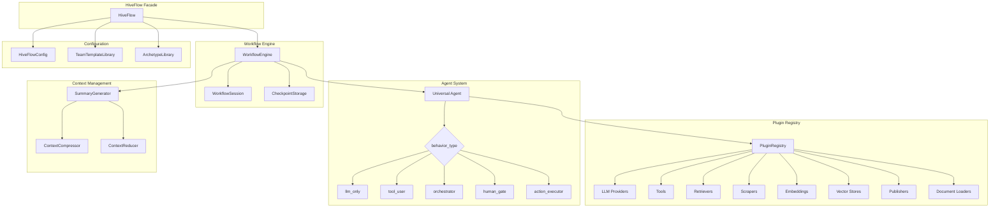

---

## Directory Structure

```
hiveflow/
 core/ # Core framework
    hiveflow.py # HiveFlow facade (top-level entry point)
    agent.py # Universal Agent class (5 behavior types)
    workflow.py # Workflow Graph Engine (6 step types)
    session.py # WorkflowSession + ApprovalRequest
    checkpoint.py # Workflow checkpointing (save/resume)
    schema.py # Team Configuration Schema (Pydantic)
    state.py # Workflow state container
    config.py # Layered configuration with tier resolution
    registry.py # Plugin discovery (entry points + drop-in)
    documents.py # Document pipeline (load, chunk, scope)
    research.py # Deep research orchestrator
    citations.py # Source citation tracking (APA, MLA, Chicago)
    source_curation.py # Source credibility scoring pipeline
    compression.py # Context compression pipeline
    prompts.py # Prompt template library
    teams.py # Team templates, archetypes, and generation
    fallback.py # LLM fallback chains + retry wrappers
    observability.py # Structured logging (structlog) + OpenTelemetry
    streaming.py # Async event streaming
    cost.py # Token/cost tracking
    errors.py # Circuit breaker, bulkhead, timeout
    ratelimit.py # Token bucket rate limiting
    json_utils.py # Resilient JSON parsing
 plugins/
    tools/ # Tool plugins (search, scrape, etc.)
    llm/ # LLM providers
       __init__.py # LLMProvider base, registry, resolve_model()
       secrets.py # Pluggable SecretBackend protocol
       openai_provider.py # OpenAI + compatible APIs (llama.cpp, vLLM)
       anthropic_provider.py # Anthropic Claude models
       azure_provider.py # Azure OpenAI (Entra ID RBAC + API key)
    embeddings/ # Embedding providers
       __init__.py # EmbeddingProvider base, registry
       openai_embeddings.py # OpenAI text-embedding-3-small
    retrievers/ # Search/retrieval backends
       __init__.py # RetrieverPlugin base, registry, SearchResult
       tavily_retriever.py # Tavily Search API
       duckduckgo_retriever.py # DuckDuckGo search
    scrapers/ # Web scraping backends
       __init__.py # ScraperPlugin base, ScraperRouter, validation
       bs4_scraper.py # BeautifulSoup4 HTML scraper
       playwright_scraper.py # Playwright JS-capable scraper
    vector_stores/ # Vector storage backends
       __init__.py # VectorStorePlugin base, registry, CollectionManager
       memory_store.py # In-memory store with numpy cosine similarity
    publishers/ # Output format plugins (PDF, DOCX, Markdown)
    documents/ # Document loaders (PDF, DOCX, HTML, etc.)
        azure_blob_loader.py # Azure Blob Storage loader
        url_loader.py # URL content loader via httpx
 validation/ # Input validation (path security)
 api/ # FastAPI backend
 cli/ # CLI entry point (hiveflow run)
 templates/
     teams/ # Bundled team configurations
     archetypes/ # Reusable agent definition files
```

---

## Core Components

### HiveFlow Facade

`HiveFlow` is the top-level entry point for the framework. It composes all subsystems behind a clean API and serves as the single object most users interact with.

```
HiveFlow
   run(team, task) → WorkflowSession
   run_sync(team, task) → WorkflowSession
   generate_team(task) → TeamGenerationResult
   resume(session_id, responses) → WorkflowSession
   Discovery
        team_library() → TeamTemplateLibrary
        archetype_library() → ArchetypeLibrary
        tool_registry() → ToolRegistry
        model_registry() → LLMProviderRegistry
```

Team resolution accepts three input forms:
- **str** — template name, looked up in the team library
- **dict** — raw JSON validated against `TeamConfiguration` schema
- **TeamConfiguration** — used directly

---

### Agent System

The `Agent` class is the universal building block. Every agent is the **same class**, specialized at creation time through a single `behavior_type` field. This avoids deep class hierarchies while keeping each behavior well-defined.

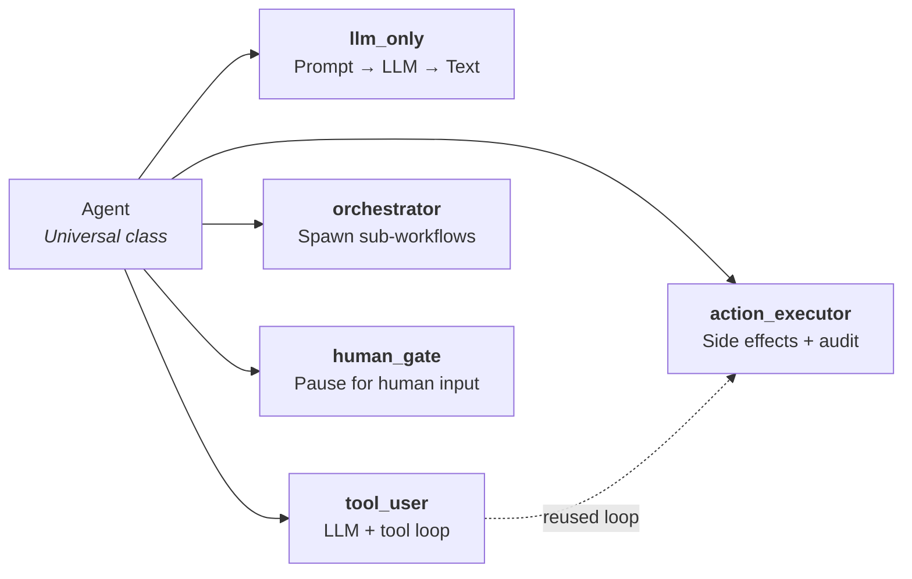

| Behavior Type | What It Does | Default Output Type |
|--------------|--------------|---------------------|
| `llm_only` | Pure LLM response — receives state, generates text | `text` |
| `tool_user` | LLM with tool access — calls registered plugins in a loop | `text` |
| `orchestrator` | Spawns and manages sub-workflows | `structured_data` |
| `human_gate` | Pauses execution for human approval or input | `text` |
| `action_executor` | Performs real-world side effects via tools with safety policies | `side_effect` |

#### Action Executor

The `action_executor` behavior type reuses the `tool_user` execution loop but adds a safety policy gate:

- **`auto`** — Tools execute immediately. Each execution is recorded as a structured audit entry in the workflow state.
- **`require_approval`** — The agent pauses after the LLM proposes tool calls but before executing them. Proposed actions are surfaced as `ApprovalRequest` objects. The workflow resumes after approval.

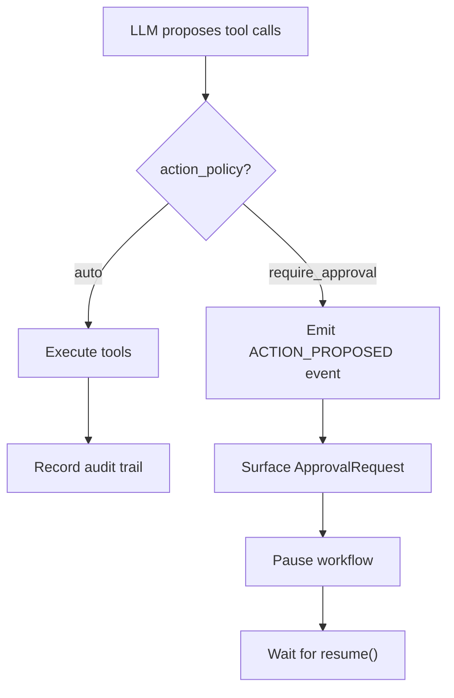

#### Model Requirements

Agents can specify model selection declaratively instead of by name:

```json
{
  "id": "analyzer",
  "behavior_type": "tool_user",
  "model_requirements": {
    "cost_tier": "smart",
    "supports_tools": true,
    "strengths": ["reasoning", "coding"]
  }
}
```

When `model` is not set but `model_requirements` are provided, the framework resolves to a concrete model at build time using the tier mapping. If both are set, `model` takes precedence.

#### Output Types

Each agent has an output type that describes what it produces:

| Output Type | Description | Default For |
|------------|-------------|-------------|
| `text` | Free-form text | `llm_only`, `tool_user`, `human_gate` |
| `structured_data` | Structured key-value data | `orchestrator` |
| `side_effect` | External actions with audit trail | `action_executor` |
| `composite` | Mixed output types | (explicit only) |

When `output_type` is not specified, it is inferred from `behavior_type`.

---

### Workflow Engine

The `WorkflowEngine` executes a directed graph of agents. Each step in the graph has a type that determines its execution semantics.

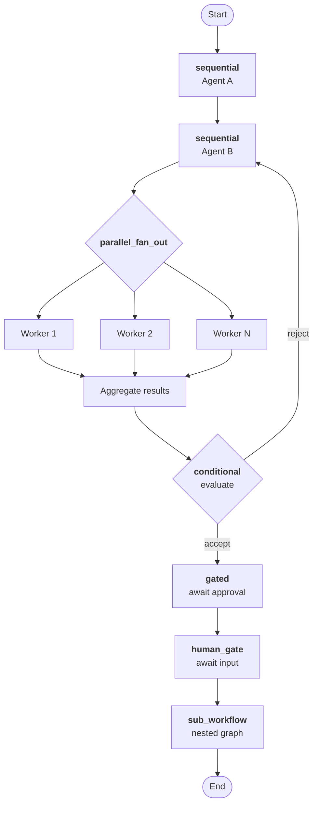

| Step Type | Behavior |
|-----------|----------|
| **sequential** | One agent after another — output feeds into the next step's state |
| **parallel_fan_out** | Multiple agents run concurrently, results aggregated |
| **conditional** | Branch based on agent evaluation (accept/reject path, with max iterations) |
| **human_gate** | Agent-level pause for human input |
| **gated** | Workflow-level pause requiring external approval before proceeding |
| **sub_workflow** | Nested workflow graph executed as a single step |

#### Conditional Loop Limits

Conditional steps have a configurable `max_iterations` (default: 3). When exceeded, the workflow raises a `WorkflowError` instead of silently accepting. Per-step limits override the global `max_conditional_loops` setting.

#### Gated Steps

Gated steps are workflow-level pauses with no agent execution. They have a `gate_id` for identification and `gate_description` for context. The workflow emits a `GATE_REQUESTED` event and transitions to `PAUSED` status until `session.resume()` is called.

```json
{"agent": "", "type": "gated", "gate_id": "review_gate", "gate_description": "Review draft before publishing"}
```

#### State Schema Enforcement

The workflow engine can enforce state access patterns declared in `StateSchema`:

| Mode | Behavior |
|------|----------|
| `warn` (default) | Log warnings for undeclared state writes |
| `strict` | Filter agent output to only declared write keys |
| `off` | No enforcement |

Enforcement runs after each agent execution, before state merge. This catches state pollution without breaking existing workflows.

---

### WorkflowSession

`WorkflowSession` is a handle to a running or completed workflow:

```
WorkflowSession
   session_id: str (UUID)
   status: PENDING → RUNNING → COMPLETED | FAILED | PAUSED
   result: WorkflowResult | None
   error: str | None
   pending_requests: list[ApprovalRequest]
   resume(responses) continue from PAUSED
   cancel() transition to CANCELLED
   subscribe() async event stream
   to_dict() JSON-serializable snapshot
```

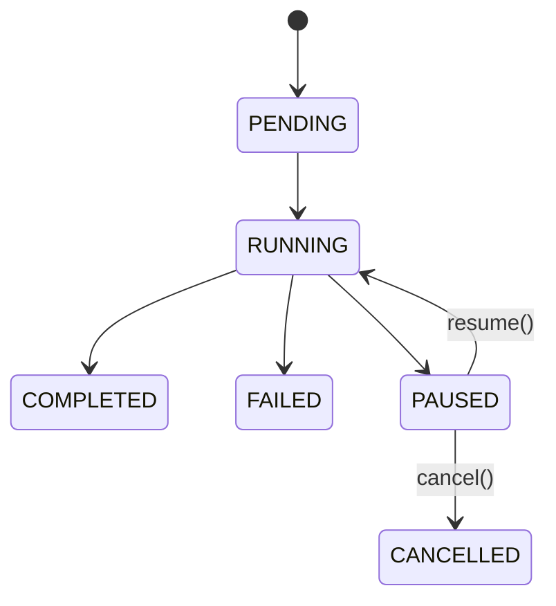

---

### Workflow Checkpointing

Workflows checkpoint at pause points (human gates and gated steps) for durable persistence across process restarts.

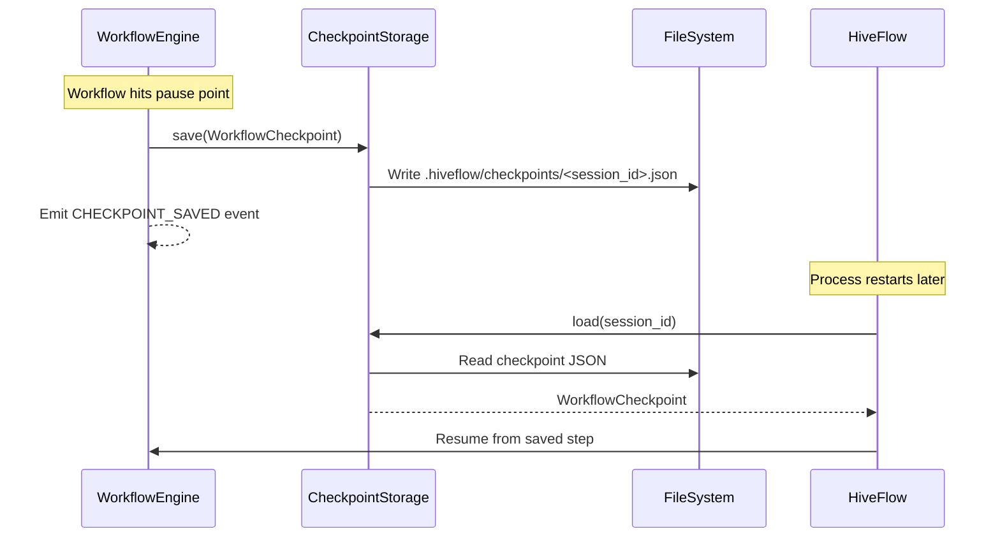

`CheckpointStorage` is defined as a Protocol, allowing custom backends in future phases. Phase 1 provides `FileCheckpointStorage` with JSON files.

---

### Team Composition

Teams can be composed in three ways:

1. **Template** — Load a pre-built configuration from `TeamTemplateLibrary`
2. **Custom** — Developer provides a `TeamConfiguration` as JSON/dict
3. **LLM-generated** — `HiveFlow.generate_team()` uses an LLM to design a team

#### ArchetypeLibrary

Archetypes are reusable agent definitions (building blocks for teams). `ArchetypeLibrary` provides:

- `register(name, archetype)` — add a custom archetype
- `get(name)` — retrieve by name
- `list_archetypes()` — enumerate available archetypes
- `from_directory(path)` — load from JSON files
- `default()` — load built-in archetypes (researcher, planner, writer, reviewer, editor, human_reviewer)

#### Capability Gap Reporting

When generating teams via LLM, the framework reports missing capabilities:

| Severity | Meaning |
|----------|---------|
| `blocking` | Team cannot function without this resource |
| `degraded` | Quality will be reduced |
| `functional_but_limited` | Minor capability loss |

`TeamGenerationResult` wraps the generated config with `capability_gaps` and `has_blocking_gaps` for programmatic checking.

---

### Event Streaming

Workflows emit structured events consumable as async iterators:

| Event Type | Description |
|-----------|-------------|
| `step_start` | Agent step begins |
| `step_complete` | Agent step finishes |
| `step_error` | Agent step fails |
| `output` | Agent produces output |
| `tool_call` | Tool invocation |
| `request_info` | Information request from agent |
| `approval` | Approval request surfaced |
| `checkpoint_saved` | Checkpoint persisted to storage |
| `action_proposed` | action_executor proposes actions (before approval) |
| `action_executed` | action_executor completes an action |
| `gate_requested` | Gated step pauses workflow |

---

### Plugin Registry

All plugin types (tools, LLM providers, document loaders, etc.) share the same generic `PluginRegistry<T>` discovery mechanism.

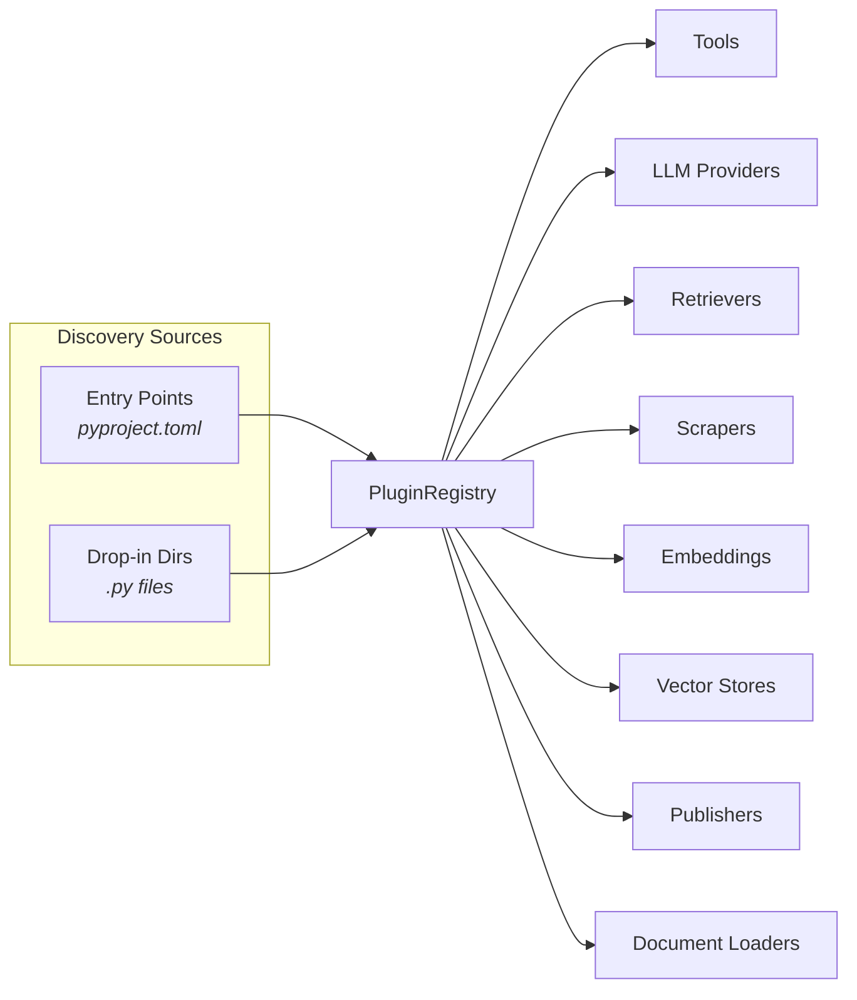

1. **Entry points** — declared in `pyproject.toml`, discovered via `importlib.metadata`
2. **Drop-in directories** — Python files in a configurable directory
3. **Graceful degradation** — failed imports log a warning, don't crash

> **Design note:** Every plugin category uses the same `PluginRegistry` generic class.
> Adding a new plugin type requires only a base class and a new entry point group —
> no framework changes needed.

---

### LLM Provider System

The LLM provider system resolves model strings (e.g. `openai:gpt-4o`) to concrete provider instances, supporting tier variables for environment-based model selection.

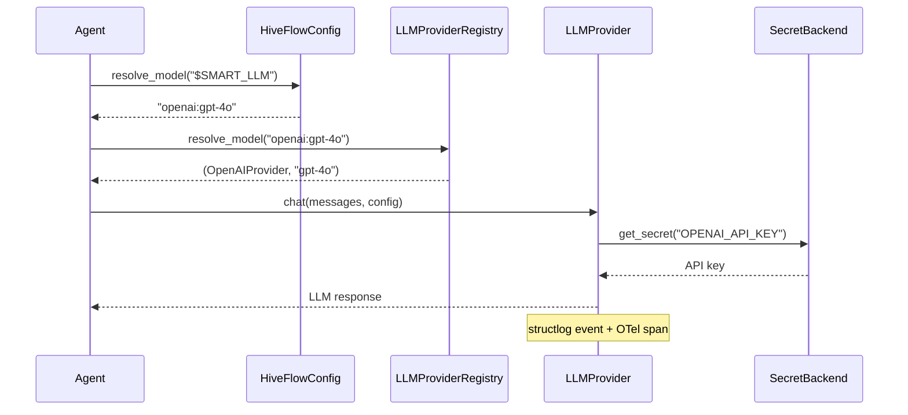

---

### Document Pipeline

Documents flow through: **load** → **chunk** → **scope** → **inject into agent context**.

- `DocumentPipeline` loads files via format-specific loaders
- Chunks are created with configurable token budgets
- Per-agent scoping controls which agents see which documents (`full`, `metadata_only`, `none`)
- `relevant_chunks` mode uses semantic filtering when an embedding provider is configured

---

### Data Processing Pipeline

The data processing layer provides pluggable retrieval, extraction, embedding, and curation capabilities — turning raw search queries into semantically indexed, cited content.

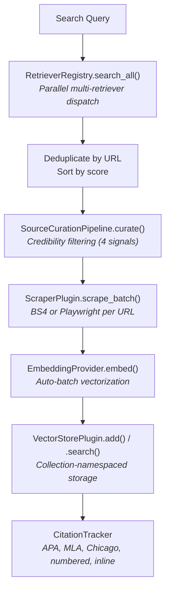

#### Source Curation Signals

| Signal | Weight | Source |
|--------|--------|--------|
| Domain authority | 0.25 | Allow/block lists + known-domain heuristics |
| Content relevance | 0.30 | Cosine similarity of snippet vs query (needs embedding provider) |
| Freshness | 0.15 | Time-decay based on publication date |
| LLM judgment | 0.30 | LLM quality rating on 1-10 scale (needs LLM provider) |

When optional providers are unavailable, their signals are skipped and remaining weights are reweighted proportionally.

#### Semantic Filtering (relevant_chunks mode)

When an embedding provider is configured on `DocumentPipeline`, the `relevant_chunks` document mode:

1. Embeds each document chunk and the task/query
2. Computes cosine similarity between each chunk and the query
3. Keeps only chunks above the similarity threshold (default 0.35)
4. Sorts retained chunks by relevance score
5. Falls back to full content if no provider is configured or embedding fails

---

### Context Management

Multi-agent workflows need to pass information between steps without exceeding LLM context limits. HiveFlow uses a **divide-and-conquer** pattern: no single LLM call sees the full accumulated output; instead, each agent receives a compressed view of prior work.

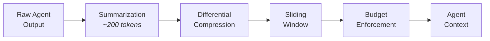

#### Task Decomposition and Parallel Fan-Out

An `orchestrator` agent breaks a task into N independent sub-tasks. The workflow engine then runs the next step once per sub-task in parallel, each worker receiving only its own assignment:

```
Orchestrator
 Decompose task → state["parallel_items"]

 For each item (parallel fan-out):
    Worker receives:
       • current_item (this sub-task only)
       • item_index (position in list)
       • ~3-4K tokens of isolated context

 Collect outputs → state["writer_outputs"]
 Summarize each → state["writer_summaries"]
 Build outline → state["writer_outline"]
```

Total tokens scale linearly (N × per-task budget), not quadratically.

#### Summary Propagation

After each step, `SummaryGenerator` compresses the agent's output to ~200 tokens. Downstream agents receive summaries instead of full outputs:

```
agent._summarize_state() priority:
  1. task + input_data (always included)
  2. {agent_id}_outline (from parallel fan-out)
  3. {agent_id}_summary (preferred over raw output)
  4. {agent_id}_output (fallback when no summary exists)
```

State key conventions:

| Pattern | Written by | Contains |
|---------|-----------|----------|
| `{agent_id}_output` | Agent | Full raw output |
| `{agent_id}_summary` | WorkflowEngine | ~200-token summary |
| `{agent_id}_outline` | WorkflowEngine | Cross-cutting outline from parallel items |
| `parallel_items` | Orchestrator | Sub-task descriptions |
| `final_output` | WorkflowEngine | Code-level assembled output |

#### Context Reduction Strategies

Six strategies prevent context overflow in deep pipelines. Only redundancy detection is automatic; the rest require explicit configuration:

| Strategy | Activation | How it works |
|----------|-----------|-------------|
| **Differential compression** | `output_type` set on agent | Summary budget multiplier: `reasoning`/`structured_data` get 2×, `data`/`side_effect` get 0.5×, unset = 1× |
| **Sliding window** | `context_recency_window > 0` on agent | Keeps only N most recent summaries; older entries collapse to a placeholder. Activates when entry count exceeds window size. |
| **Context TTL** | `context_ttl` set on step | Summary expires when downstream step distance exceeds TTL. Default `None` = never expires. |
| **Context budget** | `context_budget` set on agent | Caps assembled context at N words. Truncates oldest sections first, preserving at least 50 words per section. |
| **Intelligent reduction** | `ContextReducer` attached to agent | Three tiers: within budget = passthrough; over budget but under 1.5× = mechanical truncation; over 1.5× = LLM-based reduction then mechanical fallback. |
| **Redundancy detection** | Always (when ≥ 2 entries) | Trigram Jaccard overlap > 60% between consecutive entries replaces older one with a back-reference. No configuration needed. |

These strategies are composable. A typical deep pipeline might use summary propagation + differential compression + sliding window + TTL, while a simple two-agent workflow may need none at all.

#### Code-Level Assembly

After all steps complete, the engine concatenates outputs from specified agents into `state["final_output"]` using Python code, not an LLM call. This preserves full section length without truncation:

```python
engine = WorkflowEngine(
    steps,
    summarizer=summarizer,
    assembly_agents=["researcher", "writer"], # outputs to stitch
)
```

---

### Resilience

Multiple resilience patterns protect against real-world failures:

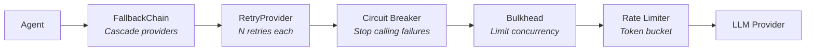

- **FallbackChain** — cascade through LLM providers on failure (strategic → smart → fast tiers)
- **RetryProvider** — retry a single provider N times on transient errors
- **Circuit breaker** — stop calling a failing service after threshold breaches
- **Bulkhead** — limit concurrency per resource to prevent cascading failures
- **Rate limiting** — token bucket algorithm for API rate compliance

> When all providers in a `FallbackChain` are exhausted, an `LLMFallbackExhaustedError`
> is raised with details about each provider's failure.

---

## Use Cases

These architectural patterns combine to enable several key use cases:

### Multi-Provider LLM Resilience

HiveFlow's `FallbackChain` + tier-variable system means a workflow never hard-codes a single LLM. Agents declare intent (`$SMART_LLM`) rather than a specific model. At runtime, the config resolves the tier to a concrete provider, and the fallback chain wraps it with retry + cascade logic. If OpenAI is rate-limited, the request transparently falls to Anthropic or Azure — no workflow changes required.

```python
# Agent config just declares the tier
{"id": "analyst", "model": "$SMART_LLM", "behavior_type": "tool_user"}

# HiveFlowConfig resolves at runtime:
# $SMART_LLM → openai:gpt-4o → fallback: anthropic:claude-sonnet → azure:gpt-4o
```

### Dynamic Team Generation

Instead of hand-writing team configurations, developers can describe a goal in natural language and let HiveFlow design the team:

```python
hf = HiveFlow()
result = await hf.generate_team("Research and write a technical blog post about WebAssembly")
# result.config → TeamConfiguration with researcher + writer + reviewer agents
# result.capability_gaps → any missing tools or providers
```

The LLM selects from the `ArchetypeLibrary`, assigns behavior types, and wires the workflow graph. `capability_gaps` report what's missing so the developer can install plugins before running.

### Context-Aware Agent Chains

Deep multi-agent pipelines (5+ steps) can easily blow context windows. HiveFlow's context management pipeline solves this through composable strategies:

1. **Orchestrator** decomposes the task → parallel workers each get only their sub-task
2. **Summary propagation** compresses each output to ~200 tokens for downstream agents
3. **Sliding window** drops old summaries beyond a configurable recency horizon
4. **Budget enforcement** hard-caps the total context any single agent receives

The result: a 10-agent pipeline where each agent sees only what it needs, tokens scale linearly, and no manual prompt engineering is required.

---

## Design Decisions

### Configuration Over Code

All features are driven by configuration, not code. Teams, agents, archetypes, workflows, and safety policies are all defined declaratively in JSON/YAML. This ensures portability (SC-003) and enables non-developer users to configure the framework.

### Progressive Disclosure

The simplest usage requires minimal code:

```python
hf = HiveFlow()
session = hf.run_sync(team="summarizer", task="Summarize this document")
```

Advanced features (action policies, gated steps, checkpointing, model requirements) are all optional with sensible defaults. Existing configurations work without modification.

### Explicit State, No Magic

All data flows through the workflow state dict. Checkpoints serialize the full state explicitly. Action audit trails are stored in state. There are no hidden channels or implicit data flows.

### Async-First

All I/O operations are async. Sync wrappers (`run_sync`) are provided for convenience but delegate to the async implementation.
