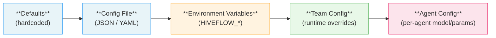
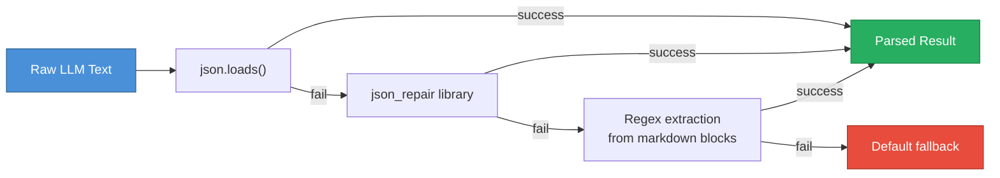
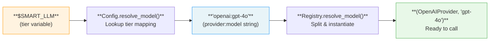

# Configuration

HiveFlow uses a layered configuration system where each layer can override the previous one. This gives you sensible defaults out of the box while allowing fine-grained control at every level—from global environment variables down to individual agent settings.

## Config Layering



Each layer overrides values from the layer before it:

| Layer | Source | Example |
|-------|--------|---------|
| **Defaults** | Hardcoded in `HiveFlowConfig` | `FAST_LLM = "openai:gpt-4o-mini"` |
| **Config File** | `HiveFlowConfig.from_file("config.json")` | `{"SMART_LLM": "anthropic:claude-sonnet-4-20250514"}` |
| **Environment Variables** | `HIVEFLOW_` prefix via pydantic-settings | `export HIVEFLOW_SMART_LLM=azure:gpt-4o-eastus` |
| **Team Config** | `apply_overrides()` at runtime | Team YAML with model overrides |
| **Agent Config** | Per-agent `model` or `model_requirements` | `{"model": "$SMART_LLM"}` |

## Environment Variables

### LLM Tiers

> **When to use:** Configure LLM tiers to control which models handle different workload classes across your entire deployment—without changing agent definitions.

| Variable | Default | Description |
|----------|---------|-------------|
| `HIVEFLOW_FAST_LLM` | `openai:gpt-4o-mini` | Quick operations, formatting |
| `HIVEFLOW_SMART_LLM` | `openai:gpt-4o` | Primary reasoning, research |
| `HIVEFLOW_STRATEGIC_LLM` | `openai:o3-mini` | Complex planning, orchestration |

Tier variables can be used in agent definitions and are resolved at runtime:

```json
{"model": "$SMART_LLM"}
```

Override via environment:

```bash
export HIVEFLOW_SMART_LLM=azure:gpt-4o-eastus
```

Or programmatically:

```python
from hiveflow.core.config import HiveFlowConfig

config = HiveFlowConfig(SMART_LLM="anthropic:claude-sonnet-4-20250514")
resolved = config.resolve_model("$SMART_LLM") # "anthropic:claude-sonnet-4-20250514"
```

### LLM Provider Keys

> **When to use:** Set provider API keys for every LLM backend your agents use. Only the providers you reference need credentials.

| Variable | Provider | Required? |
|----------|----------|-----------|
| `OPENAI_API_KEY` | OpenAI | Yes, for OpenAI |
| `ANTHROPIC_API_KEY` | Anthropic | Yes, for Anthropic |
| `AZURE_OPENAI_ENDPOINT` | Azure | Yes, for Azure |
| `AZURE_OPENAI_API_KEY` | Azure | Optional (omit for RBAC) |
| `OPENAI_API_VERSION` | Azure | Optional (default: `2024-10-21`) |

### Observability

> **When to use:** Tune logging and tracing for development debugging or production monitoring dashboards.

| Variable | Default | Description |
|----------|---------|-------------|
| `HIVEFLOW_ENV` | `development` | `development` = pretty console, `production` = JSON lines |
| `HIVEFLOW_OTEL_ENABLED` | `false` | Enable OpenTelemetry spans and metrics |
| `HIVEFLOW_LOG_LEVEL` | `INFO` | Standard Python logging level |

### Embedding

> **When to use:** Choose an embedding backend for semantic search. Use `huggingface` for local/private data, `openai` for highest quality, or `local` for zero-dependency hashing.

| Variable | Default | Description |
|----------|---------|-------------|
| `HIVEFLOW_EMBEDDING_PROVIDER` | `huggingface` | Embedding provider (`huggingface` = local transformer, `local` = numpy hashing, `openai` = API) |
| `HIVEFLOW_EMBEDDING_MODEL` | _(empty)_ | Provider-specific model; empty = provider default (`all-MiniLM-L6-v2` for huggingface) |

### Retrieval

> **When to use:** Configure web search and retrieval when building agents that need to gather information from external sources.

| Variable | Default | Description |
|----------|---------|-------------|
| `HIVEFLOW_RETRIEVERS` | | Comma-separated list of retriever plugins |
| `HIVEFLOW_MAX_SEARCH_RESULTS_PER_QUERY` | | Max search results per query |
| `TAVILY_API_KEY` | | API key for Tavily retriever |

### Scraping

> **When to use:** Adjust scraping timeouts when working with slow or rate-limited websites.

| Variable | Default | Description |
|----------|---------|-------------|
| `HIVEFLOW_SCRAPER_TIMEOUT` | `15` | Per-URL scrape timeout in seconds |

### Context and Compression

> **When to use:** Fine-tune context window management when agents process large documents or long multi-step workflows. These settings control how much information flows between agents.

| Variable | Default | Description |
|----------|---------|-------------|
| `HIVEFLOW_SIMILARITY_THRESHOLD` | `0.35` | Minimum similarity score for relevance |
| `HIVEFLOW_BROWSE_CHUNK_MAX_LENGTH` | `1000` | Max tokens per chunk |
| `HIVEFLOW_CHUNK_OVERLAP` | `200` | Overlap between chunks |
| `HIVEFLOW_TOTAL_WORDS` | `8000` | Total word budget for context |
| `HIVEFLOW_MAX_CONTEXT_PER_TASK` | `4000` | Max context tokens passed to a sub-task worker |
| `HIVEFLOW_MAX_SUMMARY_LENGTH` | `200` | Max tokens per agent summary |
| `HIVEFLOW_MAX_OUTLINE_LENGTH` | `1000` | Max tokens for cross-cutting outline |
| `HIVEFLOW_ENABLE_SUMMARY_PROPAGATION` | `true` | Enable automatic summary generation after each step |
| `HIVEFLOW_SUMMARY_THRESHOLD` | `None` | Min word count before summarization activates. `None` = legacy (uses `max_summary_tokens` as threshold). Set to e.g. `4000` to pass short/medium outputs through unchanged. |
| `HIVEFLOW_CONTEXT_RECENCY_WINDOW` | `0` | Sliding window for prior agent summaries. When >0, only the N most recent agent summaries are included fully; older ones are collapsed into a single-line placeholder. `0` = include all (no windowing). |

#### Task Preprocessing

These settings control automatic large-input preprocessing. When a task exceeds a model-derived word threshold, it is split into instructions and data chunks with a compact summary.

| Variable | Default | Description |
|----------|---------|-------------|
| `HIVEFLOW_TASK_PREPROCESS_DISABLED` | `false` | Disable task preprocessing entirely |
| `HIVEFLOW_TASK_PREPROCESS_THRESHOLD_OVERRIDE` | `0` | Fixed word threshold (0 = auto-compute from model) |
| `HIVEFLOW_TASK_CONTEXT_RATIO` | `0.15` | Fraction of context window used for threshold computation |
| `HIVEFLOW_TASK_PIPELINE_FACTOR` | `0.3` | Per-agent context multiplier for threshold |
| `HIVEFLOW_TASK_CHUNK_CONTEXT_RATIO` | `0.10` | Fraction of context window per data chunk |
| `HIVEFLOW_TASK_CHUNK_OVERLAP_RATIO` | `0.10` | Overlap between chunks as fraction of chunk size |
| `HIVEFLOW_TASK_TOKENS_PER_WORD` | `1.35` | Token-to-word conversion ratio |

#### Agent-Level Context Parameters

These are set per-agent in code or in the team configuration JSON:

| Parameter | Default | Description |
|-----------|---------|-------------|
| `context_budget` | `None` | Max words of assembled context passed to this agent. `None` = no limit. |
| `context_recency_window` | `0` | Sliding window override for this agent (0 = use global setting). |
| `output_type` | `None` | Controls differential compression: `reasoning`/`structured_data` get 2x summary budget, `data`/`side_effect` get 0.5x. |

#### Step-Level Context Parameters

Set per workflow step in the team configuration or `WorkflowStep`:

| Parameter | Default | Description |
|-----------|---------|-------------|
| `context_ttl` | `None` | How many downstream steps this agent's summary stays visible. `None` = never expires. |

### Output

> **When to use:** Control report formatting and publishing when generating deliverables from workflow results.

| Variable | Default | Description |
|----------|---------|-------------|
| `HIVEFLOW_REPORT_FORMAT` | `apa` | Citation format |
| `HIVEFLOW_OUTPUT_DIR` | `./output` | Output directory |
| `HIVEFLOW_PUBLISH_FORMATS` | _(empty)_ | Comma-separated output formats. Empty = all discovered publisher plugins |

### Deep Research

> **When to use:** Tune recursive research behavior when agents perform multi-level web research with sub-query expansion.

| Variable | Default | Description |
|----------|---------|-------------|
| `HIVEFLOW_DEEP_RESEARCH_BREADTH` | `3` | Number of sub-queries per level |
| `HIVEFLOW_DEEP_RESEARCH_DEPTH` | `2` | Maximum recursion depth |
| `HIVEFLOW_DEEP_RESEARCH_CONCURRENCY` | `4` | Max parallel research tasks |

## Config File

Load configuration from a JSON or YAML file:

```python
from hiveflow.core.config import HiveFlowConfig

config = HiveFlowConfig.from_file("config.json")
```

Environment variables still override values from the file.

## JSON Resilience

HiveFlow includes a resilient JSON parsing pipeline in `core/json_utils.py` that handles malformed LLM output. LLMs frequently produce broken JSON -- missing quotes, trailing commas, markdown code fences around JSON, or mixed prose and data. The resilient parser recovers from all of these.

### Fallback Pipeline



The parser tries four strategies in order:

1. **Standard `json.loads()`** -- handles well-formed JSON
2. **`json_repair` library** -- fixes common LLM errors (trailing commas, unquoted keys, single quotes)
3. **Regex extraction** -- pulls JSON from markdown code blocks (` ```json ... ``` `) or raw `{...}` / `[...]` patterns
4. **Default fallback** -- returns the caller-specified default value

### API Reference

**`parse_json_resilient(text, default=None, expect_type=None)`**

Main entry point for resilient JSON parsing.

| Parameter | Type | Description |
|-----------|------|-------------|
| `text` | `str` | Raw text that should contain JSON |
| `default` | `Any` | Fallback value if all parsing fails (default: `None`) |
| `expect_type` | `type` or `None` | Expected type (`dict`, `list`) for validation. If the parsed result does not match, parsing continues to the next strategy. |

Returns the parsed JSON value, or `default` if all strategies fail.

**`extract_json_from_response(response, expect_type=dict)`**

Convenience wrapper for the common case of extracting a `dict` or `list` from an LLM response.

| Parameter | Type | Description |
|-----------|------|-------------|
| `response` | `str` | LLM response text |
| `expect_type` | `type` | Expected JSON type (default: `dict`) |

Returns parsed JSON or `None`.

### Usage Example

```python
from hiveflow.core.json_utils import parse_json_resilient, extract_json_from_response

# Handles markdown-wrapped JSON from LLMs
raw = '''Here is the analysis:
```json
{"findings": ["trend A", "trend B"], "confidence": 0.85}
```
'''
data = parse_json_resilient(raw, default={}, expect_type=dict)
print(data["findings"])  # ['trend A', 'trend B']

# Convenience wrapper
result = extract_json_from_response(raw, expect_type=dict)
```

> **Note:** HiveFlow uses resilient JSON parsing throughout to handle malformed LLM output. This is automatic -- you rarely need to call these directly, but they are available for custom tool plugins that need to parse LLM-generated JSON.

## Tier Variable Resolution

When an agent references a tier variable like `$SMART_LLM`, HiveFlow resolves it through a two-stage chain: first the config maps the tier to a `provider:model` string, then the registry splits that into a live provider instance and model name.



```python
from hiveflow.core.config import get_config
from hiveflow.plugins.llm import get_llm_registry

config = get_config()
model_ref = config.resolve_model("$SMART_LLM") # "openai:gpt-4o"

registry = get_llm_registry()
provider, model = registry.resolve_model(model_ref) # (OpenAIProvider, "gpt-4o")
```

Direct references pass through unchanged:

```python
config.resolve_model("azure:gpt-4o-eastus") # "azure:gpt-4o-eastus"
```

## Model Requirements

Agents can declare model requirements instead of specifying a model by name. Requirements are resolved at build time using the tier mapping:

```json
{
  "id": "analyzer",
  "behavior_type": "tool_user",
  "model_requirements": {
    "cost_tier": "smart",
    "supports_tools": true,
    "supports_vision": false,
    "strengths": ["reasoning", "coding"]
  }
}
```

| Field | Type | Description |
|-------|------|-------------|
| `cost_tier` | `"fast"` \| `"smart"` \| `"strategic"` | Maps to the corresponding LLM tier variable |
| `supports_tools` | bool | Requires tool/function calling capability |
| `supports_vision` | bool | Requires vision/multimodal capability |
| `strengths` | list[str] | Desired capabilities (informational) |

When both `model` and `model_requirements` are set on an agent, `model` takes precedence.

## Checkpointing

> **When to use:** Enable checkpointing for long-running workflows that need crash recovery or resumability.

Workflow checkpoints are stored as JSON files. Configure the storage directory:

```python
from hiveflow import HiveFlow
from hiveflow.core.checkpoint import FileCheckpointStorage

hf = HiveFlow(
    checkpoint_storage=FileCheckpointStorage(directory=".hiveflow/checkpoints")
)
```

The default directory is `.hiveflow/checkpoints` relative to the working directory. Each session gets a separate JSON file named by session ID.

## State Schema Enforcement

> **When to use:** Add schema enforcement in multi-agent workflows to catch data contract violations early—especially useful during development and testing of new agent pipelines.

Control how the workflow engine validates state writes:

```json
{
  "state_schema": {
    "required_keys": ["task"],
    "enforcement_mode": "warn",
    "agent_io": {
      "researcher": {"reads": ["task"], "writes": ["findings"]},
      "writer": {"reads": ["task", "findings"], "writes": ["report"]}
    }
  }
}
```

| Mode | Behavior |
|------|----------|
| `warn` (default) | Log warnings for undeclared state writes |
| `strict` | Filter agent output to only declared write keys |
| `off` | No enforcement |

## Citation Configuration

> **When to use:** Enable citations when building research or report-generation workflows that need traceable, properly formatted source attribution.

Enable automatic citation tracking via the team configuration:

```yaml
# team_config.yaml
citations:
  enabled: true
  style: apa # apa, mla, chicago, numbered, inline
  inline: true # Include [source](url) inline references
  generate_reference_section: true # Append reference list to output
```

| Field | Type | Default | Description |
|-------|------|---------|-------------|
| `enabled` | `bool` | `false` | Activate citation tracking |
| `style` | `str` | `"apa"` | Citation format |
| `inline` | `bool` | `true` | Inline `[source](url)` references |
| `generate_reference_section` | `bool` | `true` | Append reference list |

When `enabled` is `false` (default), no citation processing occurs.

## Source Curation Configuration

> **When to use:** Configure source curation when building research pipelines that need credible sources. This filters out low-quality pages before they consume scraping and LLM budgets.

Configure source credibility scoring and filtering:

```yaml
# team_config.yaml
source_curation:
  enabled: true
  min_score: 0.4
  max_sources: 10
  freshness_max_age_days: 730
  domain_allow_list:
    - nature.com
    - ieee.org
  domain_block_list:
    - pinterest.com
    - quora.com
  scoring_weights:
    domain_authority: 0.25
    content_relevance: 0.30
    freshness: 0.15
    llm_judgment: 0.30
```

| Field | Type | Default | Description |
|-------|------|---------|-------------|
| `enabled` | `bool` | `false` | Activate source curation |
| `min_score` | `float` | `0.4` | Minimum composite score to pass |
| `max_sources` | `int` | `10` | Maximum URLs to deep-scrape |
| `freshness_max_age_days` | `int` | `730` | Penalize content older than this |
| `domain_allow_list` | `list[str]` | `[]` | Domains with boosted authority |
| `domain_block_list` | `list[str]` | `[]` | Domains scored as zero authority |

When `enabled` is `false` (default), all retriever results proceed directly to scraping.

## Vector Store Configuration

> **When to use:** Configure the vector store when agents need semantic memory—for example, to retrieve relevant context from previously processed documents or past workflow runs.

Configure the vector store backend for semantic search:

```yaml
# team_config.yaml
vector_store:
  backend: memory # Plugin ID (memory, chroma, etc.)
  collection_prefix: workflow_
  persist: false # Clear on workflow completion
  similarity_metric: cosine
```

| Field | Type | Default | Description |
|-------|------|---------|-------------|
| `backend` | `str` | `"memory"` | Vector store plugin ID |
| `collection_prefix` | `str` | `"workflow_"` | Namespace prefix for collections |
| `persist` | `bool` | `false` | Keep vectors across workflow runs |
| `similarity_metric` | `str` | `"cosine"` | Distance metric |

## Common Configurations

Complete, copy-pasteable examples for typical deployment scenarios.

### Basic OpenAI Setup

The simplest configuration—set one API key and go:

```bash
# .env
OPENAI_API_KEY=sk-...
```

All three tiers default to OpenAI models. No config file needed.

```python
from hiveflow import HiveFlow

hf = HiveFlow() # Uses defaults: gpt-4o-mini, gpt-4o, o3-mini
```

### Azure Enterprise Deployment

Lock all tiers to Azure OpenAI with RBAC authentication and production-grade observability:

```bash
# .env
AZURE_OPENAI_ENDPOINT=https://mycompany.openai.azure.com
HIVEFLOW_FAST_LLM=azure:gpt-4o-mini-eastus
HIVEFLOW_SMART_LLM=azure:gpt-4o-eastus
HIVEFLOW_STRATEGIC_LLM=azure:o3-mini-eastus
HIVEFLOW_ENV=production
HIVEFLOW_OTEL_ENABLED=true
HIVEFLOW_LOG_LEVEL=WARNING
```

> **Tip:** Omit `AZURE_OPENAI_API_KEY` to use RBAC via `DefaultAzureCredential`. This works with `az login`, managed identity, and service principal environment variables.

### Multi-Provider with Fallbacks

Use Azure as the primary provider with OpenAI and Anthropic as fallbacks:

```python
from hiveflow.plugins.llm import get_llm_registry
from hiveflow.core.fallback import build_fallback_chain

registry = get_llm_registry()
azure, azure_model = registry.resolve_model("azure:gpt-4o-eastus")
openai, openai_model = registry.resolve_model("openai:gpt-4o")
anthropic, anthropic_model = registry.resolve_model("anthropic:claude-sonnet-4-20250514")

chain = build_fallback_chain([
    (azure, azure_model),
    (openai, openai_model),
    (anthropic, anthropic_model),
], max_retries_per_provider=2)
```

```bash
# .env — all three providers need credentials
AZURE_OPENAI_ENDPOINT=https://mycompany.openai.azure.com
OPENAI_API_KEY=sk-...
ANTHROPIC_API_KEY=sk-ant-...
```

### Research Pipeline with Curation

A full research setup with Tavily retrieval, source curation, and citation formatting:

```bash
# .env
OPENAI_API_KEY=sk-...
TAVILY_API_KEY=tvly-...
HIVEFLOW_RETRIEVERS=tavily
HIVEFLOW_EMBEDDING_PROVIDER=huggingface
HIVEFLOW_DEEP_RESEARCH_BREADTH=4
HIVEFLOW_DEEP_RESEARCH_DEPTH=3
HIVEFLOW_DEEP_RESEARCH_CONCURRENCY=6
```

```yaml
# team_config.yaml
source_curation:
  enabled: true
  min_score: 0.5
  max_sources: 15
  domain_allow_list:
    - arxiv.org
    - nature.com
    - ieee.org
    - acm.org
  domain_block_list:
    - pinterest.com
    - quora.com

citations:
  enabled: true
  style: apa
  inline: true
  generate_reference_section: true

vector_store:
  backend: memory
  persist: false
```
