# Getting Started

This guide walks through using the HiveFlow framework, from the simplest single-agent call to advanced workflows with checkpointing, safety policies, and deep research. Each section builds on the previous one, so you can stop at whatever complexity level fits your needs.

## Learning Path

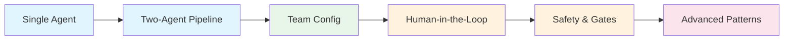

## What You'll Learn

| Section | Pattern | Complexity |
|---------|---------|------------|
| [Quick Start](#quick-start-hiveflow-api) | Run a pre-built team in two lines | |
| [Single Agent](#single-agent-execution) | Define and run one agent inline | |
| [Async Events](#async-execution-with-events) | Subscribe to real-time workflow events | |
| [Team Configuration](#define-a-team-configuration) | Multi-agent pipeline via JSON config | |
| [Human-in-the-Loop](#human-in-the-loop-with-checkpointing) | Pause workflows for human approval | |
| [Action Executor](#action-executor-with-safety-policy) | Safety policies for side-effect actions | |
| [Gated Workflows](#gated-workflow-steps) | Explicit approval gates between steps | |
| [LLM-Generated Teams](#llm-generated-teams) | Let the LLM design your team | |
| [Deep Research](#deep-research) | Recursive breadth/depth exploration | |
| [Context Management](#context-management) | Automatic context compression for long pipelines | |

---

## Quick Start: HiveFlow API

> **Use Case:** You have a pre-built team template and just want to run it with a single task — the fastest path from zero to output.

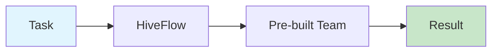

The `HiveFlow` class is the primary entry point. Two lines to run a team:

```python
from hiveflow import HiveFlow

hf = HiveFlow()
# Run a named team template with a task string
session = hf.run_sync(team="summarizer", task="Summarize the history of computing")
print(session.result.state)
```

> ** Tip:** `run_sync` blocks until the workflow completes. Use `await hf.run()` for async execution — covered in [Async Execution](#async-execution-with-events).

---

## Single Agent Execution

> **Use Case:** You need a single LLM call with a specific persona — a writer, a translator, a code reviewer — without the overhead of a full team configuration file.

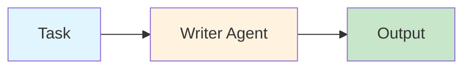

Run a single agent with an inline team configuration:

```python
from hiveflow import HiveFlow

hf = HiveFlow()
session = hf.run_sync(
    team={
        "team_name": "single",
        "description": "One agent",
        "agents": [
            {
                "id": "writer",
                "role": "Writer",
                "system_prompt": "Write clearly and concisely.",
                "behavior_type": "llm_only", # Pure LLM, no tool calling
            }
        ],
        # Single-step workflow — the agent runs and the workflow completes
        "workflow": {"steps": [{"agent": "writer", "type": "sequential"}]},
    },
    task="Write a haiku about Python",
)
# Each agent's output is stored as "<agent_id>_output" in the result state
print(session.result.state["writer_output"])
```

> **Next →** Need real-time visibility into what's happening? See [Async Execution with Events](#async-execution-with-events).

---

## Async Execution with Events

> **Use Case:** You're building a UI or logging system that needs to show progress as agents work — streaming events from a long-running research or writing pipeline.

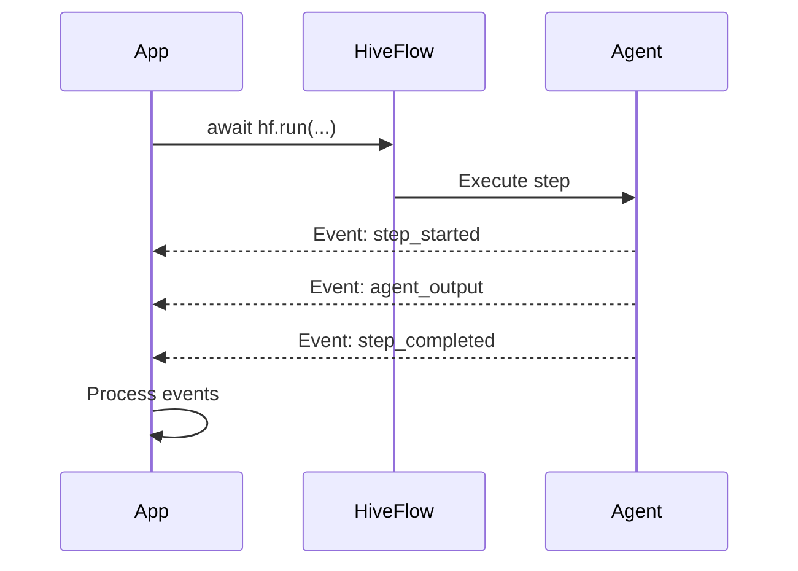

Subscribe to real-time workflow events:

```python
import asyncio
from hiveflow import HiveFlow

async def main():
    hf = HiveFlow()
    session = await hf.run(team="researcher", task="Research quantum computing")

    # Events stream in real-time as agents execute
    async for event in session.subscribe():
        print(f"[{event.event_type}] {event.agent_id}: {event.data}")

    print(session.result.state)

asyncio.run(main())
```

> **Next →** Ready to coordinate multiple agents? See [Define a Team Configuration](#define-a-team-configuration).

---

## Define a Team Configuration

> **Use Case:** You're building a content pipeline where one agent gathers information and another synthesizes it into a polished answer — a classic researcher → writer pattern stored as a reusable JSON config.

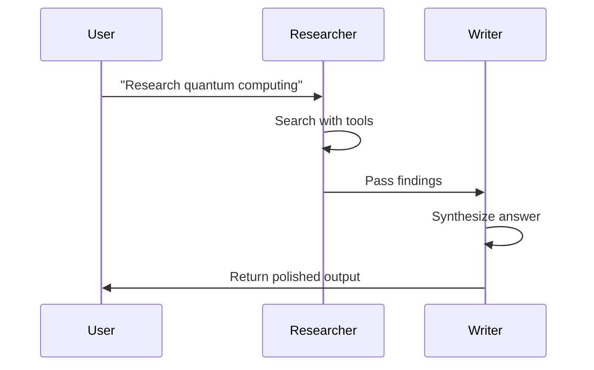

Team configurations are JSON files that define agents and their workflow:

```json
{
  "team_name": "simple_qa",
  "description": "Research and answer questions",
  "agents": [
    {
      "id": "researcher",
      "role": "Researcher",
      "system_prompt": "You are a research agent. Find relevant information.",
      "behavior_type": "tool_user",
      "tools": ["web_search"],
      "model": "$SMART_LLM"
    },
    {
      "id": "writer",
      "role": "Writer",
      "system_prompt": "You are a writer. Synthesize research into clear answers.",
      "behavior_type": "llm_only",
      "model": "$SMART_LLM"
    }
  ],
  "workflow": {
    "steps": [
      {"agent": "researcher", "type": "sequential", "next": "writer"},
      {"agent": "writer", "type": "sequential", "next": null}
    ]
  }
}
```

Tier variables like `$SMART_LLM` are resolved at runtime. See [configuration.md](configuration.md) for details.

> **Next →** Need a human to approve output before proceeding? See [Human-in-the-Loop](#human-in-the-loop-with-checkpointing).

---

## Human-in-the-Loop with Checkpointing

> **Use Case:** You're building a content pipeline that needs human review before publishing, or a proposal workflow where a manager must approve before submission. The workflow pauses, persists its state, and resumes — even after a process restart.

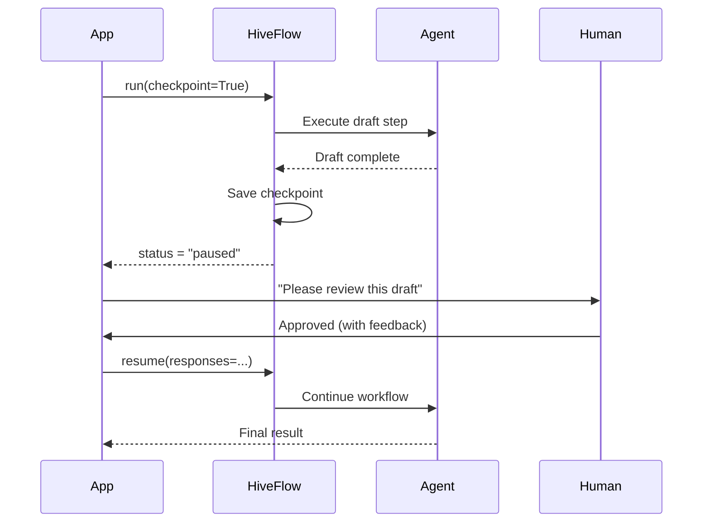

Workflows can pause at gates and resume later, even after process restarts:

```python
import asyncio
from hiveflow import HiveFlow
from hiveflow.core.checkpoint import FileCheckpointStorage

async def main():
    # FileCheckpointStorage persists state to .hiveflow/checkpoints/
    hf = HiveFlow(checkpoint_storage=FileCheckpointStorage())

    # Start workflow — pauses at human gate
    session = await hf.run(team="review_team", task="Draft a proposal", checkpoint=True)

    if session.status.value == "paused":
        # Inspect what the workflow is waiting for
        for req in session.pending_requests:
            print(f"Approval needed: {req.context}")

        # Resume with approval (works even after process restart)
        session = await hf.resume(
            session_id=session.session_id,
            responses={req.request_id: {"approved": True, "feedback": "Looks good"}},
        )

    print(session.result.state)

asyncio.run(main())
```

### Listing Checkpoints and Resuming from a Specific Point

Every pause point automatically saves a checkpoint. You can list all checkpoints for a session and resume from any of them:

```python
async def inspect_and_resume():
    hf = HiveFlow(checkpoint_storage=FileCheckpointStorage())

    # List all checkpoints for a session
    checkpoints = await hf.list_checkpoints("my-session-id")
    for cp in checkpoints:
        print(f" {cp['checkpoint_id']} — step {cp['step_index']} ({cp['current_agent_id']})")

    # Resume from a specific checkpoint (rewind to an earlier state)
    session = await hf.resume(
        session_id="my-session-id",
        responses={"approval": True},
        checkpoint_id=checkpoints[0]["checkpoint_id"], # Pick any saved checkpoint
    )
```

> **Next →** Need safety controls on actions like sending emails or deploying code? See [Action Executor](#action-executor-with-safety-policy).

---

## Action Executor with Safety Policy

> **Use Case:** Your agent performs real-world side effects — sending emails, creating database records, calling external APIs — and you need a human to approve each action before it executes.

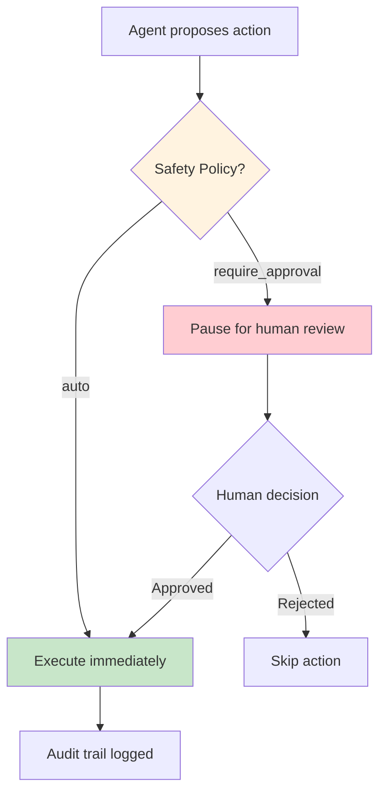

Agents that perform real-world side effects can require approval before executing:

```python
from hiveflow import HiveFlow

hf = HiveFlow()
session = hf.run_sync(
    team={
        "team_name": "action_team",
        "description": "Agent that sends emails",
        "agents": [
            {
                "id": "emailer",
                "role": "Email Sender",
                "behavior_type": "action_executor", # Can execute real-world actions
                "system_prompt": "Send emails as instructed.",
                "tools": ["send_email"],
                "action_policy": "require_approval", # Pause before every action
            }
        ],
        "workflow": {"steps": [{"agent": "emailer", "type": "sequential"}]},
    },
    task="Send a welcome email to new-user@example.com",
)

# Session pauses for action approval
if session.status.value == "paused":
    for req in session.pending_requests:
        print(f"Proposed action: {req.context}")
```

> ** Tip:** Use `action_policy: "auto"` to execute tools immediately with an audit trail — useful for low-risk actions in trusted environments.

> **Next →** Want to add approval checkpoints between workflow steps? See [Gated Workflow Steps](#gated-workflow-steps).

---

## Gated Workflow Steps

> **Use Case:** You have a multi-step pipeline (e.g., draft → review → publish) and need an explicit approval gate between steps — the workflow pauses at the gate until a human gives the green light.

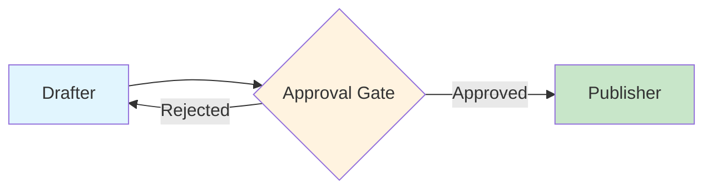

Add explicit approval gates between workflow steps:

```python
from hiveflow import HiveFlow

hf = HiveFlow()
session = hf.run_sync(
    team={
        "team_name": "gated_flow",
        "description": "Flow with a review gate",
        "agents": [
            {"id": "drafter", "role": "Drafter", "system_prompt": "Draft content.",
             "behavior_type": "llm_only"},
            {"id": "publisher", "role": "Publisher", "system_prompt": "Publish content.",
             "behavior_type": "action_executor", "tools": ["publish"],
             "action_policy": "auto"}, # Auto-execute after gate approval
        ],
        "workflow": {"steps": [
            # Step 1: Draft content
            {"agent": "drafter", "type": "sequential", "next": "approval_gate"},
            # Step 2: Gate — workflow pauses here for human review
            {"agent": "", "type": "gated", "gate_id": "approval_gate",
             "gate_description": "Review draft before publishing", "next": "publisher"},
            # Step 3: Publish (only runs after gate approval)
            {"agent": "publisher", "type": "sequential"},
        ]},
    },
    task="Write and publish a blog post about AI safety",
)
```

> **Next →** What if you don't know which agents you need? See [LLM-Generated Teams](#llm-generated-teams).

---

## LLM-Generated Teams

> **Use Case:** You have a task but don't know the right team structure — let the framework analyze your problem and design an optimal team with the right agents, tools, and workflow automatically.

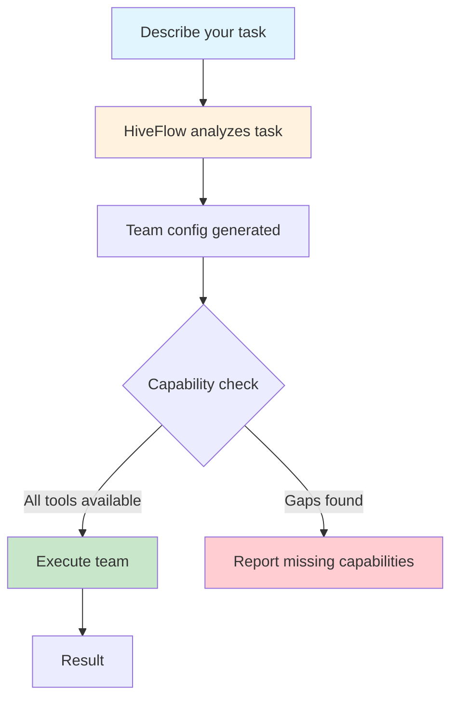

Ask the framework to design a team for a specific problem:

```python
import asyncio
from hiveflow import HiveFlow

async def main():
    hf = HiveFlow()
    # Describe your task — HiveFlow designs the team
    result = await hf.generate_team(task="Analyze competitor pricing strategies")

    print(f"Team: {result.config.team_name}")
    print(f"Agents: {[a.id for a in result.config.agents]}")

    # Check if the generated team can actually run (all tools available)
    if result.has_blocking_gaps:
        print(f"Blocking gaps: {[g.resource_id for g in result.capability_gaps]}")
    else:
        # Run the generated team directly
        session = await hf.run(team=result.config, task="Analyze competitor pricing")
        print(session.result.state)

asyncio.run(main())
```

> **Next →** Need to explore a topic in depth with recursive research? See [Deep Research](#deep-research).

---

## Discovery APIs

> **Use Case:** You want to explore what's available in the framework — list all team templates, agent archetypes, and registered tool plugins.

```python
from hiveflow import HiveFlow

hf = HiveFlow()
# Browse available team templates (pre-built configurations)
print("Teams:", hf.team_library().list_templates())
# Browse agent archetypes (reusable agent blueprints)
print("Archetypes:", hf.archetype_library().list_archetypes())
# Browse registered tool plugins
print("Tools:", [t.plugin_id for t in hf.tool_registry().list_plugins()])
```

---

## Run a Workflow Programmatically (Low-Level)

> **Use Case:** You need fine-grained control over the workflow engine — creating agents in code, configuring steps manually, and bypassing the `HiveFlow` facade for custom integrations or testing.

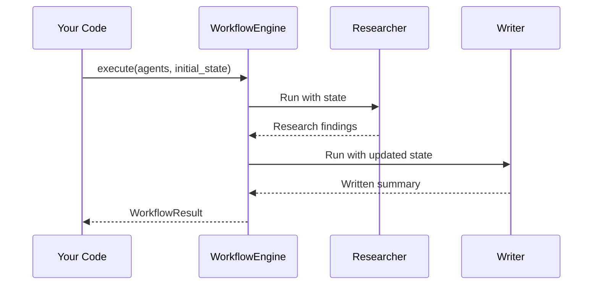

For direct access to the engine without the `HiveFlow` facade:

```python
import asyncio
from hiveflow import (
    Agent, AgentBehaviorType, WorkflowEngine, WorkflowStep,
)

async def main():
    # Define agents directly in code (no JSON config needed)
    researcher = Agent(
        agent_id="researcher",
        role="Researcher",
        system_prompt="Find relevant information about the given topic.",
        behavior_type=AgentBehaviorType.LLM_ONLY,
        model="openai:gpt-4o",
    )
    writer = Agent(
        agent_id="writer",
        role="Writer",
        system_prompt="Write a clear summary based on research findings.",
        behavior_type=AgentBehaviorType.LLM_ONLY,
        model="openai:gpt-4o",
    )

    # Define the sequential workflow: researcher → writer
    steps = [
        WorkflowStep(agent="researcher", step_type="sequential", next_step="writer"),
        WorkflowStep(agent="writer", step_type="sequential"),
    ]
    engine = WorkflowEngine(steps)

    # Execute the workflow with an initial state
    result = await engine.execute(
        agents={"researcher": researcher, "writer": writer},
        initial_state={"task": "Explain quantum computing"},
    )
    print(f"Status: {result.status}")
    print(f"Output: {result.state}")

asyncio.run(main())
```

---

## Use Team Templates

> **Use Case:** You want to use a pre-built team pattern (like a research report pipeline) or dynamically generate a team with optional review steps.

### Built-in Templates

| Template | Agents | Pipeline | Best For |
|----------|:------:|----------|----------|
| `research_report` | 6 | editor, researcher, reviewer, reviser, writer, publisher (with conditional review loop) | Comprehensive research reports |
| `code_review` | 3 | code_writer, reviewer, human_reviewer (with human gate) | Code generation with quality review |
| `content_creation` | -- | Content pipeline for article/blog creation | Article and blog writing |

```python
from hiveflow import TeamGenerator, TeamTemplateLibrary

# Load built-in templates
lib = TeamTemplateLibrary.default()
print(lib.list_templates()) # ['research_report', 'code_review', 'content_creation']

# Run a template directly
from hiveflow import HiveFlow
hf = HiveFlow()
session = hf.run_sync(team="research_report", task="AI safety trends 2025")

# Or generate a team dynamically with review steps
gen = TeamGenerator()
team = gen.generate_team(
    "Write a comprehensive report about AI safety",
    include_review=True, # Adds a review agent to the pipeline
)
```

---

## Deep Research

> **Use Case:** You need to explore a topic in depth — the framework recursively generates sub-queries, researches each branch, and synthesizes findings across all branches. Think of it as a "research tree" that grows wider (breadth) and deeper (depth) with each iteration.

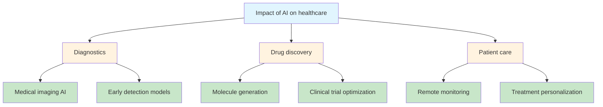

```python
import asyncio
from hiveflow import DeepResearcher, DeepResearchConfig

# Plug in your own research function (web search, database query, etc.)
async def my_research_fn(query, context):
    return {"findings": f"Research on: {query}", "citations": []}

# Plug in your own query generator (or use the built-in LLM-based one)
async def my_query_gen(query, breadth):
    return [f"{query} - aspect {i}" for i in range(breadth)]

async def main():
    researcher = DeepResearcher(
        config=DeepResearchConfig(
            breadth=3, # Generate 3 sub-queries per level
            depth=2, # Recurse 2 levels deep
            concurrency=4, # Run up to 4 research calls in parallel
        ),
        research_fn=my_research_fn,
        query_generator_fn=my_query_gen,
    )
    result = await researcher.research("Impact of AI on healthcare")
    state = researcher.get_research_state(result)
    print(f"Findings: {len(result.all_findings)} branches")
    print(f"Citations: {researcher.citations.count}")

asyncio.run(main())
```

> **Next →** Working with long pipelines where context grows too large? See [Context Management](#context-management).

---

## Context Management

> **Use Case:** You have a multi-step workflow where context grows with every agent — a planner generates sub-tasks, researchers write sections in parallel, and an analyst needs to see everything without hitting token limits. HiveFlow automatically compresses and assembles context between agents.

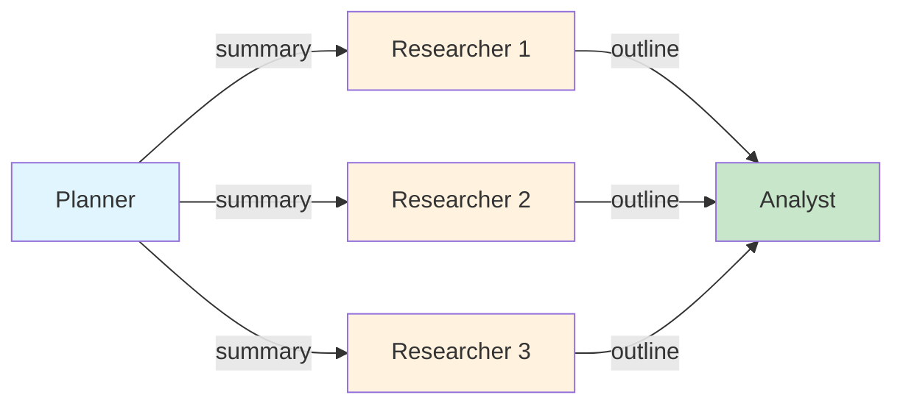

For multi-step workflows, HiveFlow automatically compresses context between agents. Enable it by passing a `SummaryGenerator` to the workflow engine:

```python
import asyncio
from hiveflow import (
    Agent, AgentBehaviorType, WorkflowEngine, WorkflowStep,
)
from hiveflow.core.summarizer import SummaryGenerator

async def main():
    provider = ... # your LLM provider

    planner = Agent(
        agent_id="planner",
        role="Planner",
        system_prompt="Break the task into 3 independent sub-tasks. Respond with JSON: {\"sub_tasks\": [...]}",
        behavior_type=AgentBehaviorType.ORCHESTRATOR,
        model="openai:gpt-4o",
        output_type="structured_data", # Controls compression ratio (0.5x budget)
    )
    researcher = Agent(
        agent_id="researcher",
        role="Researcher",
        system_prompt="Write a detailed section for your assigned sub-task.",
        behavior_type=AgentBehaviorType.LLM_ONLY,
        model="openai:gpt-4o",
        output_type="data", # Low compression ratio — data is condensed aggressively
    )
    analyst = Agent(
        agent_id="analyst",
        role="Analyst",
        system_prompt="Analyze the research outline and identify key themes.",
        behavior_type=AgentBehaviorType.LLM_ONLY,
        model="openai:gpt-4o",
        context_budget=3000, # Cap assembled context at 3000 words
        context_recency_window=2, # Only see 2 most recent summaries
        output_type="reasoning", # High compression ratio — reasoning gets 2x budget
    )

    steps = [
        WorkflowStep(agent="planner", step_type="sequential", next_step="researcher",
                      context_ttl=2), # Planner summary expires after 2 downstream steps
        # Fan-out: run researcher in parallel for each sub-task
        WorkflowStep(agent="researcher", step_type="parallel_fan_out", next_step="analyst"),
        WorkflowStep(agent="analyst", step_type="sequential"),
    ]

    summarizer = SummaryGenerator(
        llm_provider=provider,
        model="openai:gpt-4o-mini", # Use a fast model for summarization
        max_summary_tokens=200, # Max tokens per summary
        max_outline_tokens=800, # Max tokens for outlines
        summary_threshold=100, # Skip summarization for outputs under 100 words
    )

    engine = WorkflowEngine(
        steps,
        summarizer=summarizer,
        assembly_agents=["researcher"], # Stitch researcher outputs into final_output
    )

    result = await engine.execute(
        agents={"planner": planner, "researcher": researcher, "analyst": analyst},
        initial_state={"task": "Compare three cloud providers for ML workloads"},
    )

    # Summaries are in state["planner_summary"], state["researcher_outline"], etc.
    print(result.state["final_output"])

asyncio.run(main())
```

### Key Parameters

| Parameter | Effect |
|-----------|--------|
| **`output_type`** | Controls differential compression — `reasoning` gets 2× summary budget, `data` gets 0.5× |
| **`context_budget`** | Caps assembled context in words for a specific agent |
| **`context_recency_window`** | Sliding window that collapses old summaries |
| **`context_ttl`** | Per-step TTL that expires summaries after N downstream steps |
| **`summary_threshold`** | Minimum word count before summarization activates (shorter outputs pass through unchanged) |
| **`assembly_agents`** | Agents whose outputs are stitched into `final_output` by Python code (no LLM call) |

See [architecture.md](architecture.md#context-management) for the full strategy reference and `examples/agents_and_teams/09_context_management.py` for a runnable end-to-end example.

---

## Next Steps

- **[Architecture](architecture.md)** — understand how the pieces fit together
- **[Configuration](configuration.md)** — environment variables and tier selection
- **[LLM Providers](llm-providers.md)** — set up OpenAI, Anthropic, or Azure
- **[Plugins](plugins.md)** — create custom tools and providers
