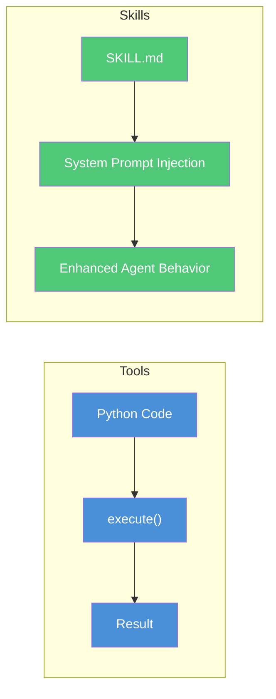
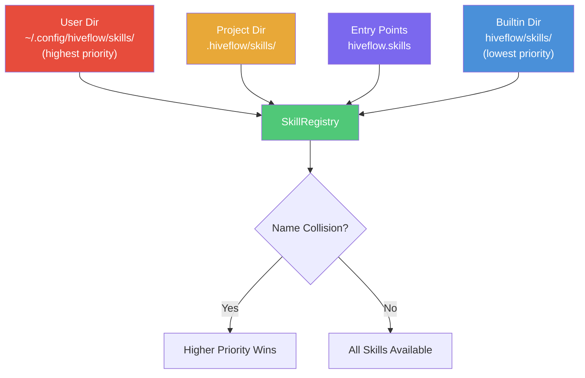
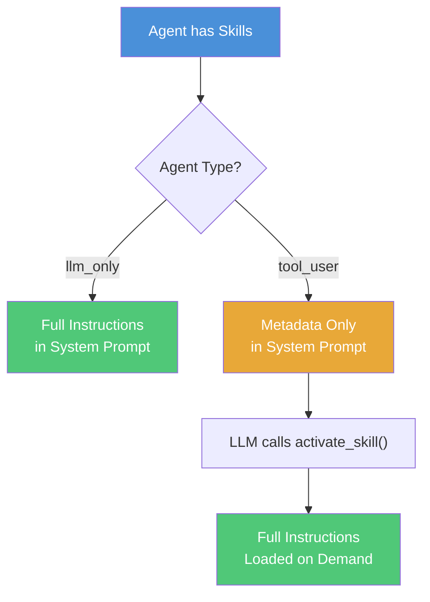

# Agent Skills

Agent Skills are prompt-based instruction packages that teach agents **how to approach** specific categories of tasks. They follow the open [agentskills.io](https://agentskills.io) standard.

> **Use case:** Use skills to teach agents domain expertise without writing code — for example, giving a reviewer agent a `code-review` skill that includes your team's review checklist, or giving a writer agent a `document-writing` skill with your organization's style guide.

## Skills vs Tools

Skills and tools are complementary. An agent can have both tools (what it *can do*) and skills (how it *should approach* a task).



| Aspect | Tools (`ToolPlugin`) | Skills (`Skill`) |
|--------|---------------------|------------------|
| What they are | Code-based plugins with `execute()` method | Markdown instruction packages |
| Purpose | Atomic function calls (search, retrieve, compute) | Multi-step domain expertise |
| Discovery | Python entry points + drop-in directories | Filesystem scanning for `SKILL.md` files |
| Integration | LLM function calling (OpenAI-compatible spec) | System prompt injection |
| Format | Python classes | `SKILL.md` with YAML frontmatter |

## Quick Start

```python
from hiveflow import HiveFlow
from hiveflow.plugins.skills import SkillRegistry

# Create and discover skills
registry = SkillRegistry()
registry.discover()

# Use skills in a workflow
hf = HiveFlow(skill_registry=registry)
session = hf.run_sync(
    team={
        "team_name": "review_team",
        "description": "Code review workflow",
        "agents": [
            {
                "id": "reviewer",
                "role": "Code Reviewer",
                "system_prompt": "You are a senior code reviewer.",
                "behavior_type": "llm_only",
                "skills": ["code-review"],
            }
        ],
        "workflow": {
            "steps": [{"agent": "reviewer", "type": "sequential"}]
        },
    },
    task="Review the authentication module.",
)
```

## SKILL.md Format

Each skill is a directory containing a `SKILL.md` file with YAML frontmatter and Markdown instructions.

### SKILL.md Structure

```

  --- (YAML Frontmatter) 
  name: my-skill 
  description: What this skill does... 
  license: Apache-2.0 
  compatibility: Python 3.11+ 
  metadata: 
    author: your-org 
    version: "1.0" 
  allowed-tools: Bash Read Write 
  --- 

  # My Skill (Markdown) 
                                         
  ## When to use this skill 
  Activate when... 
                                         
  ## Step-by-step instructions 
  1. First, ... 
  2. Then, ... 
                                         
  ## Output format 
  Structure your output as... 

```

### Required Fields

| Field | Constraints |
|-------|-------------|
| `name` | 1-64 chars, lowercase alphanumeric + hyphens, must match directory name |
| `description` | 1-1024 chars, describes what it does AND when to use it |

### Optional Fields

| Field | Purpose |
|-------|---------|
| `license` | License name or path to bundled license file |
| `compatibility` | Environment requirements (max 500 chars) |
| `metadata` | Arbitrary key-value pairs (author, version, tags) |
| `allowed-tools` | Space-delimited list of pre-approved tool IDs |

## Skill Discovery

Skills are discovered from multiple directories with priority override (higher tiers override lower on name collision):

### Skill Discovery Flow



1. **user** `~/.config/hiveflow/skills/` (or `HIVEFLOW_SKILLS_DIR` env var) — highest priority
2. **project** `.hiveflow/skills/` (relative to working directory)
3. **entrypoint** Python entry points under `hiveflow.skills`
4. **builtin** `hiveflow/skills/` (shipped with the package) — lowest priority

## Progressive Disclosure

To keep context usage efficient, skills use a two-tier loading strategy based on agent type:



- **`llm_only` agents**: Full skill instructions are appended to the system prompt. Since these agents have no tool-calling loop, instructions must be available upfront.

- **`tool_user` agents**: Only skill metadata (name + description in `<available_skills>` XML) is in the system prompt. A `SkillActivationTool` is auto-injected, allowing the LLM to call `activate_skill(skill_name="...")` to load full instructions on demand.

> **Tip:** Progressive disclosure keeps token usage low for `tool_user` agents — skill instructions are only loaded when the agent decides they're relevant.

## Built-in Skills

HiveFlow ships with four built-in skills:

| Skill | Description |
|-------|-------------|
| `code-review` | Systematic code review methodology |
| `research-synthesis` | Multi-source research synthesis |
| `structured-extraction` | Extract structured data from text |
| `document-writing` | Professional document creation |

### code-review

Systematic code review methodology -- teaches agents to check for bugs, security issues, performance problems, and code style. Follows a structured checklist approach covering correctness, error handling, edge cases, and maintainability.

```json
{
    "id": "reviewer",
    "role": "Code Reviewer",
    "system_prompt": "You are a senior code reviewer.",
    "behavior_type": "llm_only",
    "skills": ["code-review"]
}
```

### research-synthesis

Multi-source research synthesis -- teaches agents to gather information from multiple sources, cross-reference findings, identify consensus and disagreements, and produce balanced summaries with proper attribution.

```json
{
    "id": "researcher",
    "role": "Research Analyst",
    "system_prompt": "You are a research analyst specializing in literature review.",
    "behavior_type": "llm_only",
    "skills": ["research-synthesis"]
}
```

### structured-extraction

Extract structured data from unstructured text -- teaches agents to identify entities, relationships, and data points, then output them in a specified schema (JSON). Useful for parsing reports, contracts, or any document into machine-readable format.

```json
{
    "id": "extractor",
    "role": "Data Extractor",
    "system_prompt": "You extract structured data from documents.",
    "behavior_type": "llm_only",
    "skills": ["structured-extraction"]
}
```

### document-writing

Professional document creation -- teaches agents to structure documents with clear headings, logical flow, appropriate tone, and consistent formatting. Covers outline planning, section transitions, and audience-appropriate language.

```json
{
    "id": "writer",
    "role": "Technical Writer",
    "system_prompt": "You write clear, well-structured technical documents.",
    "behavior_type": "llm_only",
    "skills": ["document-writing"]
}
```

## Creating Custom Skills

1. Create a directory under `.hiveflow/skills/` (project-level) or `~/.config/hiveflow/skills/` (user-level):

```
.hiveflow/skills/
  my-custom-skill/
    SKILL.md
    scripts/ # Optional helper scripts
    references/ # Optional reference docs (loaded into context)
    assets/ # Optional assets (NOT loaded into context)
```

2. Write your `SKILL.md` with frontmatter and instructions.

3. The skill will be automatically discovered on the next `registry.discover()` call.

## API Reference

### SkillRegistry

```python
from hiveflow.plugins.skills import SkillRegistry

registry = SkillRegistry(
    builtin_dir=Path("hiveflow/skills"), # Optional
    project_dir=Path(".hiveflow/skills"), # Optional
    user_dir=Path("~/.config/hiveflow/skills"), # Optional
)
registry.discover()

# List skills
registry.list_skills() # ["code-review", "document-writing", ...]

# Get metadata (frontmatter only)
meta = registry.get_metadata("code-review")

# Load full skill
skill = registry.get_skill("code-review")
print(skill.instructions)

# Generate system prompt XML
xml = registry.get_prompt_section(["code-review", "research-synthesis"])
```

### SkillActivationTool

Auto-injected for `tool_user` agents with skills. The LLM calls it to load instructions:

```python
from hiveflow.plugins.skills import SkillActivationTool

tool = SkillActivationTool(available_skills={"code-review": skill})
result = await tool.execute({"skill_name": "code-review"})
# result["instructions"] contains the full SKILL.md body
```

### Global Registry

```python
from hiveflow.plugins.skills import get_skill_registry, reset_skill_registry

# Auto-discovers from default tiers
registry = get_skill_registry()

# Reset (mainly for testing)
reset_skill_registry()
```
