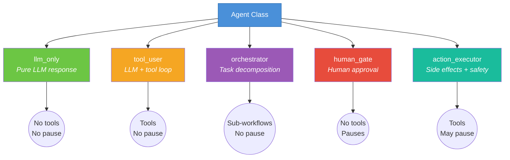
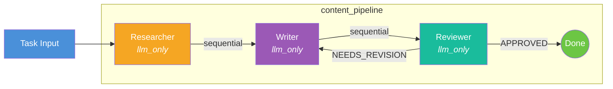
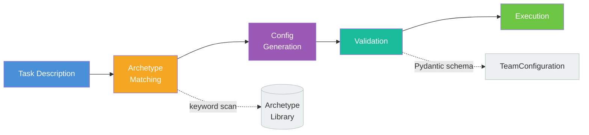
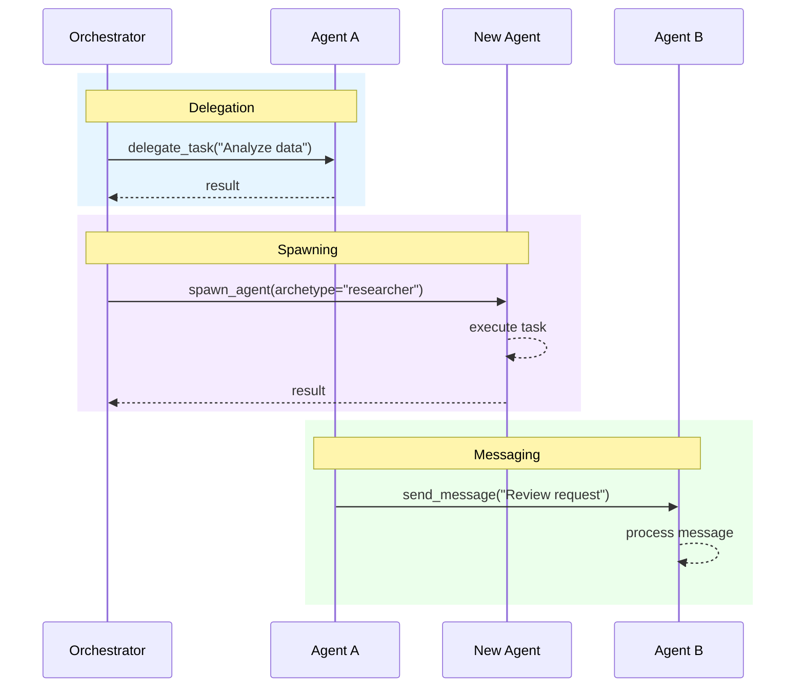

# Agents & Teams Guide

This guide covers how to build agents, compose them into teams, use archetypes, and leverage dynamic team generation.

## Concepts

- **Agent** — A unit of work with a role, system prompt, behavior type, and optional tools
- **Team** — A collection of agents wired together in a workflow
- **Archetype** — A reusable agent template (researcher, writer, reviewer, etc.)
- **TeamConfiguration** — A validated Pydantic schema for declarative team definitions

## Agent Behavior Types

Every agent is an instance of the same `Agent` class, specialized through its `behavior_type`:

| Behavior Type | Description | Tools? | Pauses? |
|---------------|-------------|--------|---------|
| `llm_only` | Pure LLM response from state | No | No |
| `tool_user` | LLM with tool access in a loop | Yes | No |
| `orchestrator` | Decomposes tasks, manages sub-workflows | No | No |
| `human_gate` | Pauses for human approval/input | No | Yes |
| `action_executor` | Performs real-world side effects with safety policies | Yes | Maybe |

The following diagram shows how a single `Agent` class branches into five distinct behavior types:



> ** When to use `llm_only`**: Best for straightforward text generation — summarization, drafting, translation, or any task where the LLM has all the context it needs in the prompt. This is the simplest and fastest behavior type.

> ** When to use `tool_user`**: Choose this when the agent needs to interact with external systems — web search, database queries, API calls, or file operations. The agent runs an LLM→tool→LLM loop until it has a final answer.

> ** When to use `orchestrator`**: Use for complex, multi-step tasks that need to be broken down. Orchestrators delegate work to other agents, manage sub-workflows, and synthesize results. They are the "managers" of your team.

> ** When to use `human_gate`**: Use when a workflow step requires human judgment, approval, or manual input before proceeding — e.g., content sign-off, deployment approval, or sensitive data review.

> ** When to use `action_executor`**: Use for agents that perform real-world side effects: sending emails, deploying code, writing to databases. Supports `auto` and `require_approval` safety policies to control risk.

### Creating Agents Programmatically

```python
from hiveflow import Agent, AgentBehaviorType

researcher = Agent(
    agent_id="researcher",
    role="Research Analyst",
    system_prompt="Research the given topic and provide key findings with data.",
    behavior_type=AgentBehaviorType.LLM_ONLY,
    model="openai:gpt-4o",
)

writer = Agent(
    agent_id="writer",
    role="Writer",
    system_prompt="Write a clear report based on research findings.",
    behavior_type=AgentBehaviorType.LLM_ONLY,
    model="$SMART_LLM", # Resolved at runtime via config
    context_budget=4000, # Limit context to 4000 words
)
```

### Agent with Tools

```python
from hiveflow import Agent, AgentBehaviorType
from hiveflow.plugins.tools import ToolPlugin

class WebSearchTool(ToolPlugin):
    @property
    def plugin_id(self) -> str:
        return "web_search"

    @property
    def description(self) -> str:
        return "Search the web"

    def to_llm_tool_spec(self) -> dict:
        return {
            "type": "function",
            "function": {
                "name": "web_search",
                "description": "Search the web for information",
                "parameters": {
                    "type": "object",
                    "properties": {"query": {"type": "string"}},
                    "required": ["query"],
                },
            },
        }

    async def execute(self, **kwargs) -> str:
        return f"Results for: {kwargs.get('query', '')}"

tool_agent = Agent(
    agent_id="searcher",
    role="Web Searcher",
    system_prompt="Search the web to find relevant information.",
    behavior_type=AgentBehaviorType.TOOL_USER,
    tools=[WebSearchTool()],
    max_tool_iterations=5,
)
```

### Action Executor with Safety Policy

Action executors perform real-world side effects and support two safety policies:

```python
# Auto mode — execute immediately, record audit trail
emailer = Agent(
    agent_id="emailer",
    role="Email Sender",
    system_prompt="Send emails as instructed.",
    behavior_type=AgentBehaviorType.ACTION_EXECUTOR,
    tools=[send_email_tool],
    action_policy="auto",
)

# Approval mode — pause for review before executing
deployer = Agent(
    agent_id="deployer",
    role="Deployer",
    system_prompt="Deploy code to production.",
    behavior_type=AgentBehaviorType.ACTION_EXECUTOR,
    tools=[deploy_tool],
    action_policy="require_approval",
)
```

### Model Requirements

Instead of specifying a model by name, declare what capabilities you need:

```python
from hiveflow import Agent, AgentBehaviorType

agent = Agent(
    agent_id="analyzer",
    role="Code Analyzer",
    system_prompt="Analyze code quality.",
    behavior_type=AgentBehaviorType.TOOL_USER,
    tools=[code_lint_tool],
)
```

In a team configuration JSON, use `model_requirements`:

```json
{
    "id": "analyzer",
    "behavior_type": "tool_user",
    "model_requirements": {
        "cost_tier": "smart",
        "supports_tools": true,
        "strengths": ["reasoning", "coding"]
    }
}
```

The `cost_tier` maps to the three LLM tiers: `fast` → `$FAST_LLM`, `smart` → `$SMART_LLM`, `strategic` → `$STRATEGIC_LLM`.

## Team Configuration

Teams are defined declaratively as JSON or YAML. The diagram below illustrates how agents compose into a team with sequential and conditional workflow connections:



```json
{
    "team_name": "content_pipeline",
    "description": "Research, write, and review content",
    "agents": [
        {
            "id": "researcher",
            "role": "Researcher",
            "system_prompt": "Research the topic thoroughly.",
            "behavior_type": "llm_only",
            "model": "$SMART_LLM"
        },
        {
            "id": "writer",
            "role": "Writer",
            "system_prompt": "Write a polished article from the research.",
            "behavior_type": "llm_only",
            "model": "$SMART_LLM"
        },
        {
            "id": "reviewer",
            "role": "Reviewer",
            "system_prompt": "Review the article for accuracy and clarity. Respond with 'APPROVED' or 'NEEDS_REVISION'.",
            "behavior_type": "llm_only",
            "model": "$STRATEGIC_LLM"
        }
    ],
    "workflow": {
        "steps": [
            {"agent": "researcher", "type": "sequential", "next": "writer"},
            {"agent": "writer", "type": "sequential", "next": "reviewer"},
            {
                "agent": "reviewer",
                "type": "conditional",
                "next_on_accept": null,
                "next_on_reject": "writer",
                "max_iterations": 3
            }
        ]
    }
}
```

### Loading Team Configurations

```python
from hiveflow import TeamConfiguration

# From a JSON file
config = TeamConfiguration.from_json_file("team_config.json")

# From a dictionary
config = TeamConfiguration(**team_dict)

# Inspect the configuration
print(f"Team: {config.team_name}")
print(f"Agents: {[a.id for a in config.agents]}")
print(f"Steps: {len(config.workflow.steps)}")
```

### Running a Team

Three ways to specify a team when calling `HiveFlow.run()`:

```python
from hiveflow import HiveFlow

hf = HiveFlow()

# 1. By template name (from TeamTemplateLibrary)
session = hf.run_sync(team="research_report", task="AI trends")

# 2. By dict
session = hf.run_sync(team={"team_name": "...", ...}, task="...")

# 3. By TeamConfiguration object
config = TeamConfiguration(**my_dict)
session = hf.run_sync(team=config, task="...")
```

## Archetypes

Archetypes are reusable agent building blocks. HiveFlow ships with six built-in archetypes:

| Archetype | Role | Behavior Type | System Prompt Summary | Best For |
|-----------|------|---------------|-----------------------|----------|
| `researcher` | Research Analyst | `llm_only` | Research topics, find key data | Information gathering |
| `planner` | Strategic Planner | `orchestrator` | Break tasks into sub-tasks | Task decomposition |
| `writer` | Content Writer | `llm_only` | Write clear, polished content | Report/article generation |
| `reviewer` | Quality Reviewer | `llm_only` | Review for accuracy, clarity | Quality assurance loops |
| `editor` | Copy Editor | `llm_only` | Polish grammar, style, flow | Final editing passes |
| `human_reviewer` | Human Reviewer | `human_gate` | Pause for human feedback | Approval gates |

### Using Archetypes

```python
from hiveflow import ArchetypeLibrary

lib = ArchetypeLibrary.default()
print(lib.list_archetypes()) # ['researcher', 'planner', 'writer', ...]

# Get an archetype definition
researcher = lib.get("researcher")
print(researcher["role"])
print(researcher["system_prompt"][:80])
```

### Custom Archetypes

```python
lib.register("data_analyst", {
    "id": "data_analyst",
    "role": "Data Analyst",
    "system_prompt": "Analyze data and produce statistical insights.",
    "behavior_type": "tool_user",
    "tools": ["data_query"],
    "model": "$SMART_LLM",
})
```

Or load from JSON files:

```python
lib = ArchetypeLibrary.from_directory("./my_archetypes")
```

## Dynamic Team Generation

`TeamGenerator` creates teams from task descriptions using archetype matching. The flow below shows each stage of the generation pipeline:



```python
from hiveflow import TeamGenerator

generator = TeamGenerator()

# Deterministic archetype matching (no LLM call)
config = generator.generate_team(
    task_description="Analyze competitive landscape and write a strategy report",
    include_review=True,
)

print(config["team_name"])
print([a["id"] for a in config["agents"]])
```

### Building Agents from Generated Config

```python
# Build live agents and workflow engine from the config
agents, engine = generator.build(config, llm_provider, model="openai:gpt-4o")

# Execute
import asyncio
result = asyncio.run(engine.execute(
    agents, {"task": "Analyze competitive landscape"}
))
```

### LLM-Generated Teams

For more sophisticated team generation, use `HiveFlow.generate_team()`:

```python
import asyncio
from hiveflow import HiveFlow

async def main():
    hf = HiveFlow()
    result = await hf.generate_team(task="Design a data migration pipeline")

    print(f"Team: {result.config['team_name']}")
    print(f"Agents: {[a['id'] for a in result.config['agents']]}")

    # Check for capability gaps
    if result.has_blocking_gaps:
        for gap in result.capability_gaps:
            print(f" Missing: {gap.resource_id} ({gap.severity})")
    else:
        session = await hf.run(team=result.config, task="Migrate the database")

asyncio.run(main())
```

### Capability Gap Detection

When generating teams, HiveFlow checks whether required tools are registered:

| Severity | Meaning |
|----------|---------|
| `blocking` | Team cannot function without this resource |
| `degraded` | Quality will be reduced but team can operate |
| `functional_but_limited` | Minor capability loss |

## Failure Policies

Each agent can specify how failures are handled:

```json
{
    "id": "researcher",
    "on_failure": "retry",
    "max_retries": 3
}
```

| Policy | Behavior |
|--------|----------|
| `fail` (default) | Workflow fails immediately |
| `retry` | Retry up to `max_retries` times |
| `skip` | Skip agent, continue workflow |

## Output Types

Each agent produces a specific type of output that controls downstream context compression:

| Output Type | Compression Multiplier | Default For |
|-------------|----------------------|-------------|
| `text` | 1x | `llm_only`, `tool_user`, `human_gate` |
| `reasoning` | 2x (more context preserved) | — |
| `structured_data` | 2x | `orchestrator` |
| `data` | 0.5x (aggressively compressed) | — |
| `side_effect` | 0.5x | `action_executor` |

Set `output_type` on either the `Agent` constructor or in the team config JSON.

## Dynamic Agent Collaboration

Enable dynamic collaboration to let orchestrator agents delegate work, spawn specialists, exchange messages, and create structured task plans at runtime.

The sequence diagram below shows the three core collaboration patterns — delegation, spawning, and messaging:



### Enabling Collaboration

Add a `collaboration` section to your team configuration:

```python
team_config = {
    "team_name": "collaborative_team",
    "description": "Team with dynamic collaboration",
    "collaboration": {
        "enabled": True,
        "max_delegation_depth": 3,
        "max_spawned_agents": 10,
        "delegation_timeout_seconds": 300,
        "budget_policy": "inherit_parent",
    },
    "agents": [...],
    "workflow": {...},
}
```

When `collaboration.enabled` is `True`, the framework automatically injects tools into agents:

| Agent Type | Injected Tools |
|-----------|---------------|
| All agents | `send_message`, `read_messages` |
| Orchestrators only | `delegate_task`, `spawn_agent`, `plan_and_execute` |

### Delegation

Orchestrator agents use `delegate_task` to assign sub-tasks to other agents:

```
Orchestrator calls delegate_task:
  task: "Analyze the quarterly revenue data"
  delegate_to: "analyst" # or "auto" for auto-selection
```

The runtime handles depth tracking, timeout enforcement, and budget control. If `delegate_to` is `"auto"`, the system selects the best agent based on role keyword matching, or spawns a fallback agent if none match.

### Spawning Agents

Orchestrators can create new agents at runtime from the archetype library or from custom definitions:

```
# From archetype
Orchestrator calls spawn_agent:
  archetype: "researcher"

# Custom definition
Orchestrator calls spawn_agent:
  custom_definition:
    role: "Legal Analyst"
    system_prompt: "You specialize in contract law..."
```

### Task Planning

The `plan_and_execute` tool lets orchestrators create structured plans with dependency ordering:

```
Orchestrator calls plan_and_execute:
  plan:
    sub_tasks:
      - id: "st_1"
        description: "Research market trends"
        assigned_to: "researcher"
      - id: "st_2"
        description: "Analyze competitor data"
        assigned_to: "analyst"
      - id: "st_3"
        description: "Write executive summary"
        assigned_to: "writer"
        depends_on: ["st_1", "st_2"]
```

Sub-tasks `st_1` and `st_2` run concurrently (no shared dependencies), while `st_3` waits for both to complete.

### Inter-Agent Messaging

All agents (not just orchestrators) can send and receive messages:

```
Agent A calls send_message:
  to: "agent_b"
  subject: "Review request"
  body: "Please review this draft..."

Agent B sees the message in its context automatically.
```

### Configuration Options

| Option | Default | Description |
|--------|---------|-------------|
| `enabled` | `false` | Enable collaboration tools |
| `max_delegation_depth` | `3` | Maximum nesting depth for delegation chains |
| `max_spawned_agents` | `10` | Maximum agents spawnable per execution |
| `delegation_timeout_seconds` | `300` | Per-delegation timeout |
| `allow_recursive_orchestrators` | `false` | Allow spawned agents to be orchestrators |
| `budget_policy` | `"inherit_parent"` | Budget propagation: `inherit_parent`, `fixed`, `unlimited` |
| `fixed_budget_tokens` | `None` | Token budget when `budget_policy` is `fixed` |

### Observability

All collaboration operations emit stream events:

- `AGENT_SPAWNED` — a new agent was created at runtime
- `DELEGATION_STARTED` — delegation to another agent began
- `DELEGATION_COMPLETED` — delegated task finished successfully
- `DELEGATION_FAILED` — delegated task failed or timed out
- `MESSAGE_SENT` — an inter-agent message was sent
- `PLAN_CREATED` — a structured task plan was created

> **Note:** HiveFlow defines 32 total event types covering the full workflow lifecycle. The six above are collaboration-specific. See the [Streaming SDK Reference](../sdk/streaming.md) for the complete list.

## Tone System

The tone system lets you control the voice and style of text-producing agents. It ships with 17 built-in tones and supports custom tones via YAML files or programmatic registration.

### How Tone Injection Works


The `ToneCatalog` resolves a tone ID to a `ToneDefinition`, then `inject_tone()` appends the tone's `prompt_modifier` to the agent's system prompt as a clearly delineated section.

Tone injection only applies to agents with `behavior_type` of `llm_only` or `tool_user`. Orchestrators, human gates, and action executors are unaffected. The helper `should_inject_tone(behavior_type)` returns `True` only for text-producing agent types.

### ToneDefinition Model

Each tone is a Pydantic model with four fields:

| Field | Type | Description |
|-------|------|-------------|
| `tone_id` | `str` | Unique identifier (e.g., `"formal"`, `"executive"`) |
| `label` | `str` | Human-readable display name |
| `description` | `str` | Purpose description |
| `prompt_modifier` | `str` | 1-3 sentence instruction injected into agent prompts |

### Built-in Tones

HiveFlow ships with 17 tones covering common writing styles:

| Tone ID | Label | Purpose |
|---------|-------|---------|
| `objective` | Objective | Impartial, unbiased presentation of facts |
| `formal` | Formal | Academic standards with sophisticated language |
| `analytical` | Analytical | Critical evaluation of data and theories |
| `persuasive` | Persuasive | Convincing the audience of a viewpoint |
| `informative` | Informative | Clear, comprehensive information |
| `explanatory` | Explanatory | Clarifying complex concepts |
| `descriptive` | Descriptive | Detailed depiction of phenomena |
| `critical` | Critical | Judging validity and relevance |
| `comparative` | Comparative | Juxtaposing alternatives to highlight differences |
| `speculative` | Speculative | Exploring hypotheses and implications |
| `reflective` | Reflective | Considering process and insights |
| `narrative` | Narrative | Storytelling to illustrate findings |
| `humorous` | Humorous | Light-hearted, engaging content |
| `optimistic` | Optimistic | Highlighting positive findings and benefits |
| `pessimistic` | Pessimistic | Focusing on limitations and challenges |
| `concise` | Concise | Brief and to the point |
| `executive` | Executive | High-level summary for decision-makers |

### ToneCatalog API

The `ToneCatalog` class manages tone resolution and registration:

| Method | Description |
|--------|-------------|
| `resolve(tone_id)` | Look up a tone by ID. Returns `ToneDefinition` or `None` (with a warning log listing available tones). |
| `register(tone)` | Register a custom `ToneDefinition`. Overrides built-in tones on ID collision. |
| `list_tones()` | Return a sorted list of all available tone IDs. |

### Setting Tone in Team Config

Set the `tone` field at the team level in your JSON or YAML configuration:

```json
{
    "team_name": "executive_report",
    "tone": "executive",
    "agents": [
        {
            "id": "researcher",
            "role": "Researcher",
            "system_prompt": "Research the given topic.",
            "behavior_type": "llm_only"
        },
        {
            "id": "writer",
            "role": "Writer",
            "system_prompt": "Write an executive summary.",
            "behavior_type": "llm_only"
        }
    ],
    "workflow": {
        "steps": [
            {"agent": "researcher", "type": "sequential", "next": "writer"}
        ]
    }
}
```

### Setting Tone Programmatically

```python
from hiveflow.core.tone import ToneCatalog, ToneDefinition, inject_tone, should_inject_tone

# Resolve a built-in tone
catalog = ToneCatalog()
print(catalog.list_tones())  # ['analytical', 'comparative', 'concise', ...]

tone = catalog.resolve("executive")
print(tone.prompt_modifier)

# Register a custom tone
catalog.register(ToneDefinition(
    tone_id="technical",
    label="Technical",
    description="Precise technical language for engineering audiences",
    prompt_modifier=(
        "Write in a precise, technical tone. Use domain-specific terminology "
        "accurately. Favor clarity and specificity over narrative flow."
    ),
))

# Inject tone into a system prompt (only for text-producing agents)
if should_inject_tone("llm_only"):
    augmented = inject_tone("You are a research analyst.", tone)
    # Result: "You are a research analyst.\n\nTONE & STYLE — Executive\n..."
```

> **When to use tones:** Use tones when you need consistent voice across agents -- for example, executive summaries need the `executive` tone, research drafts need `analytical`, and user-facing content may need `informative` or `concise`. Set the tone once at the team level and all text-producing agents pick it up automatically.

## Examples

| Example | Description |
|---------|-------------|
| [01_team_from_config.py](../../examples/agents_and_teams/01_team_from_config.py) | Define and run a team from inline config |
| [02_failure_policies.py](../../examples/agents_and_teams/02_failure_policies.py) | Per-agent failure policies |
| [03_archetypes.py](../../examples/agents_and_teams/03_archetypes.py) | Browse and compose from archetype library |
| [07_llm_team_generation.py](../../examples/agents_and_teams/07_llm_team_generation.py) | LLM-generated team composition |
| [08_e2e_llm_team.py](../../examples/agents_and_teams/08_e2e_llm_team.py) | Full pipeline: generate → build → execute → publish |
| [11_delegation.py](../../examples/agents_and_teams/11_delegation.py) | Orchestrator delegates to team members dynamically |
| [12_spawn_and_delegate.py](../../examples/agents_and_teams/12_spawn_and_delegate.py) | Spawn specialists from archetypes on-demand |
| [13_collaborative_planning.py](../../examples/agents_and_teams/13_collaborative_planning.py) | Structured task planning with concurrent execution |

See the [Agents & Teams examples](../../examples/agents_and_teams/) directory for the full set.
