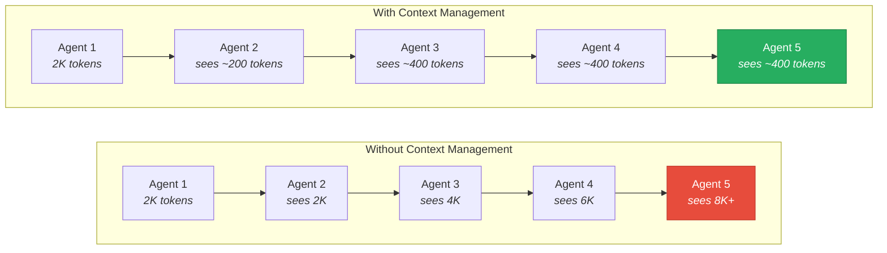
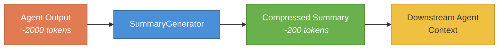
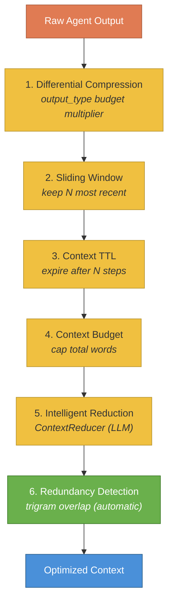
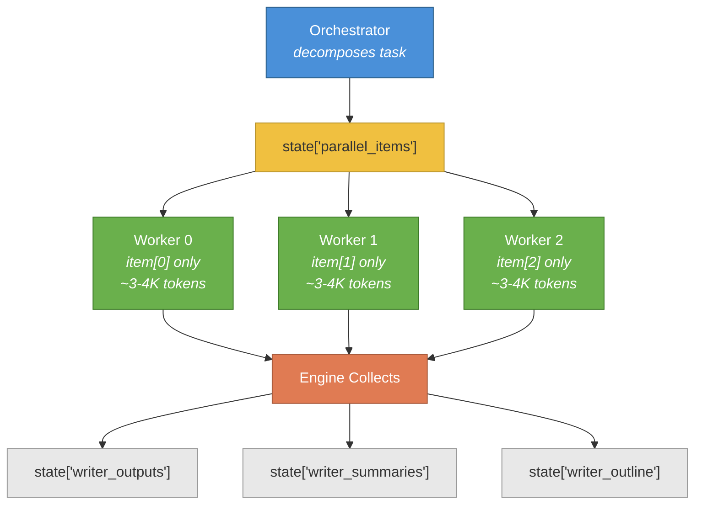

# Context Management Guide

This guide covers how HiveFlow manages context flow between agents in multi-step workflows, preventing context overflow while preserving essential information. Effective context management is the difference between a multi-agent workflow that degrades gracefully and one that collapses under token bloat.

> ** When to worry about context:** If your workflow has 3+ agents in a sequential pipeline, or uses parallel fan-out, context management is critical. For simple 1–2 agent workflows, the default summary propagation handles everything automatically.

## The Problem

In multi-agent pipelines, context grows with each step. Without management, every downstream agent inherits the full raw output of every upstream agent:



A 5-agent workflow where each agent produces 2K tokens would accumulate 10K+ tokens of context — exceeding budgets and degrading quality. HiveFlow uses a **divide-and-conquer** strategy: no single LLM call sees the full accumulated output.

## Summary Propagation

After each step, `SummaryGenerator` compresses the agent's output to ~200 tokens. Downstream agents receive summaries instead of raw outputs:



```python
from hiveflow import WorkflowEngine, WorkflowStep
from hiveflow.core.summarizer import SummaryGenerator

summarizer = SummaryGenerator(
    llm_provider=provider,
    model="openai:gpt-4o-mini",
    max_summary_tokens=200, # Max tokens per agent summary
    max_outline_tokens=800, # Max tokens for cross-cutting outlines
    summary_threshold=100, # Min words before summarization activates
)

engine = WorkflowEngine(
    steps,
    summarizer=summarizer,
    assembly_agents=["writer"], # Outputs to stitch into final_output
)
```

### State Key Conventions

| Key Pattern | Written By | Contains |
|-------------|-----------|----------|
| `{agent_id}_output` | Agent | Full raw output |
| `{agent_id}_summary` | WorkflowEngine | ~200-token summary |
| `{agent_id}_outline` | WorkflowEngine | Cross-cutting outline from parallel items |
| `parallel_items` | Orchestrator | Sub-task decomposition |
| `final_output` | WorkflowEngine | Code-level assembled output |

### How Context is Assembled for Each Agent

```
Agent._summarize_state() priority:
  1. task + input_data (always included)
  2. {agent_id}_outline (from parallel fan-out)
  3. {agent_id}_summary (preferred over raw output)
  4. {agent_id}_output (fallback when no summary exists)
```

## Six Context Reduction Strategies

HiveFlow provides six composable strategies that form a layered pipeline. Only redundancy detection is automatic; the rest require configuration.



### 1. Differential Compression

> ** Use when:** Different agents produce outputs of varying importance — give chain-of-thought reasoning more context budget than raw data collection.

Set `output_type` on the agent to control how aggressively its output is summarized:

| Output Type | Budget Multiplier | When to Use |
|-------------|:-----------------:|-------------|
| `reasoning` | 2x | Complex analysis, chain-of-thought |
| `structured_data` | 2x | JSON/structured output from orchestrators |
| `text` | 1x (default) | General text |
| `data` | 0.5x | Raw data, metrics |
| `side_effect` | 0.5x | Action audit trails |

```python
analyst = Agent(
    agent_id="analyst",
    output_type="reasoning", # Gets 2x summary budget
    ...
)

data_agent = Agent(
    agent_id="data_collector",
    output_type="data", # Gets 0.5x summary budget
    ...
)
```

### 2. Sliding Window

> ** Use when:** You have long sequential pipelines where early agent outputs become irrelevant to later agents.

Keep only the N most recent agent summaries visible. Older entries collapse to a placeholder:

```python
agent = Agent(
    agent_id="writer",
    context_recency_window=3, # See 3 most recent summaries
    ...
)
```

Or set globally via environment variable:

```bash
export HIVEFLOW_CONTEXT_RECENCY_WINDOW=3
```

When entry count exceeds the window size, older entries become single-line placeholders.

### 3. Context TTL

> ** Use when:** A specific agent's output is only relevant for the next 1–2 steps (e.g., a planner whose plan is consumed by the immediate next agent).

Set a per-step time-to-live limiting how many downstream steps can see an agent's summary:

```python
from hiveflow import WorkflowStep

step = WorkflowStep(
    agent="planner",
    step_type="sequential",
    next_step="researcher",
    context_ttl=2, # Summary expires after 2 downstream steps
)
```

In team config JSON:

```json
{
    "agent": "planner",
    "type": "sequential",
    "next": "researcher",
    "context_ttl": 2
}
```

Default is `None` (never expires).

### 4. Context Budget

> ** Use when:** You want a hard ceiling on how much context any single agent can receive, regardless of how many upstream agents contributed.

Cap the total context assembled for a specific agent:

```python
agent = Agent(
    agent_id="writer",
    context_budget=3000, # Max 3000 words of context
    ...
)
```

When the budget is exceeded, the oldest sections are truncated first, preserving at least 50 words per section.

### 5. Intelligent Reduction (ContextReducer)

> ** Use when:** You need context reduction that preserves semantic meaning rather than just truncating at arbitrary boundaries.

Three-tier reduction: passthrough → mechanical truncation → LLM-based reduction:

```python
from hiveflow.core.context_reducer import ContextReducer

reducer = ContextReducer(
    llm_provider=provider,
    model="openai:gpt-4o-mini",
    max_tokens=2000,
)

agent = Agent(
    agent_id="writer",
    context_reducer=reducer,
    ...
)
```

| Input Size vs Budget | Behavior |
|---------------------|----------|
| Within budget | Passthrough (no modification) |
| 1x–1.5x budget | Mechanical truncation |
| > 1.5x budget | LLM-based reduction, then mechanical fallback |

### 6. Redundancy Detection (Automatic)

> ** Always active:** No configuration needed. This is the only strategy that runs automatically.

When two or more consecutive entries have >60% trigram Jaccard overlap, the older entry is replaced with a back-reference. This is always active (no configuration needed) when there are ≥2 entries.

## Combining Strategies

Strategies are composable. A typical deep pipeline:

```python
# Planner output expires quickly, analyst gets more context budget
steps = [
    WorkflowStep(agent="planner", step_type="sequential",
                  next_step="researcher", context_ttl=2),
    WorkflowStep(agent="researcher", step_type="parallel_fan_out",
                  next_step="analyst"),
    WorkflowStep(agent="analyst", step_type="sequential",
                  next_step="writer"),
    WorkflowStep(agent="writer", step_type="sequential"),
]

agents = {
    "planner": Agent(agent_id="planner", output_type="structured_data", ...),
    "researcher": Agent(agent_id="researcher", output_type="data", ...),
    "analyst": Agent(agent_id="analyst", output_type="reasoning",
                     context_recency_window=2, context_budget=3000, ...),
    "writer": Agent(agent_id="writer", context_budget=4000, ...),
}
```

For a simple two-agent workflow, you may need none at all — the default summary propagation handles most cases.

## Parallel Fan-Out and Context Isolation

When an orchestrator decomposes a task and workers run in parallel, each worker receives **only its own sub-task** — not the full context of all other workers:



Total tokens scale linearly (N × per-task budget), not quadratically.

## Code-Level Assembly

After all steps complete, the engine concatenates specified agents' outputs into `final_output` using Python — no LLM call:

```python
engine = WorkflowEngine(
    steps,
    summarizer=summarizer,
    assembly_agents=["researcher", "writer"],
)
```

This preserves full section length without truncation.

## Configuration Reference

### Environment Variables

| Variable | Default | Description |
|----------|---------|-------------|
| `HIVEFLOW_MAX_SUMMARY_LENGTH` | `200` | Max tokens per summary |
| `HIVEFLOW_MAX_OUTLINE_LENGTH` | `1000` | Max tokens for outlines |
| `HIVEFLOW_ENABLE_SUMMARY_PROPAGATION` | `true` | Enable auto-summarization |
| `HIVEFLOW_SUMMARY_THRESHOLD` | `None` | Min words before summarization |
| `HIVEFLOW_CONTEXT_RECENCY_WINDOW` | `0` | Global sliding window |
| `HIVEFLOW_MAX_CONTEXT_PER_TASK` | `4000` | Max context per parallel sub-task |

### Agent-Level Parameters

| Parameter | Default | Description |
|-----------|---------|-------------|
| `context_budget` | `None` | Max words of assembled context |
| `context_recency_window` | `0` | Sliding window for this agent |
| `output_type` | `None` | Controls differential compression |

### Step-Level Parameters

| Parameter | Default | Description |
|-----------|---------|-------------|
| `context_ttl` | `None` | Steps until summary expires |

## Task Preprocessing (Large Inputs)

When a task input exceeds a model-derived threshold, HiveFlow automatically separates instructions from data, chunks the data into model-appropriate segments, and generates a compact summary for routing agents.

### How It Works

1. **Threshold check**: Word count is compared against `context_window * context_ratio / tokens_per_word / (agents * pipeline_factor)`. Tasks below the threshold pass through unchanged.
2. **Boundary detection**: Structural heuristics identify where instructions end and data begins (explicit labels, horizontal rules, code fences, size gradient). Falls back to LLM-based detection if no pattern matches.
3. **Chunking**: Data is split into paragraph-aware chunks targeting ~10% of the model's context window with configurable overlap.
4. **Summarization**: A single LLM call generates a compact summary and per-chunk topic hints for the manifest.

### State Keys

After preprocessing, these keys are added to workflow state:

| Key | Type | Description |
|-----|------|-------------|
| `task_instructions` | `str` | Extracted instructions (replaces `task`) |
| `task_data` | `list[dict]` | Serialized data chunks |
| `task_data_summary` | `str` | Compact summary of all data |
| `task_data_manifest` | `dict` | Metadata: chunk count, sizes, topic hints |

### Agent Context Routing

- **Planners**: Receive instructions + data summary + manifest chunk listing
- **Workers** (fan-out): Receive instructions + their assigned chunk content
- **Fallback**: When preprocessing keys are absent, agents see the original `state["task"]`

### Configuration

All parameters have sensible defaults. Override via environment variables or team config YAML:

```yaml
preprocessing:
  disabled: false          # Set true to disable
  threshold_override: 0    # Fixed word threshold (0 = auto)
  context_ratio: 0.15      # Fraction of context window for threshold
  pipeline_factor: 0.3     # Per-agent context multiplier
  chunk_context_ratio: 0.10  # Fraction of context window per chunk
  chunk_overlap_ratio: 0.10  # Overlap between chunks
  tokens_per_word: 1.35    # Token-to-word conversion ratio
```

Environment variables use the `HIVEFLOW_TASK_*` prefix (e.g., `HIVEFLOW_TASK_PREPROCESS_DISABLED=true`).

## Examples

| Example | Description |
|---------|-------------|
| [09_context_management.py](../../examples/agents_and_teams/09_context_management.py) | All context strategies with instrumentation |
| [01_fan_out_report.py](../../examples/advanced_workflows/01_fan_out_report.py) | Fan-out with summary propagation |
| [06_parallel_fanout.py](../../examples/agents_and_teams/06_parallel_fanout.py) | Parallel fan-out context isolation |
