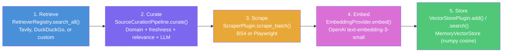
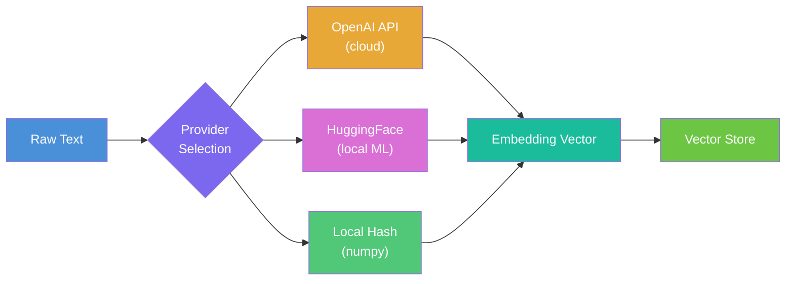
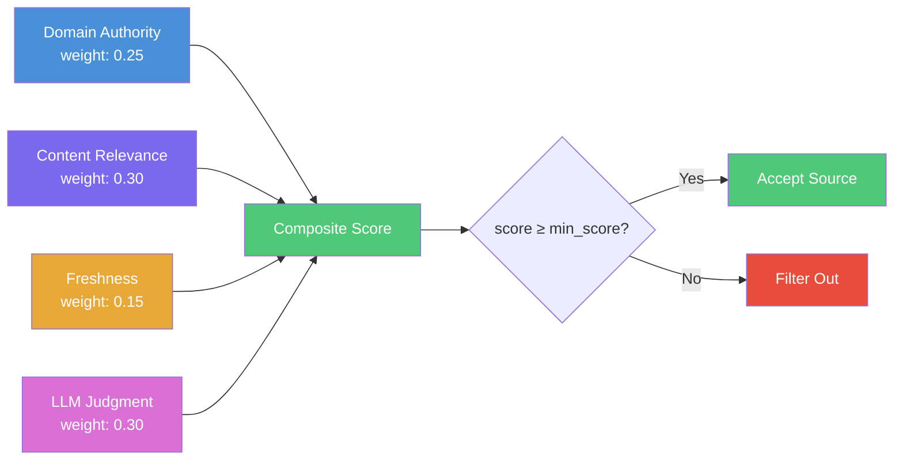

# Data Processing Guide

HiveFlow's data processing pipeline provides end-to-end support for web research — from searching and retrieving sources, to scoring their credibility, scraping content, generating embeddings, and tracking citations. Each stage is optional and pluggable, so you can use the full pipeline or just the pieces you need.

> **Use case:** Use the data processing pipeline when building research tools that need reliable, scored sources from the web — for example, an agent that retrieves academic papers, filters by credibility, scrapes full text, and produces a cited report.

## 5-Stage Pipeline

The data processing pipeline flows through five stages. Each stage is optional and pluggable:



## Retrievers

Retrievers search external sources and return normalized `SearchResult` objects.

### Built-in Retrievers

| Retriever | Plugin ID | API Key Required? |
|-----------|-----------|:-----------------:|
| DuckDuckGo | `duckduckgo` | No |
| Tavily | `tavily` | Yes (`TAVILY_API_KEY`) |

### Searching

```python
from hiveflow.plugins.retrievers import RetrieverRegistry

registry = RetrieverRegistry()
registry.discover()

# Search with a single retriever
results = await registry.search("quantum computing", retriever_ids=["duckduckgo"])

# Search across all registered retrievers (results are deduplicated by URL)
results = await registry.search_all(
    query="quantum computing breakthroughs 2025",
    max_results=10,
)

for r in results:
    print(f"[{r.score:.2f}] {r.title}: {r.url}")
```

### Installing Retriever Extras

```bash
uv sync --extra retrieval # Installs duckduckgo-search, tavily-python
```

## Scrapers

Scrapers extract clean text from web pages.

### Built-in Scrapers

| Scraper | Plugin ID | JavaScript? | Extra |
|---------|-----------|:-----------:|-------|
| BeautifulSoup4 | `beautifulsoup` | No | `scraping` |
| Playwright | `playwright` | Yes | `scraping` + `playwright install chromium` |

### Basic Scraping

```python
from hiveflow.plugins.scrapers import ScraperRegistry

registry = ScraperRegistry()
registry.discover()

scraper = registry.get("beautifulsoup")
content = await scraper.scrape("https://example.com/article")
print(f"Title: {content.title}")
print(f"Words: {content.word_count}")
print(f"Text: {content.text[:200]}")
```

### Batch Scraping with Concurrency Control

```python
urls = ["https://example.com/a", "https://example.com/b", "https://example.com/c"]
results = await scraper.scrape_batch(urls, max_concurrent=15)

for result in results:
    if isinstance(result, BaseException):
        print(f"Error: {result}")
    else:
        print(f"{result.title}: {result.word_count} words")
```

### Scraper Router

Automatically select the best scraper for each URL:

```python
from hiveflow.plugins.scrapers import ScraperRouter

router = ScraperRouter(registry, default_scraper_id="beautifulsoup")
scraper = router.select("https://spa-app.example.com") # May route to Playwright
```

### Content Validation

```python
from hiveflow.plugins.scrapers import validate_scraped_content

if validate_scraped_content(content):
    # Content has enough text (>100 chars) to be useful
    process(content)
```

## Embeddings

Embedding providers convert text to vector representations. HiveFlow ships with three providers covering cloud API, local ML model, and lightweight hash-based approaches.

### Embedding Pipeline



### Built-in Providers

| Provider | Plugin ID | Model | Dimensions | Max Batch | Cost |
|----------|-----------|-------|:----------:|:---------:|------|
| OpenAI | `openai` | text-embedding-3-small | 1536 | 100 | ~$0.02/M tokens |
| HuggingFace | `huggingface` | all-MiniLM-L6-v2 | 384 | 512 | Free (local) |
| Local | `local` | numpy hash embeddings | 384 | 10,000 | Free |

### OpenAI Embedding Provider

Cloud-based embeddings via the OpenAI API. Produces high-quality 1536-dimensional vectors suitable for production retrieval and similarity search.

- **Plugin ID:** `openai`
- **Default model:** text-embedding-3-small
- **Dimensions:** 1536
- **Max batch size:** 100
- **Requires:** `OPENAI_API_KEY` environment variable

```python
from hiveflow.plugins.embeddings import EmbeddingProviderRegistry

registry = EmbeddingProviderRegistry()
registry.discover()

provider = registry.get("openai")
vectors = await provider.embed(["Hello world", "Another sentence"])
print(f"Dimension: {len(vectors[0])}")  # 1536
```

### HuggingFace Embedding Provider

Runs a sentence-transformers model locally -- no API calls required. Use HuggingFace when you need free, local embeddings with no API calls -- ideal for development, CI/CD, and privacy-sensitive workloads.

- **Plugin ID:** `huggingface`
- **Default model:** all-MiniLM-L6-v2 (runs locally)
- **Dimensions:** 384
- **Max batch size:** 512
- **Requires:** `sentence-transformers` package

```python
provider = registry.get("huggingface")
vectors = await provider.embed(["Hello world", "Another sentence"])
print(f"Dimension: {len(vectors[0])}")  # 384
```

### Local Embedding Provider

Deterministic hash-based embeddings using only numpy. Use the local provider for testing and development -- it produces deterministic hash-based vectors without any model downloads.

- **Plugin ID:** `local`
- **Default model:** numpy-based hash embeddings (no ML model)
- **Dimensions:** 384
- **Max batch size:** 10,000
- **Requires:** numpy only

```python
provider = registry.get("local")
vectors = await provider.embed(["Hello world", "Another sentence"])
print(f"Dimension: {len(vectors[0])}")  # 384
```

### Choosing a Provider

| Criteria | OpenAI | HuggingFace | Local |
|----------|--------|-------------|-------|
| Quality | High (production-grade) | Good (sentence-level) | Low (hash-based) |
| Latency | Network-bound | CPU/GPU-bound | Near-instant |
| Privacy | Data sent to API | Fully local | Fully local |
| Cost | ~$0.02/M tokens | Free | Free |
| Offline | No | Yes (after model download) | Yes |
| Best for | Production retrieval | Development, CI/CD, privacy | Testing, unit tests |

### Configuration

Set the embedding provider via environment variables:

```bash
HIVEFLOW_EMBEDDING_PROVIDER=huggingface  # or openai, local
HIVEFLOW_EMBEDDING_MODEL=all-MiniLM-L6-v2  # provider-specific
```

Or configure in your team config:

```yaml
embeddings:
  provider: huggingface
  model: all-MiniLM-L6-v2
```

### Generating Embeddings

```python
from hiveflow.plugins.embeddings import EmbeddingProviderRegistry

registry = EmbeddingProviderRegistry()
registry.discover()

provider = registry.get("openai")
vectors = await provider.embed(["Hello world", "Another sentence"])
print(f"Dimension: {len(vectors[0])}")  # 1536
```

Auto-batch splitting handles large inputs:

```python
# Embeds 1000 texts, automatically split into batches
vectors = await provider.embed(large_text_list)
```

## Vector Stores

Vector stores persist embeddings and support similarity search.

### Built-in Stores

| Store | Plugin ID | Backend |
|-------|-----------|---------|
| Memory | `memory` | In-memory numpy cosine similarity |

### Usage

```python
from hiveflow.plugins.vector_stores import VectorStoreRegistry, CollectionManager

registry = VectorStoreRegistry()
registry.discover()

store = registry.get("memory")

# Add documents with embeddings
await store.add(
    vectors=[[0.1, 0.2, ...], [0.3, 0.4, ...]],
    documents=[
        {"doc_id": "doc1", "text": "Quantum computing basics"},
        {"doc_id": "doc2", "text": "Machine learning trends"},
    ],
)

# Search by vector
results = await store.search(query_vector=[0.1, 0.2, ...], top_k=5)
for doc, score in results:
    print(f"[{score:.3f}] {doc['text']}")
```

### Collection Manager

Namespace isolation per workflow session:

```python
mgr = CollectionManager(store, collection_prefix="research_", persist=False)
print(mgr.collection_name("session-abc")) # "research_session-abc"

# Clean up ephemeral collections after workflow
await mgr.cleanup()
```

### Configuration in Team Config

```yaml
vector_store:
  backend: memory
  collection_prefix: workflow_
  persist: false
  similarity_metric: cosine
```

## Source Curation

The `SourceCurationPipeline` scores and filters sources based on four signals that combine into a composite credibility score.

### Source Curation Scoring



| Signal | Default Weight | Source |
|--------|:--------------:|--------|
| Domain authority | 0.25 | Allow/block lists + domain heuristics |
| Content relevance | 0.30 | Cosine similarity (requires embedding provider) |
| Freshness | 0.15 | Time-decay based on publication date |
| LLM judgment | 0.30 | LLM quality rating 1–10 (requires LLM provider) |

> **Tip:** When optional providers are unavailable (e.g., no embedding provider for relevance scoring), their signals are skipped and remaining weights are reweighted proportionally.

### Usage

```python
from hiveflow.core.source_curation import SourceCurationPipeline

pipeline = SourceCurationPipeline(
    min_score=0.4,
    max_sources=10,
    domain_allow_list=["nature.com", "ieee.org"],
    domain_block_list=["pinterest.com"],
)

scored = await pipeline.curate(search_results, query="quantum computing")
for source in scored:
    print(f"[{source.composite_score:.2f}] {source.url}")
```

### Configuration in Team Config

```yaml
source_curation:
  enabled: true
  min_score: 0.4
  max_sources: 10
  freshness_max_age_days: 730
  domain_allow_list: [nature.com, ieee.org]
  domain_block_list: [pinterest.com]
  scoring_weights:
    domain_authority: 0.25
    content_relevance: 0.30
    freshness: 0.15
    llm_judgment: 0.30
```

## Citations

Track and format source citations in multiple styles.

### Citation Styles Comparison

| Style | Example Output |
|-------|---------------|
| `apa` | Smith, J. (2025). Quantum Computing Review. *Nature*. https://example.com |
| `mla` | Smith, J. "Quantum Computing Review." *Nature*, 2025. https://example.com |
| `chicago` | Smith, J. "Quantum Computing Review." *Nature*. 2025. https://example.com |
| `numbered` | [1] Smith, J. Quantum Computing Review. https://example.com |
| `inline` | [Quantum Computing Review](https://example.com) |

### Usage

```python
from hiveflow.core.citations import CitationTracker, Citation

tracker = CitationTracker(style="apa")

tracker.add(Citation(
    title="Quantum Computing Review",
    url="https://example.com/article",
    author="Smith, J.",
    source="Nature",
    date="2025",
))

# Format reference section
references = tracker.format_references()
print(references)
```

### Configuration in Team Config

```yaml
citations:
  enabled: true
  style: apa
  inline: true
  generate_reference_section: true
```

## Full Research Pipeline Example

```python
import asyncio
from hiveflow.plugins.retrievers import RetrieverRegistry
from hiveflow.plugins.scrapers import ScraperRegistry
from hiveflow.core.source_curation import SourceCurationPipeline
from hiveflow.core.citations import CitationTracker

async def research(query: str):
    # 1. Search
    retriever_reg = RetrieverRegistry()
    retriever_reg.discover()
    results = await retriever_reg.search_all(query, max_results=20)

    # 2. Curate
    curation = SourceCurationPipeline(min_score=0.4, max_sources=10)
    curated = await curation.curate(results, query=query)

    # 3. Scrape
    scraper_reg = ScraperRegistry()
    scraper_reg.discover()
    scraper = scraper_reg.get("beautifulsoup")
    urls = [s.url for s in curated]
    contents = await scraper.scrape_batch(urls, max_concurrent=10)

    # 4. Track citations
    tracker = CitationTracker(style="apa")
    for content in contents:
        if not isinstance(content, BaseException):
            tracker.add_from_scraped(content)

    print(f"Sources: {len(curated)}")
    print(tracker.format_references())

asyncio.run(research("AI safety research 2025"))
```

## Source Mode

Source mode controls which tool categories are available to agents based on where data comes from. Set `source_mode` on your team configuration to restrict tools team-wide.

### Available Modes

| Mode | Allowed Tool Categories | Use Case |
|------|------------------------|----------|
| `web` | web_retriever, tavily, duckduckgo, web_scraper, beautifulsoup, playwright | Web-only research |
| `local` | document_retriever, file_loader, local_reader, embeddings, vector_store | Local/offline processing |
| `hybrid` | All web + all local categories | Mixed source pipelines |
| `cloud` | cloud_storage, blob_reader, s3_reader, gcs_reader, azure_blob | Cloud storage access |
| `mcp` | mcp_tool, mcp_resource | MCP server tools only |
| `custom` | User-specified via `allowed_categories` | Fine-grained control |

Framework tools (`delegate_task`, `send_message`, `read_messages`, `spawn_agent`, `plan_and_execute`, `skill_activation`) are always preserved regardless of source mode.

### Team Configuration

```yaml
team_name: web_research_team
source_mode: web
agents:
  - id: researcher
    role: Web Researcher
    tools: [tavily, duckduckgo, beautifulsoup, document_retriever]
    # document_retriever will be filtered out because source_mode is "web"
```

### Custom Mode

```yaml
team_name: custom_pipeline
source_mode: custom
source_options:
  allowed_categories:
    - tavily
    - embeddings
```

### Python API

```python
from hiveflow import SourceMode, SourceModeRouter

router = SourceModeRouter(source_mode="web")
filtered = router.filter_tools(["tavily_search", "document_retriever", "delegate_task"])
# filtered: ["tavily_search", "delegate_task"]
# document_retriever removed (not in web category), delegate_task preserved (framework tool)
```

## Examples

| Example | Description |
|---------|-------------|
| [01_retriever_search.py](../../examples/data_processing/01_retriever_search.py) | Multi-retriever search with dedup |
| [02_scraper_pipeline.py](../../examples/data_processing/02_scraper_pipeline.py) | Scraping, routing, validation |
| [03_embeddings_similarity.py](../../examples/data_processing/03_embeddings_similarity.py) | Embeddings + vector store |
| [05_source_curation.py](../../examples/data_processing/05_source_curation.py) | Credibility scoring |
| [06_citations.py](../../examples/data_processing/06_citations.py) | Citation tracking styles |
| [07_research_workflow.py](../../examples/data_processing/07_research_workflow.py) | Full pipeline |
| [source_mode_routing.py](../../examples/data_processing/source_mode_routing.py) | Source mode tool filtering |
