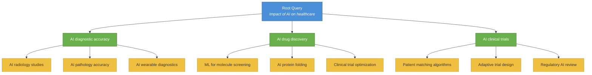
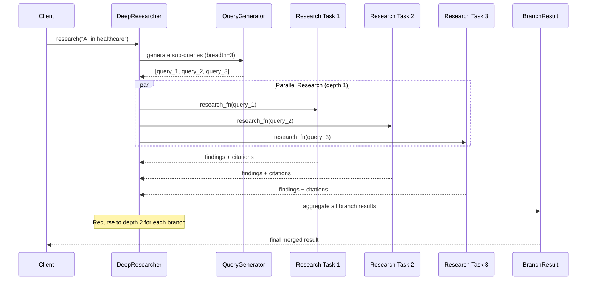

# Deep Research Guide

This guide covers HiveFlow's recursive branching research system for complex, multi-faceted topics. DeepResearcher automates the process of decomposing a broad question into focused sub-queries, researching each in parallel, and synthesizing the findings into a comprehensive result — all with configurable depth, breadth, and concurrency.

> ** When to use deep research:** Use `DeepResearcher` when you need comprehensive, multi-faceted analysis of complex topics — market landscapes, literature reviews, competitive analysis, or any question that benefits from exploring multiple angles simultaneously.

## Overview

`DeepResearcher` performs recursive breadth-first research: starting from a query, it generates sub-queries, researches each in parallel, then recursively deepens the most promising branches.

### Recursive Research Tree

The tree below illustrates how a single root query fans out into sub-queries at each depth level. With `breadth=3` and `depth=2`, the researcher explores up to **12 branches** (3 at depth 1, 9 at depth 2):



### Research Execution Flow

Each level of the tree is researched in parallel, with results aggregated into `BranchResult` objects before the next depth level begins:



## Configuration

```python
from hiveflow import DeepResearcher, DeepResearchConfig

config = DeepResearchConfig(
    breadth=3, # Sub-queries per level
    depth=2, # Maximum recursion depth
    concurrency=4, # Max parallel research tasks
)
```

| Parameter | Default | Description |
|-----------|:-------:|-------------|
| `breadth` | 3 | Number of sub-queries generated at each level |
| `depth` | 2 | Maximum recursion depth |
| `concurrency` | 4 | Maximum parallel research tasks |

### Environment Variables

| Variable | Default | Description |
|----------|:-------:|-------------|
| `HIVEFLOW_DEEP_RESEARCH_BREADTH` | `3` | Sub-queries per level |
| `HIVEFLOW_DEEP_RESEARCH_DEPTH` | `2` | Max recursion depth |
| `HIVEFLOW_DEEP_RESEARCH_CONCURRENCY` | `4` | Max parallel tasks |

## Basic Usage

```python
import asyncio
from hiveflow import DeepResearcher, DeepResearchConfig

async def my_research_fn(query: str, context: dict) -> dict:
    """Your implementation: call an LLM, search the web, etc."""
    return {
        "findings": f"Research findings on: {query}",
        "citations": [{"title": "Source", "url": "https://example.com"}],
    }

async def my_query_gen(query: str, breadth: int) -> list[str]:
    """Generate sub-queries for deeper exploration."""
    return [f"{query} - aspect {i}" for i in range(breadth)]

async def main():
    researcher = DeepResearcher(
        config=DeepResearchConfig(breadth=3, depth=2, concurrency=4),
        research_fn=my_research_fn,
        query_generator_fn=my_query_gen,
    )

    result = await researcher.research("Impact of AI on healthcare")

    # Access results
    state = researcher.get_research_state(result)
    print(f"Total branches: {len(result.all_findings)}")
    print(f"Total citations: {researcher.citations.count}")

asyncio.run(main())
```

## Research Functions

You provide two callback functions:

### Research Function

Called for each query at each depth level:

```python
async def research_fn(query: str, context: dict) -> dict:
    """
    Args:
        query: The specific research query
        context: Accumulated context from parent branches

    Returns:
        Dict with 'findings' (str) and optional 'citations' (list)
    """
    # Use any data source: LLM, web search, database, etc.
    results = await search_api(query)
    return {
        "findings": summarize(results),
        "citations": extract_citations(results),
    }
```

### Query Generator Function

Generates sub-queries for the next depth level:

```python
async def query_gen(query: str, breadth: int) -> list[str]:
    """
    Args:
        query: The parent query to decompose
        breadth: How many sub-queries to generate

    Returns:
        List of sub-query strings
    """
    # Use an LLM to generate diverse sub-queries
    response = await llm.generate(
        f"Generate {breadth} specific sub-questions about: {query}"
    )
    return parse_questions(response)
```

## BranchResult

Each branch of the research tree produces a `BranchResult`:

```python
result = await researcher.research("AI in healthcare")

for branch in result.all_findings:
    print(f"Query: {branch.query}")
    print(f"Depth: {branch.depth}")
    print(f"Findings: {branch.findings[:200]}")
    print(f"Children: {len(branch.children)}")
```

## Research Progress

Track progress during execution:

```python
async def progress_callback(progress):
    print(f"Completed: {progress.completed}/{progress.total} branches")
    print(f"Current depth: {progress.current_depth}")

researcher = DeepResearcher(
    config=config,
    research_fn=research_fn,
    query_generator_fn=query_gen,
    progress_callback=progress_callback,
)
```

## Citation Tracking

DeepResearcher integrates with `CitationTracker` for automatic source tracking:

```python
result = await researcher.research("topic")

# Access accumulated citations
print(f"Total citations: {researcher.citations.count}")
references = researcher.citations.format_references()
print(references)
```

## Integration with Workflows

Use `DeepResearcher` within a workflow via the `OrchestratorAgent`:

```python
from hiveflow import HiveFlow

hf = HiveFlow()
session = await hf.run(
    team={
        "team_name": "deep_research",
        "agents": [
            {
                "id": "researcher",
                "role": "Deep Researcher",
                "behavior_type": "orchestrator",
                "system_prompt": "Conduct deep research on the topic.",
            },
            {
                "id": "writer",
                "role": "Report Writer",
                "behavior_type": "llm_only",
                "system_prompt": "Write a comprehensive report from the research.",
            },
        ],
        "workflow": {
            "steps": [
                {"agent": "researcher", "type": "sequential", "next": "writer"},
                {"agent": "writer", "type": "sequential"},
            ]
        },
    },
    task="Comprehensive analysis of quantum computing applications",
)
```

## Combining with Data Processing

DeepResearcher connects to HiveFlow's full data processing stack — retrievers, source curation, scrapers, and citation tracking — through the research function you provide:


> ** Tip:** By wiring your `research_fn` to the retriever/scraper pipeline, each branch of the research tree automatically benefits from source curation and deduplication.

Connect deep research to the full data processing pipeline:

```python
from hiveflow.plugins.retrievers import RetrieverRegistry
from hiveflow.plugins.scrapers import ScraperRegistry
from hiveflow.core.source_curation import SourceCurationPipeline

retriever_reg = RetrieverRegistry()
retriever_reg.discover()
scraper_reg = ScraperRegistry()
scraper_reg.discover()
curation = SourceCurationPipeline(min_score=0.4)

async def research_fn(query, context):
    # Search → Curate → Scrape
    results = await retriever_reg.search_all(query, max_results=10)
    curated = await curation.curate(results, query=query)
    urls = [s.url for s in curated[:5]]
    scraper = scraper_reg.get("beautifulsoup")
    contents = await scraper.scrape_batch(urls)

    findings = "\n".join(
        c.text[:500] for c in contents if not isinstance(c, BaseException)
    )
    citations = [
        {"title": c.title, "url": c.url}
        for c in contents if not isinstance(c, BaseException)
    ]
    return {"findings": findings, "citations": citations}
```

## Examples

| Example | Description |
|---------|-------------|
| [03_deep_research.py](../../examples/advanced_workflows/03_deep_research.py) | Recursive branching research (mock) |
| [07_research_workflow.py](../../examples/data_processing/07_research_workflow.py) | Full research pipeline with live data |
