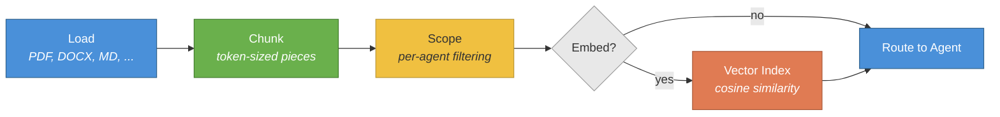
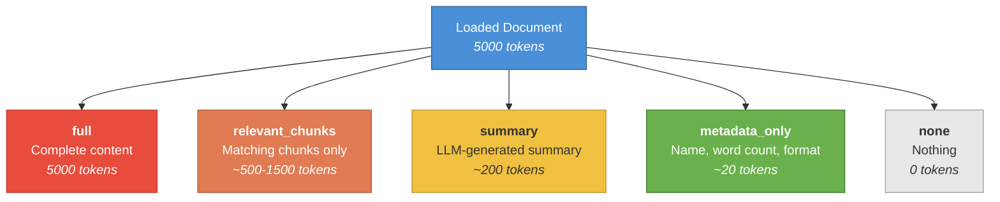

# Document Processing Guide

This guide covers loading, chunking, scoping, and retrieving documents within HiveFlow workflows. Whether you're building a document Q&A system, generating reports from existing files, or feeding structured data into a multi-agent pipeline, the document processing system handles format conversion, intelligent chunking, and per-agent scoping out of the box.

> ** When to use document processing:** Use the document pipeline when building document analysis, Q&A, or report generation from existing files — PDFs, Word docs, spreadsheets, web pages, and more.

## Overview

The document pipeline provides:

1. **Loading** — Read files in 10+ formats (PDF, DOCX, Markdown, HTML, JSON, XML, Excel, PPTX, plain text, URLs)
2. **Chunking** — Split documents into configurable token-sized chunks
3. **Scoping** — Control which agents see which documents and how
4. **Retrieval** — On-demand chunk search via `DocumentRetrieverTool`
5. **Summary mode** — LLM-generated summaries injected into agent context

### Document Pipeline Flow



## Loading Documents

### From Files

```python
from hiveflow.core.documents import DocumentPipeline

pipeline = DocumentPipeline(working_dir="./docs")
documents = await pipeline.load_documents(["report.pdf", "notes.md", "data.xlsx"])

for doc in documents:
    print(f"{doc.name}: {doc.word_count} words, {len(doc.chunks)} chunks")
```

### From Bytes (In-Memory)

Load documents from bytes without writing to disk:

```python
from hiveflow.plugins.documents import DocumentLoaderRegistry

registry = DocumentLoaderRegistry()
registry.discover()

loader = registry.get("markdown")
doc = await loader.load_from_bytes(
    data=b"# Hello\n\nThis is a test document.",
    filename="test.md",
)
```

### From URLs

```python
from hiveflow.plugins.documents import DocumentLoaderRegistry

registry = DocumentLoaderRegistry()
registry.discover()

url_loader = registry.get("url")
doc = await url_loader.load("https://example.com/article")
```

### Supported Formats

**Built-in** — no extra dependencies:

| Format | Loader ID | Extension |
|--------|-----------|-----------|
| Plain text | `plain_text` | `.txt` |
| Markdown | `markdown` | `.md` |
| JSON | `json` | `.json` |
| XML | `xml` | `.xml` |
| HTML | `html` | `.html` |
| URL | `url` | — |

**Office & PDF** — requires `documents` extra (`uv sync --extra documents`):

| Format | Loader ID | Extension |
|--------|-----------|-----------|
| PDF | `pdf` | `.pdf` |
| DOCX | `docx` | `.docx` |
| Excel | `excel` | `.xlsx` |
| PowerPoint | `pptx` | `.pptx` |

**Cloud & Universal** — requires specific extras:

| Format | Loader ID | Extra |
|--------|-----------|-------|
| Azure Blob | `azure_blob` | `documents-azure` |
| MarkItDown | `markitdown` | `markitdown` |

### Installing Document Extras

```bash
uv sync --extra documents # PDF, DOCX, Excel, PPTX loaders
uv sync --extra documents-azure # Azure Blob Storage loader
uv sync --extra markitdown # MarkItDown universal converter
```

## Chunking

Documents are automatically chunked during loading:

```python
pipeline = DocumentPipeline(
    working_dir="./docs",
    chunk_max_length=1000, # Max tokens per chunk (default: 1000)
    chunk_overlap=200, # Overlap between chunks (default: 200)
)
```

Each chunk contains:
- `text` — The chunk content
- `chunk_index` — Position in the document
- `metadata` — Source document info

## Document Scoping

Control what each agent sees using `document_mode` in the agent definition. Each mode provides a different trade-off between completeness and token efficiency:



| Mode | What the Agent Receives |
|------|------------------------|
| `full` | Complete document content |
| `relevant_chunks` | Only chunks semantically similar to the task |
| `summary` | LLM-generated summary of the document |
| `metadata_only` | Document name, word count, and format |
| `none` (default) | No document content |

> ** Tip:** Use `relevant_chunks` for Q&A workflows where agents only need specific passages. Use `summary` when agents need a high-level understanding without the full text. Reserve `full` for agents that must see every detail (e.g., contract reviewers).

### Per-Agent Scoping in Team Config

```json
{
    "agents": [
        {
            "id": "analyst",
            "document_mode": "full",
            "documents": ["report.pdf"],
            "max_document_tokens": 5000
        },
        {
            "id": "writer",
            "document_mode": "summary",
            "documents": ["report.pdf", "notes.md"]
        },
        {
            "id": "reviewer",
            "document_mode": "metadata_only"
        }
    ]
}
```

The `documents` field restricts which documents an agent can see. When omitted, the agent receives all loaded documents (subject to its `document_mode`).

## Semantic Filtering (relevant_chunks mode)

When an embedding provider is configured, `relevant_chunks` mode:

1. Embeds each document chunk and the task/query
2. Computes cosine similarity between each chunk and the query
3. Keeps only chunks above the similarity threshold (default: 0.35)
4. Sorts retained chunks by relevance score

```python
pipeline = DocumentPipeline(
    working_dir="./docs",
    embedding_provider=openai_embeddings, # Optional
)
```

If no embedding provider is configured, `relevant_chunks` falls back to `full` mode.

## Summary Document Mode

The `summary` mode generates an LLM-based summary of each document:

```json
{
    "id": "analyst",
    "document_mode": "summary",
    "documents": ["report.pdf"]
}
```

Summaries are cached — if multiple agents use `summary` mode for the same document, the LLM is called only once.

## Document Retriever Tool

For `tool_user` agents, the `DocumentRetrieverTool` enables on-demand chunk search:

```python
from hiveflow.plugins.tools.document_retriever import DocumentRetrieverTool

retriever_tool = DocumentRetrieverTool(document_pipeline=pipeline)

# Agent can call this tool during its execution loop
qa_agent = Agent(
    agent_id="qa",
    behavior_type=AgentBehaviorType.TOOL_USER,
    tools=[retriever_tool],
    system_prompt="Answer questions using the document retrieval tool.",
)
```

The tool lets the LLM search document chunks by query, returning the most relevant passages.

## Instructions from File

Load task instructions from a file instead of inline text:

```python
from hiveflow import HiveFlow

hf = HiveFlow()
session = await hf.run(
    team="research_report",
    task="", # Must be empty when using instructions_file
    instructions_file="./instructions.md",
)
```

CLI equivalent:

```bash
hiveflow run --template research_report --instructions-file ./instructions.md
```

## Template Variables

Document metadata is available as template variables in agent system prompts:

| Variable | Value |
|----------|-------|
| `$document_count` | Number of loaded documents |
| `$document_names` | Comma-separated list of document names |
| `$document_summary` | Combined summaries of all documents |

```json
{
    "system_prompt": "You are analyzing $document_count documents: $document_names. Here is a summary: $document_summary"
}
```

## Full Pipeline Example

```python
import asyncio
from hiveflow import HiveFlow

async def main():
    hf = HiveFlow()
    session = await hf.run(
        team={
            "team_name": "doc_analyzer",
            "description": "Analyze documents",
            "agents": [
                {
                    "id": "analyst",
                    "role": "Analyst",
                    "system_prompt": "Analyze the provided documents and summarize key findings.",
                    "behavior_type": "llm_only",
                    "document_mode": "full",
                    "max_document_tokens": 8000,
                }
            ],
            "workflow": {
                "steps": [{"agent": "analyst", "type": "sequential"}]
            },
        },
        task="Identify the main themes across the provided documents",
        documents=["report.pdf", "notes.md"],
    )
    print(session.result.state["analyst_output"])

asyncio.run(main())
```

## Path Security

All document loading in HiveFlow goes through path validation to prevent directory traversal attacks and out-of-scope file access. The validation logic lives in `validation/path_security.py`.

### `validate_document_path(path, working_dir, allowed_paths=None)`

Validates and resolves a document path securely.

| Parameter | Type | Description |
|-----------|------|-------------|
| `path` | `str` | Raw path string from user input |
| `working_dir` | `Path` | Directory to resolve relative paths against |
| `allowed_paths` | `list[Path]` or `None` | Optional additional directories that are permitted |

**Returns:** Resolved absolute `Path`.

**Raises:**
- `ValueError` -- if the path contains `..` traversal sequences or resolves outside allowed directories
- `FileNotFoundError` -- if the resolved path does not exist

### What Gets Validated

The function applies three checks in sequence:

1. **Traversal rejection** -- Any path containing `..` segments is rejected immediately, before resolution
2. **Scope enforcement** -- The resolved absolute path must fall within `working_dir` or one of the `allowed_paths` directories. Symlinks that escape scope are also caught because validation runs on the resolved (real) path.
3. **Existence and type check** -- The path must exist and must be a file (not a directory)

### Configuration

```python
from pathlib import Path
from hiveflow.validation.path_security import validate_document_path

# Basic usage -- only allows files within the working directory
resolved = validate_document_path(
    "reports/q4.pdf",
    working_dir=Path("./project"),
)

# Allow loading from an additional shared directory
resolved = validate_document_path(
    "/data/shared/dataset.csv",
    working_dir=Path("./project"),
    allowed_paths=[Path("/data/shared")],
)
```

> **Note:** Path security is automatic -- all document loading goes through validation. Configure `allowed_paths` if you need to load documents from outside the working directory.

## Examples

| Example | Description |
|---------|-------------|
| [01_document_pipeline.py](../../examples/document_workflows/01_document_pipeline.py) | Load, chunk, scope (no LLM) |
| [02_document_summarizer.py](../../examples/document_workflows/02_document_summarizer.py) | Document analysis + summary |
| [03_document_qa.py](../../examples/document_workflows/03_document_qa.py) | Q&A with DocumentRetrieverTool |
| [04_multi_doc_report.py](../../examples/document_workflows/04_multi_doc_report.py) | Multi-document report with scoping |
| [01_instructions_file.py](../../examples/document_input_pipeline/01_instructions_file.py) | Instructions from file |
| [02_load_from_bytes.py](../../examples/document_input_pipeline/02_load_from_bytes.py) | Load from in-memory bytes |
| [03_summary_mode.py](../../examples/document_input_pipeline/03_summary_mode.py) | LLM-based document summaries |
