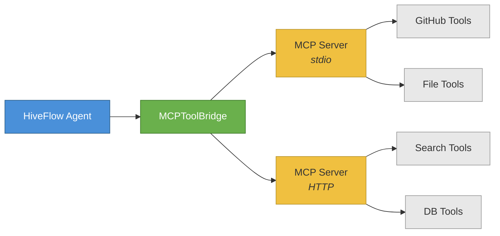
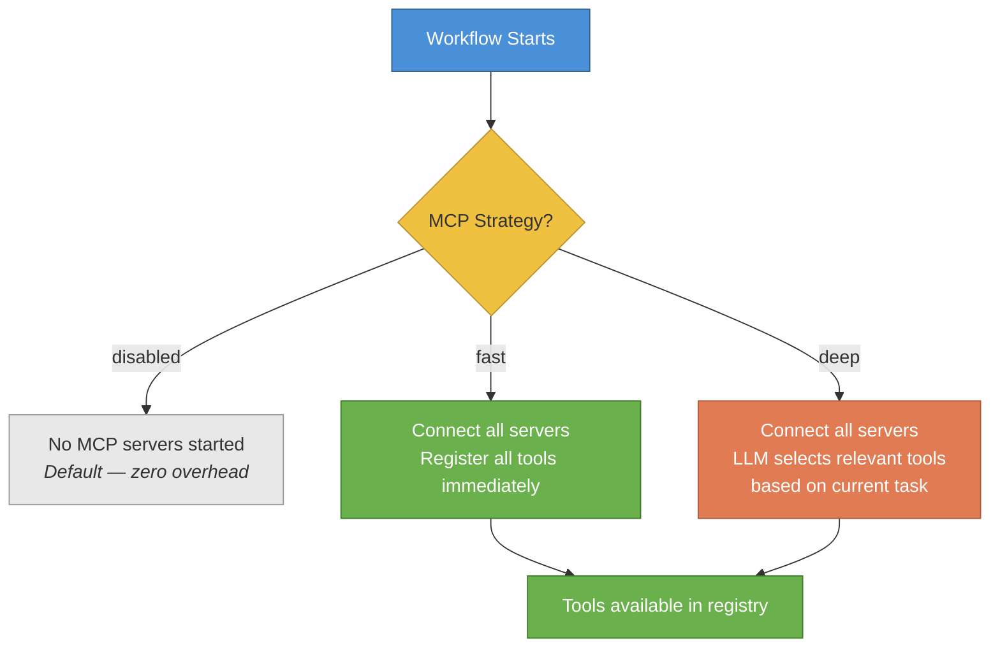
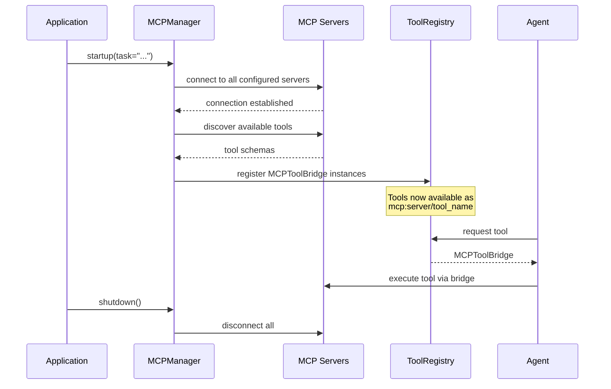
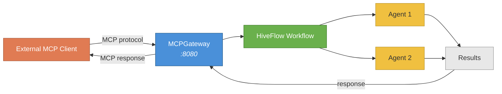

# MCP Integration Guide

This guide covers connecting HiveFlow agents to external MCP (Model Context Protocol) tool servers and exposing workflows as MCP tools. MCP lets your agents seamlessly call external tools — GitHub, Slack, databases, file systems — through a standardized protocol, and lets external clients invoke your HiveFlow workflows as tools.

> ** When to use MCP:** Use MCP integration when you want to connect agents to external tool ecosystems like GitHub, Slack, databases, or any service that exposes an MCP server. It's also the way to expose your HiveFlow workflows to external MCP clients.

## Overview

HiveFlow's MCP integration provides:

- **Tool Bridge** — Wrap MCP tools as native HiveFlow `ToolPlugin` instances
- **Manager** — Lifecycle management for MCP server connections
- **Gateway** — Expose HiveFlow workflows as MCP tools for external clients
- **Strategy Modes** — Control how MCP tools are discovered and selected

### MCP Architecture



## Installation

```bash
uv sync --extra mcp
```

## MCP Configuration

### Configuration File

Create `mcp_config.json` in the project root or specify via environment variable:

```json
{
    "strategy": "fast",
    "servers": {
        "github": {
            "transport": "stdio",
            "command": "npx",
            "args": ["-y", "@modelcontextprotocol/server-github"],
            "env": {"GITHUB_TOKEN": "${GITHUB_TOKEN}"}
        },
        "web_search": {
            "transport": "http",
            "url": "https://mcp.example.com/search",
            "auth": {
                "type": "bearer",
                "token": "${MCP_SEARCH_TOKEN}"
            }
        }
    }
}
```

### Configuration Object

```python
from hiveflow.plugins.mcp import MCPConfig, MCPServerDefinition, MCPAuthConfig

config = MCPConfig(
    strategy="fast",
    servers={
        "github": MCPServerDefinition(
            transport="stdio",
            command="npx",
            args=["-y", "@modelcontextprotocol/server-github"],
        ),
    },
)
```

### Loading from File

```python
config = MCPConfig.from_file("mcp_config.json")
# or auto-discover from project root
config = MCPConfig.from_file()
```

## Strategy Modes

The strategy mode controls how MCP tools are discovered and registered when your workflow starts:



| Strategy | Behavior | Use Case |
|----------|----------|----------|
| `disabled` | MCP is off, no servers started | Default, no MCP needed |
| `fast` | Register all discovered tools immediately | Few tools, known servers |
| `deep` | LLM selects relevant tools based on task | Many tools, costs optimization |

> ** Tip:** Start with `fast` for development and switch to `deep` in production when you have many MCP servers and want to minimize token usage from tool descriptions.

Set strategy in configuration:

```json
{"strategy": "fast"}
```

Or per-team in team config:

```json
{
    "team_name": "mcp_team",
    "mcp_strategy": "fast"
}
```

## Tool Bridge

`MCPToolBridge` wraps individual MCP tools as native `ToolPlugin` instances:

```python
from hiveflow.plugins.mcp import MCPToolBridge

bridge = MCPToolBridge(
    server_name="github",
    tool_name="search_repos",
    tool_description="Search GitHub repositories",
    input_schema={
        "type": "object",
        "properties": {"query": {"type": "string"}},
        "required": ["query"],
    },
)

# Tool ID: "mcp:github/search_repos"
print(bridge.plugin_id)

# LLM-compatible name: "mcp_github__search_repos"
print(bridge.llm_name)

# Works like any ToolPlugin
result = await bridge.execute(query="hiveflow")
```

### Tool ID Format

- **Plugin ID**: `mcp:{server_name}/{tool_name}` (e.g., `mcp:github/search_repos`)
- **LLM Name**: `mcp_{server}__{tool}` (sanitized for function calling compatibility)

## MCP Manager

The `MCPManager` handles the full lifecycle of MCP servers — from startup and tool discovery through to clean shutdown:



```python
from hiveflow.plugins.mcp import MCPManager, MCPConfig
from hiveflow.plugins.tools import ToolRegistry

tool_registry = ToolRegistry()
config = MCPConfig.from_file()
manager = MCPManager(config, tool_registry)

# Start all servers and discover tools
await manager.startup(task="Search for recent AI papers")

# Tools are now in the registry
print(tool_registry.list_ids())
# ['mcp:github/search_repos', 'mcp:github/create_issue', ...]

# Clean shutdown
await manager.shutdown()
```

### Eager vs Lazy Connections

- **Eager** (default for `fast`): Connect to all servers at startup
- **Lazy**: Connect on first tool use (saves resources)

## Mixed Tools (Native + MCP)

Combine native HiveFlow tools with MCP tools in the same agent:

```python
from hiveflow import Agent, AgentBehaviorType
from hiveflow.plugins.tools import ToolRegistry

# Registry contains both native and MCP tools
registry = ToolRegistry()
# ... discover native tools ...
# ... MCP manager adds MCP tools ...

agent = Agent(
    agent_id="researcher",
    role="Researcher",
    system_prompt="Use available tools to research the topic.",
    behavior_type=AgentBehaviorType.TOOL_USER,
    tools=registry.list_plugins(), # All tools, native + MCP
)
```

In team config:

```json
{
    "id": "researcher",
    "behavior_type": "tool_user",
    "tools": ["web_search", "mcp:github/search_repos"]
}
```

## MCP Gateway

The MCP Gateway flips the direction: instead of HiveFlow calling external tools, external MCP clients call your HiveFlow workflows as tools.



> ** Tip:** The Gateway lets you compose HiveFlow workflows into larger MCP ecosystems — other AI agents or tools can call your workflows as if they were standard MCP tools.

```python
from hiveflow.plugins.mcp import MCPGateway
from hiveflow import HiveFlow

hf = HiveFlow()
gateway = MCPGateway(hf)

# Register workflows as MCP tools
gateway.register_workflow(
    name="research_report",
    description="Generate a research report on any topic",
    team="research_report",
)

# Start the gateway server
await gateway.serve(port=8080)
```

External MCP clients can then call `research_report` as a standard MCP tool.

## Using MCP with HiveFlow.run()

The simplest way to use MCP is via the `HiveFlow` facade:

```python
from hiveflow import HiveFlow

hf = HiveFlow()

# MCP servers are started automatically based on mcp_config.json
# and the team's mcp_strategy setting
session = await hf.run(
    team={
        "team_name": "mcp_researcher",
        "mcp_strategy": "fast",
        "agents": [
            {
                "id": "researcher",
                "role": "Researcher",
                "behavior_type": "tool_user",
                "tools": ["mcp:github/search_repos"],
                "system_prompt": "Search GitHub to find relevant repositories.",
            }
        ],
        "workflow": {
            "steps": [{"agent": "researcher", "type": "sequential"}]
        },
    },
    task="Find the top Python AI frameworks",
)
```

## Checkpoint Cold Resume

MCP sessions survive process restarts through checkpointing:

```python
from hiveflow import HiveFlow
from hiveflow.core.checkpoint import FileCheckpointStorage

hf = HiveFlow(checkpoint_storage=FileCheckpointStorage())

# Run with checkpoint enabled
session = await hf.run(team=config, task="...", checkpoint=True)

# After process restart, resume picks up MCP context
session = await hf.resume(
    session_id=session.session_id,
    responses={"approved": True},
)
```

The team configuration and task are persisted in the checkpoint, allowing full cold resume.

## Transport Types

| Transport | Description | Config Field |
|-----------|-------------|-------------|
| `stdio` | Local subprocess via stdin/stdout | `command`, `args`, `env` |
| `http` | Remote server via HTTP/HTTPS | `url`, `auth` |

### stdio Transport

```json
{
    "transport": "stdio",
    "command": "npx",
    "args": ["-y", "@modelcontextprotocol/server-github"],
    "env": {"GITHUB_TOKEN": "${GITHUB_TOKEN}"}
}
```

### HTTP Transport with Authentication

```json
{
    "transport": "http",
    "url": "https://mcp.example.com/api",
    "auth": {
        "type": "bearer",
        "token": "${API_TOKEN}"
    }
}
```

## Examples

| Example | Description |
|---------|-------------|
| [01_mcp_configuration.py](../../examples/mcp_integration/01_mcp_configuration.py) | MCPConfig, server definitions, strategies |
| [02_tool_bridge.py](../../examples/mcp_integration/02_tool_bridge.py) | MCPToolBridge wrapping and execution |
| [03_manager_lifecycle.py](../../examples/mcp_integration/03_manager_lifecycle.py) | Manager startup/shutdown, tool discovery |
| [04_mixed_tools.py](../../examples/mcp_integration/04_mixed_tools.py) | Native + MCP tools in same agent |
| [05_deep_mode_selection.py](../../examples/mcp_integration/05_deep_mode_selection.py) | Deep strategy, LLM-assisted filtering |
| [06_mcp_gateway.py](../../examples/mcp_integration/06_mcp_gateway.py) | Expose workflows as MCP tools |
| [08_live_mcp_agent.py](../../examples/mcp_integration/08_live_mcp_agent.py) | Live demo with real MCP server |
