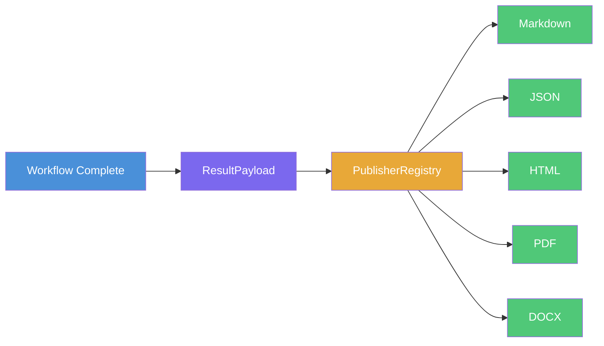
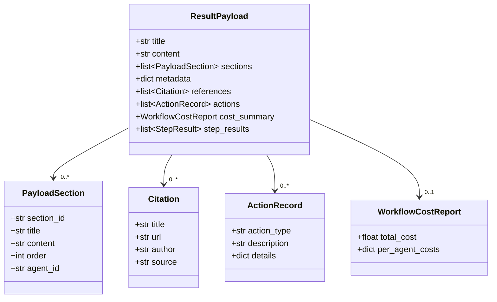
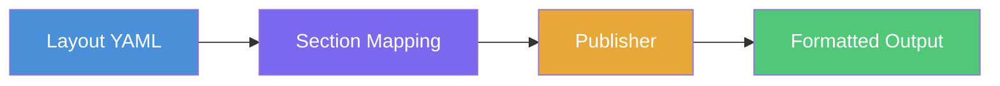

# Output & Publishing Guide

HiveFlow's output pipeline transforms raw workflow results into polished, publication-ready documents. Whether you need a quick Markdown summary or a formatted PDF report, the pipeline handles serialization, layout, and format conversion automatically.

> **Use case:** Use output publishing when you need to deliver workflow results as polished documents — research reports, executive briefs, analysis summaries — in one or more formats without manual formatting.

## Output Pipeline Flow

When a workflow completes, results flow through a structured pipeline from raw data to formatted output:



## Supported Formats

| Format | Publisher | Extra Required? |
|--------|-----------|:---------------:|
| Markdown | `MarkdownPublisher` | No |
| JSON | `JSONPublisher` | No |
| HTML | `HTMLPublisher` | `publishers` extra |
| PDF | `PDFPublisher` | `publishers` extra + LaTeX |
| DOCX | `DOCXPublisher` | `publishers` extra |

```bash
uv sync --extra publishers # Install pypandoc + jinja2
```

## ResultPayload

The `ResultPayload` is the structured data model that publishers consume. It captures every aspect of a workflow's output — content, structure, metadata, citations, and costs.

### ResultPayload Structure



### Creating a ResultPayload

```python
from hiveflow.core.result_payload import ResultPayload, PayloadSection, ActionRecord

payload = ResultPayload(
    title="Renewable Energy Report",
    content="Full report text here...",
    sections=[
        PayloadSection(
            section_id="intro",
            title="Introduction",
            content="Overview of renewable energy...",
            order=1,
            agent_id="writer",
        ),
        PayloadSection(
            section_id="analysis",
            title="Analysis",
            content="Cost trends analysis...",
            order=2,
            agent_id="analyst",
        ),
    ],
    metadata={"date": "2026-02-28", "workflow_id": "abc-123"},
)
```

### ResultPayload Fields

| Field | Type | Description |
|-------|------|-------------|
| `title` | `str` | Document title |
| `content` | `str` | Main assembled content |
| `sections` | `list[PayloadSection]` | Named content blocks |
| `metadata` | `dict[str, Any]` | Arbitrary key-value pairs |
| `references` | `list[Citation]` | Cited sources |
| `actions` | `list[ActionRecord]` | Actions taken during execution |
| `cost_summary` | `WorkflowCostReport` | Per-agent and total costs |
| `step_results` | `list[StepResult]` | Per-step execution details |

## Publishing Programmatically

### Single Format

```python
from hiveflow.plugins.publishers import PublisherRegistry

registry = PublisherRegistry()
registry.discover()

# Get a specific publisher
md_publisher = registry.get("markdown")
output_path = await md_publisher.publish_payload(payload, "./output/report")
print(f"Written to: {output_path}") # ./output/report.md
```

### Multiple Formats

```python
# Publish to all registered formats
results = await registry.publish_all(payload, "./output/report")
for fmt, path in results.items():
    print(f"{fmt}: {path}")
```

### From Workflow Results

The workflow engine can automatically build a `ResultPayload`:

```python
result = await engine.execute(agents, initial_state)

# Access the auto-generated payload
payload = result.result_payload
if payload:
    registry = PublisherRegistry()
    registry.discover()
    await registry.publish_all(payload, "./output/report")
```

## Layout Templates

Layout templates (YAML) control document structure — which sections appear and in what order.

### Layout Template Processing



### Defining a Layout

```yaml
# layouts/executive-brief.yaml
name: executive-brief
description: Concise executive summary format
sections:
  - id: executive_summary
    title: Executive Summary
    source: summary
    required: true
  - id: key_findings
    title: Key Findings
    source: findings
    required: true
  - id: recommendations
    title: Recommendations
    source: recommendations
    required: false
```

### Using Layouts

```python
from hiveflow import load_layout

layout = load_layout("executive-brief", extra_dirs=["./layouts"])

# Apply layout to publishing
output_path = await publisher.publish_payload(
    payload,
    "./output/brief",
    layout=layout,
)
```

### Listing Available Layouts

```python
from hiveflow import list_layouts

available = list_layouts(extra_dirs=["./layouts"])
print(available) # ['default', 'executive-brief']
```

## Auto-Publishing via Team Config

Configure automatic publishing in the team configuration so results are exported without any extra code.

### Auto-Publish Flow


```json
{
    "team_name": "auto_publish_team",
    "publish": {
        "formats": ["markdown", "json"],
        "output_dir": "./output",
        "style": "default",
        "layout": "default"
    },
    "agents": [...],
    "workflow": {...}
}
```

```yaml
# Or in YAML
publish:
  formats: [markdown, json, pdf]
  output_dir: ./output
  style: default
  layout: executive-brief
```

When `publish` is configured, the workflow engine publishes results automatically after successful completion.

## Completion Callbacks

Register functions that fire after workflow completion:

```python
# Sync callback
def log_results(payload: ResultPayload) -> None:
    print(f"Completed: {payload.title} ({len(payload.sections)} sections)")

engine.on_complete(log_results)

# Async callback
async def upload_results(payload: ResultPayload) -> None:
    await upload_to_cloud(payload.to_dict())

engine.on_complete(upload_results)
```

> **Tip:** Callbacks execute in registration order, receive the `ResultPayload`, and have per-callback error isolation — one failure doesn't block others.

## Custom Publishers

Create a publisher by subclassing `PublisherPlugin`:

```python
from pathlib import Path
from typing import Any
from hiveflow.plugins.publishers import PublisherPlugin
from hiveflow.core.result_payload import ResultPayload

class CSVPublisher(PublisherPlugin):
    @property
    def plugin_id(self) -> str:
        return "csv"

    @property
    def description(self) -> str:
        return "CSV output publisher"

    @property
    def output_extension(self) -> str:
        return ".csv"

    async def publish(self, content: str, output_path: str | Path, metadata=None) -> Path:
        path = Path(output_path).with_suffix(".csv")
        path.parent.mkdir(parents=True, exist_ok=True)
        path.write_text(content, encoding="utf-8")
        return path

    async def publish_payload(self, payload: ResultPayload, output_path, layout=None, config=None) -> Path:
        path = Path(output_path).with_suffix(".csv")
        path.parent.mkdir(parents=True, exist_ok=True)
        lines = [f"{s.title},{s.content[:100]}" for s in payload.sections]
        path.write_text("\n".join(lines), encoding="utf-8")
        return path
```

Register via entry point:

```toml
[project.entry-points."hiveflow.publishers"]
csv = "my_package:CSVPublisher"
```

## Examples

| Example | Description |
|---------|-------------|
| [01_basic_publish.py](../../examples/output_pipeline/01_basic_publish.py) | Workflow → Markdown + JSON |
| [02_sdk_publish.py](../../examples/output_pipeline/02_sdk_publish.py) | Programmatic ResultPayload |
| [03_custom_layout.py](../../examples/output_pipeline/03_custom_layout.py) | Custom YAML layouts |
| [04_completion_callbacks.py](../../examples/output_pipeline/04_completion_callbacks.py) | Completion callbacks |
| [05_auto_publish_config.py](../../examples/output_pipeline/05_auto_publish_config.py) | Auto-publish via config |
| [06_publish_pdf_docx.py](../../examples/output_pipeline/06_publish_pdf_docx.py) | PDF, DOCX, HTML formats |
