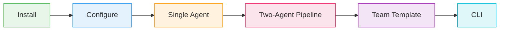
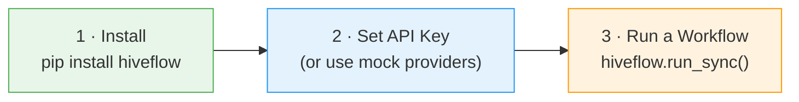
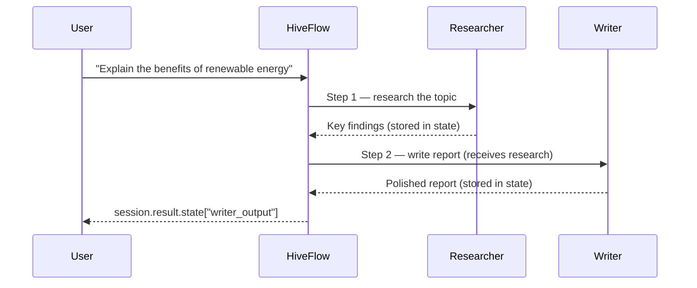
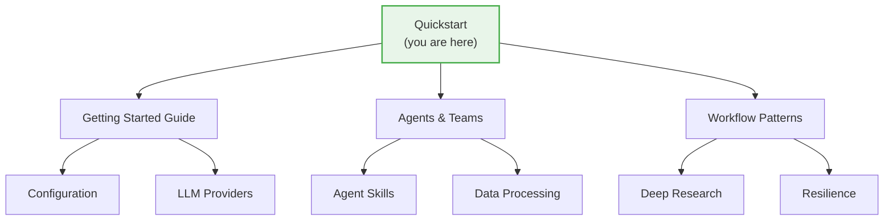

# Quickstart

Get a HiveFlow workflow running in under 5 minutes — no API keys required.

## What You'll Build



By the end of this guide you will have built a **multi-agent research pipeline** that takes a topic, researches it, and writes a polished report — all orchestrated by HiveFlow.

---

## 3-Step Getting Started



---

## Prerequisites

Before you begin, make sure you have:

- [x] **Python 3.11+** — `python --version`
- [x] **uv** package manager — [install guide](https://docs.astral.sh/uv/getting-started/installation/)
- [x] **An LLM API key** (OpenAI, Anthropic, or Azure) *or* use the built-in mock providers to explore without any keys

---

## Step 1 — Install HiveFlow

```bash
# Install from the repository
git clone <repo-url> && cd hiveflow
uv sync
```

> ** Tip:** HiveFlow also supports extras for specific integrations:
> ```bash
> uv sync --extra llm-azure # Azure OpenAI (RBAC)
> uv sync --extra retrieval # Web retrieval tools
> uv sync --extra publishers # PDF / DOCX / HTML output
> ```

---

## Step 2 — Configure an LLM Provider

HiveFlow needs at least one LLM provider. Pick whichever you have access to:

**OpenAI:**
```bash
export OPENAI_API_KEY=sk-...
```

**Anthropic:**
```bash
export ANTHROPIC_API_KEY=sk-ant-...
```

**Azure OpenAI (RBAC — no API key):**
```bash
export AZURE_OPENAI_ENDPOINT=https://my-resource.openai.azure.com
az login # Uses your Azure AD identity
uv sync --extra llm-azure # Install the Azure identity library
```

> ** No API keys?** Skip straight to [Try It Without API Keys](#-try-it-without-api-keys) — every example in this guide works with mock providers too.

---

## Step 3 — Run Your First Agent

Create a single-agent workflow that writes a haiku. Save this as `hello.py`:

```python
from hiveflow import HiveFlow

hf = HiveFlow()

# Define a team with one agent and run it synchronously
session = hf.run_sync(
    team={
        "team_name": "hello", # Name for this team
        "description": "Simple writer", # Human-readable description
        "agents": [
            {
                "id": "writer", # Unique agent ID
                "role": "Writer", # Role shown in logs
                "system_prompt": "Write clearly and concisely.",
                "behavior_type": "llm_only", # Pure LLM, no tools
            }
        ],
        "workflow": {
            "steps": [{"agent": "writer", "type": "sequential"}]
        },
    },
    task="Write a haiku about Python programming", # The user's request
)

# Every agent stores its output under "<agent_id>_output" in the state dict
print(session.result.state["writer_output"])
```

Run it:

```bash
uv run python hello.py
```

Expected output:

```text
Lines of code flow
Indentation tells the tale
Python speaks in white
```

> ** What just happened?**
>
> 1. `HiveFlow()` initialized the framework and discovered your LLM provider.
> 2. The inline `team` dict defined one agent ("writer") with a system prompt.
> 3. `run_sync()` created a workflow session, sent your task to the writer agent, and waited for the result.
> 4. The agent's response was stored in `session.result.state["writer_output"]`.

---

## Two-Agent Pipeline

Now let's chain two agents: a **researcher** that gathers findings, then a **writer** that turns them into a polished report.



Save this as `pipeline.py`:

```python
import asyncio
from hiveflow import HiveFlow


async def main():
    hf = HiveFlow()

    session = await hf.run(
        team={
            "team_name": "research_write",
            "description": "Research then write",
            "agents": [
                {
                    "id": "researcher",
                    "role": "Researcher",
                    "system_prompt": (
                        "Research the topic and list 3-5 key findings "
                        "with supporting data."
                    ),
                    "behavior_type": "llm_only",
                },
                {
                    "id": "writer",
                    "role": "Writer",
                    "system_prompt": (
                        "Write a clear, well-structured report based on "
                        "the research findings provided."
                    ),
                    "behavior_type": "llm_only",
                },
            ],
            "workflow": {
                "steps": [
                    # "next" chains the researcher's output into the writer
                    {"agent": "researcher", "type": "sequential", "next": "writer"},
                    {"agent": "writer", "type": "sequential"},
                ]
            },
        },
        task="Explain the benefits of renewable energy",
    )

    # The writer's output contains the final report
    print(session.result.state["writer_output"])

asyncio.run(main())
```

Run it:

```bash
uv run python pipeline.py
```

Expected output:

```text
# The Benefits of Renewable Energy

Renewable energy is transforming the global power landscape. Solar costs
have plummeted 89% since 2010, making it the cheapest source of new
electricity in most of the world. ...
```

> ** What just happened?**
>
> 1. The workflow engine executed two steps **sequentially**: researcher → writer.
> 2. The `"next": "writer"` field told the engine to run the writer after the researcher finishes.
> 3. The researcher's output was automatically passed to the writer as context via the shared workflow state.
> 4. Each agent's output is accessible under `<agent_id>_output` in `session.result.state`.

---

## Use a Team Template

HiveFlow ships with pre-built team templates so you don't have to define everything from scratch:

```python
from hiveflow import HiveFlow

hf = HiveFlow()

# Load a pre-built team by name — no inline config needed
session = hf.run_sync(team="research_report", task="AI safety risks")
print(session.result.state)
```

> ** What just happened?**
>
> Instead of defining agents and workflow steps inline, you loaded the
> `"research_report"` template. HiveFlow's `TeamTemplateLibrary` looked it
> up, instantiated the agents, wired the workflow, and executed everything —
> all in one line.

---

## Run from the CLI

You can also run workflows directly from your terminal:

```bash
hiveflow run --template research_report --instructions "Analyze cloud computing trends"
```

> ** Tip:** Pass documents as input with `--doc`:
> ```bash
> hiveflow run --template research_report \
> --instructions "Summarize this paper" \
> --doc paper.pdf
> ```

---

## Try It Without API Keys

Every example in the `examples/` directory includes **mock providers** that return deterministic responses — perfect for learning the framework without spending any API credits.

Run a complete two-agent workflow right now:

```bash
uv run python examples/getting_started/01_basic_workflow.py
```

Expected output:

```text
============================================================
  HiveFlow -- Basic Two-Agent Workflow
============================================================

  > Starting: researcher
  * Complete: researcher
  > Starting: writer
  * Complete: writer

------------------------------------------------------------
Workflow status: completed
Steps executed: 2
  researcher 47 words 165 tokens
  writer 93 words 330 tokens

------------------------------------------------------------
Final assembled output:
------------------------------------------------------------
# The Benefits of Renewable Energy

Renewable energy is transforming the global power landscape. ...
```

Here's the pattern — subclass `LLMProvider` with fixed responses:

```python
from hiveflow.plugins.llm import (
    LLMConfig, LLMMessage, LLMProvider, LLMResponse, TokenUsage,
)

class MockProvider(LLMProvider):
    """Returns deterministic responses — no API keys needed."""

    @property
    def provider_name(self) -> str:
        return "mock"

    @property
    def plugin_id(self) -> str:
        return "mock"

    @property
    def description(self) -> str:
        return "Mock LLM for demonstration"

    async def chat(
        self, messages: list[LLMMessage], config: LLMConfig
    ) -> LLMResponse:
        return LLMResponse(
            content="Your mock response here",
            model="mock-model",
            usage=TokenUsage(
                prompt_tokens=10, completion_tokens=20, total_tokens=30
            ),
        )
```

> ** Tip:** The `examples/core_architecture/` directory has **10 runnable examples**
> covering checkpointing, approval gates, event streaming, and more — all using
> mock providers.

---

## Next Steps

You've gone from zero to running multi-agent workflows. Here's where to go next:



| | Topic | What you'll learn |
|---|-------|-------------------|
| | [Getting Started](../getting-started.md) | Full walkthrough of core concepts |
| | [Agents & Teams](agents-and-teams.md) | Agent types, team config, and composition |
| | [Workflow Patterns](workflow-patterns.md) | Sequential, parallel, and conditional flows |
| | [Agent Skills](agent-skills.md) | Give agents tools and capabilities |
| | [Configuration](../configuration.md) | Environment variables, settings, and tuning |
| | [LLM Providers](../llm-providers.md) | OpenAI, Anthropic, Azure, Ollama, and more |
| | [Data Processing](data-processing.md) | Document loading, embeddings, and retrieval |
| | [Deep Research](deep-research.md) | Multi-turn, source-curated research |
| | [Resilience](resilience.md) | Fallbacks, retries, and error handling |
| | [CLI Reference](cli-reference.md) | All command-line options |
| | [All Examples](../../examples/README.md) | Browse the full example library |
