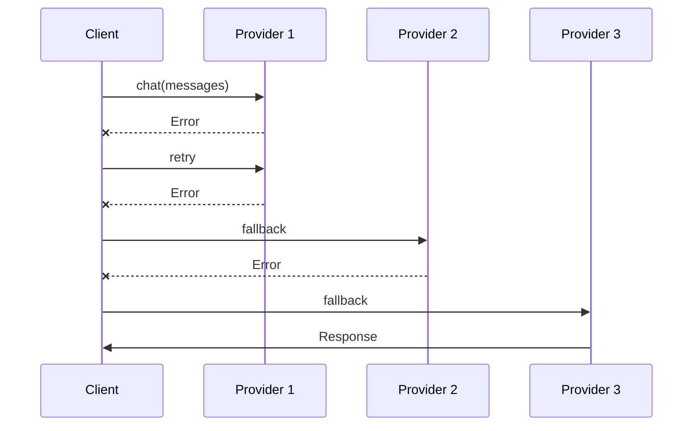
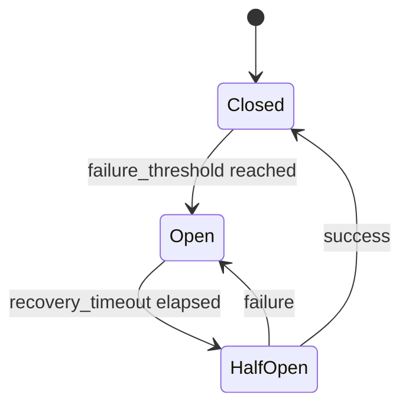
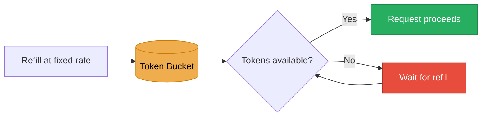
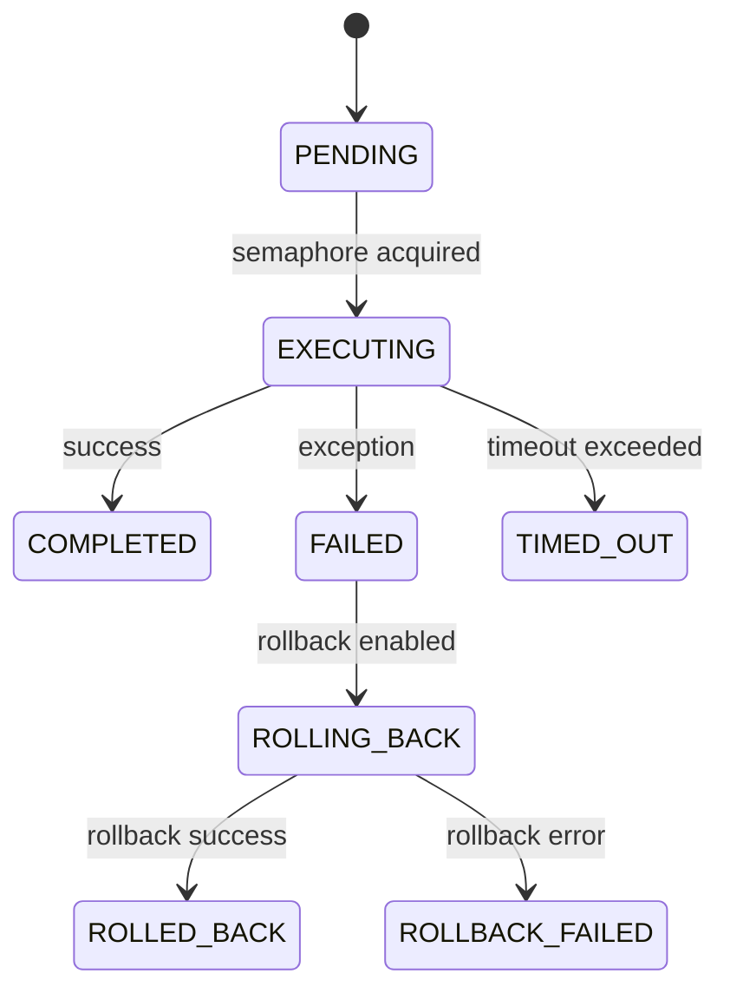
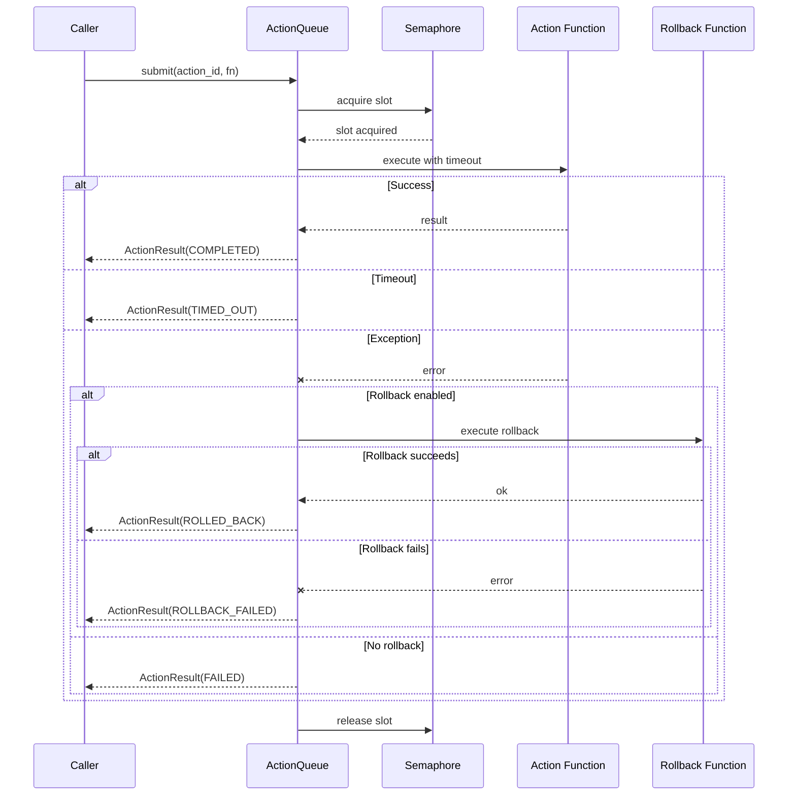

# Resilience & Reliability Guide

This guide covers HiveFlow's resilience patterns for production-grade LLM applications.

## Overview

HiveFlow provides five resilience patterns:

| Pattern | Purpose |
|---------|---------|
| **FallbackChain** | Cascade through LLM providers on failure |
| **RetryProvider** | Retry a single provider N times |
| **ResilientLLMProvider** | All-in-one wrapper (rate limit → circuit breaker → fallback → cost) |
| **Circuit Breaker** | Stop calling a service that's consistently failing |
| **Rate Limiting** | Token bucket algorithm to control request rate |

> ** Choosing a pattern**: Start with `ResilientLLMProvider` — it composes all patterns automatically. Use individual patterns only when you need fine-grained control over a specific layer.

## ResilientLLMProvider

The `ResilientLLMProvider` is the all-in-one wrapper that composes rate limiting, circuit breaking, fallback, and cost tracking:

> ** When to use**: Use `ResilientLLMProvider` as the default for any production agent. It gives you every resilience layer in a single wrapper with sensible defaults — no need to wire patterns together manually.

The following diagram shows how a request flows through each resilience layer in order:


```python
from hiveflow.core.resilient_provider import ResilientLLMProvider
from hiveflow.core.config import get_config

config = get_config()
resilient = ResilientLLMProvider.from_config(
    provider=openai_provider,
    config=config,
    cost_tracker=cost_tracker, # Optional
    agent_id="researcher", # For cost attribution
)

# Use like any LLM provider
response = await resilient.chat(messages, llm_config)
```

### Automatic Wrapping

When you create an `Agent` with an `llm_provider`, HiveFlow automatically wraps it with `ResilientLLMProvider`:

```python
agent = Agent(
    agent_id="writer",
    llm_provider=openai_provider, # Auto-wrapped with resilience
    ...
)
```

## Fallback Chains

Cascade through multiple providers when one fails:

> ** When to use**: Use fallback chains when you rely on multiple LLM providers (e.g., Azure + OpenAI + Anthropic) and want automatic failover. Essential for high-availability production workloads.

The sequence below illustrates how the chain cascades through providers, retrying each before moving to the next:



```python
from hiveflow.core.fallback import FallbackChain, RetryProvider, build_fallback_chain

# Quick builder
chain = build_fallback_chain([
    (azure_provider, "gpt-4o-eastus"),
    (openai_provider, "gpt-4o"),
    (anthropic_provider, "claude-sonnet-4-20250514"),
], max_retries_per_provider=2)

response = await chain.chat(messages, config)
```

### Manual Construction

```python
chain = FallbackChain([
    (RetryProvider(azure_provider, max_retries=3), "gpt-4o-eastus"),
    (openai_provider, "gpt-4o"), # No retries on this one
    (anthropic_provider, "claude-sonnet-4-20250514"),
])
```

### From Tiers

```python
chain = FallbackChain.from_tiers(registry, config)
# Tries: SMART_LLM → FAST_LLM → STRATEGIC_LLM
```

### Exhaustion

If all providers fail, `LLMFallbackExhaustedError` is raised with details about each failure:

```python
from hiveflow.core.fallback import LLMFallbackExhaustedError

try:
    response = await chain.chat(messages, config)
except LLMFallbackExhaustedError as e:
    print(f"All {len(e.failures)} providers failed")
    for provider_id, error in e.failures:
        print(f" {provider_id}: {error}")
```

## Retry Provider

Wrap a single provider with retry logic:

```python
from hiveflow.core.fallback import RetryProvider

retrying = RetryProvider(openai_provider, max_retries=3)
response = await retrying.chat(messages, config)
```

## Circuit Breaker

Stop calling a service that's consistently failing:

```python
from hiveflow.core.errors import CircuitBreaker

breaker = CircuitBreaker(
    failure_threshold=5, # Open after 5 consecutive failures
    recovery_timeout=60, # Try again after 60 seconds
)

# Use in custom code
if breaker.allow_request():
    try:
        result = await call_service()
        breaker.record_success()
    except Exception:
        breaker.record_failure()
        raise
```

The circuit breaker transitions between three states as failures and recoveries occur:



### States

| State | Behavior |
|-------|----------|
| **Closed** | Normal operation, requests pass through |
| **Open** | All requests fail immediately |
| **Half-Open** | One test request allowed after recovery timeout |

> ** When to use**: Use the circuit breaker when a downstream service (LLM API, database, etc.) may experience prolonged outages. It prevents wasting time and budget on requests that will fail, and allows automatic recovery.

## Rate Limiting

Token bucket algorithm to control request rate:

> ** When to use**: Use rate limiting to stay within API quota limits and avoid `429 Too Many Requests` errors. Especially important when running many agents in parallel or processing large batches.

The token bucket algorithm allows bursts up to the bucket capacity, then throttles to a steady rate:



```python
from hiveflow.core.ratelimit import TokenBucketRateLimiter, ProviderRateLimiter

# Per-provider rate limiter
limiter = ProviderRateLimiter(
    requests_per_minute=60,
    tokens_per_minute=100000,
)

# Wait for rate limit clearance before making a request
await limiter.acquire()
response = await provider.chat(messages, config)
```

> ** When to use**: Use rate limiting to stay under provider quotas. Configure `requests_per_minute` and `tokens_per_minute` to match your plan's limits.

## Bulkhead Pattern

Limit concurrency per resource to prevent saturation:

```python
from hiveflow.core.errors import Bulkhead

bulkhead = Bulkhead(max_concurrent=10)

async with bulkhead:
    response = await provider.chat(messages, config)
```

> ** When to use**: Use the bulkhead pattern when running many agents concurrently to prevent any single resource (API endpoint, database) from being overwhelmed. Set `max_concurrent` based on the target service's capacity.

## Action Queue

The action queue provides controlled execution of side-effect actions with concurrency limits, timeout enforcement, and optional rollback. It lives in `core/action_queue.py`.

> **When to use:** Use the action queue when agents perform side effects (API calls, file writes, deployments) that need concurrency limits, timeouts, and rollback support. It prevents runaway parallel actions from overwhelming external services.

### ActionStatus Lifecycle

Actions transition through the following states:



| Status | Description |
|--------|-------------|
| `PENDING` | Action submitted, waiting for a concurrency slot |
| `EXECUTING` | Running within the semaphore |
| `COMPLETED` | Finished successfully |
| `FAILED` | Raised an exception |
| `TIMED_OUT` | Exceeded the configured timeout |
| `ROLLING_BACK` | Rollback function is executing |
| `ROLLED_BACK` | Rollback completed successfully |
| `ROLLBACK_FAILED` | Rollback itself raised an exception |

### ActionResult

Each submitted action produces an `ActionResult` dataclass:

| Field | Type | Description |
|-------|------|-------------|
| `action_id` | `str` | Unique identifier for this action |
| `status` | `ActionStatus` | Final status |
| `result` | `Any` | Return value on success, `None` otherwise |
| `error` | `Exception` or `None` | Exception on failure/timeout |
| `started_at` | `datetime` or `None` | UTC timestamp when execution began |
| `completed_at` | `datetime` or `None` | UTC timestamp when execution ended |

### ActionQueue API

```python
from hiveflow.core.action_queue import ActionQueue

queue = ActionQueue(
    max_concurrency=5,    # Max parallel actions (default: 5)
    timeout=30.0,         # Per-action timeout in seconds (default: 30.0)
    enable_rollback=False, # Enable rollback on failure (default: False)
)
```

| Method | Description |
|--------|-------------|
| `submit(action_id, action_fn, *args, rollback_fn=None, **kwargs)` | Submit an async action for execution. Blocks until a concurrency slot is available, then runs with timeout enforcement. Returns `ActionResult`. |
| `drain()` | Wait for all pending tasks to complete and return all `ActionResult` objects. |
| `results` (property) | All action results collected so far (read-only list). |

### Execution Flow



### Usage Example

```python
import asyncio
from hiveflow.core.action_queue import ActionQueue

async def send_email(to: str, body: str) -> dict:
    # Simulate sending email
    await asyncio.sleep(1)
    return {"sent_to": to, "status": "delivered"}

async def undo_email(to: str) -> None:
    # Simulate recalling email
    await asyncio.sleep(0.5)

async def main():
    queue = ActionQueue(max_concurrency=3, timeout=10.0, enable_rollback=True)

    result = await queue.submit(
        "email_1",
        send_email,
        "user@example.com",
        "Hello!",
        rollback_fn=lambda: undo_email("user@example.com"),
    )
    print(f"{result.action_id}: {result.status}")  # email_1: completed

    # Drain returns all results
    all_results = await queue.drain()

asyncio.run(main())
```

## Error Handling Patterns

HiveFlow defines a set of error types and helpers in `core/errors.py` for isolating failures across agents and workflows.

### Error Hierarchy

| Error | Raised When |
|-------|-------------|
| `CircuitBreakerError` | A circuit breaker is open and rejecting calls. Catching this lets you fail fast or route to a fallback without waiting for a timeout. |
| `BudgetExhaustedError` | An agent or workflow has exceeded its token budget. The workflow engine checks budget before each LLM call and raises this to prevent runaway costs. |

### Async Timeout Helper

The `with_timeout` function wraps any coroutine with a timeout, returning a default value instead of raising on expiration:

```python
from hiveflow.core.errors import with_timeout

# Returns result if completed within 10s, otherwise returns None
result = await with_timeout(
    some_slow_coroutine(),
    timeout_seconds=10.0,
    default=None,
)
```

| Parameter | Type | Description |
|-----------|------|-------------|
| `coro` | `Coroutine` | The async operation to execute |
| `timeout_seconds` | `float` | Maximum execution time in seconds |
| `default` | `T` or `None` | Value to return if the operation times out (default: `None`) |

> **When to use:** Use `with_timeout` for operations where a timeout should degrade gracefully (return a default) rather than crash. For operations where a timeout is a hard failure, use `asyncio.wait_for` directly instead.

## Cost Tracking

Monitor and report LLM usage costs across a workflow:

```python
from hiveflow.core.cost import CostTracker

tracker = CostTracker()

# Record usage
tracker.record(
    agent_id="researcher",
    model="gpt-4o",
    prompt_tokens=500,
    completion_tokens=200,
)

# Get report
report = tracker.get_report()
print(f"Total cost: ${report.total_estimated_cost_usd:.4f}")
print(f"Total tokens: {report.total_tokens}")

for agent_id, summary in report.agent_summaries.items():
    print(f" {agent_id}: {summary.total_tokens} tokens, ${summary.total_estimated_cost_usd:.4f}")
```

### Custom Pricing

```python
tracker = CostTracker(custom_pricing={
    "my-local-model": (0.0, 0.0), # Free local model
    "custom-model": (5.0, 15.0), # $5/M input, $15/M output
})
```

### Built-in Model Pricing

| Model | Input ($/M tokens) | Output ($/M tokens) |
|-------|:-------------------:|:--------------------:|
| `gpt-4o` | $2.50 | $10.00 |
| `gpt-4o-mini` | $0.15 | $0.60 |
| `o3-mini` | $1.10 | $4.40 |
| `claude-sonnet-4-20250514` | $3.00 | $15.00 |
| `claude-haiku-4-20250414` | $0.80 | $4.00 |

## Observability

### Structured Logging

```python
from hiveflow.core.observability import configure_logging

configure_logging() # Call once at startup
```

| `HIVEFLOW_ENV` | Renderer |
|----------------|----------|
| `development` (default) | Pretty console with colors |
| `production` | JSON lines (one object per line) |

Log events from LLM providers:
- `llm.chat.complete` — successful chat
- `llm.chat.error` — failed chat
- `llm.chat_stream.complete` / `llm.chat_stream.error` — streaming

### OpenTelemetry

Enable with `HIVEFLOW_OTEL_ENABLED=true`:

```bash
HIVEFLOW_OTEL_ENABLED=true uv run python my_app.py
```

Produces:
- **Spans**: `chat <provider_id>` with model, token, and timing attributes
- **Histogram**: `gen_ai.client.operation.duration` (seconds)
- **Counter**: `gen_ai.client.token.usage` (tokens)

## Composition Example

Full resilience stack for a production agent:

```python
from hiveflow import Agent, AgentBehaviorType, HiveFlow
from hiveflow.core.cost import CostTracker
from hiveflow.core.fallback import build_fallback_chain
from hiveflow.core.observability import configure_logging

# 1. Set up observability
configure_logging()

# 2. Build fallback chain
chain = build_fallback_chain([
    (azure_provider, "gpt-4o-eastus"),
    (openai_provider, "gpt-4o"),
])

# 3. Create agent (auto-wrapped with ResilientLLMProvider)
agent = Agent(
    agent_id="researcher",
    role="Researcher",
    system_prompt="Research the topic.",
    behavior_type=AgentBehaviorType.LLM_ONLY,
    llm_provider=chain,
)

# 4. Cost tracking is automatic via ResilientLLMProvider
cost_tracker = agent.get_cost_tracker()
```

## Examples

| Example | Description |
|---------|-------------|
| [01_resilient_provider.py](../../examples/config_operations/01_resilient_provider.py) | ResilientLLMProvider with fallback + cost |
| [07_fallback_chain.py](../../examples/llm_providers/07_fallback_chain.py) | FallbackChain and RetryProvider |
| [08_observability.py](../../examples/llm_providers/08_observability.py) | structlog + OpenTelemetry |
