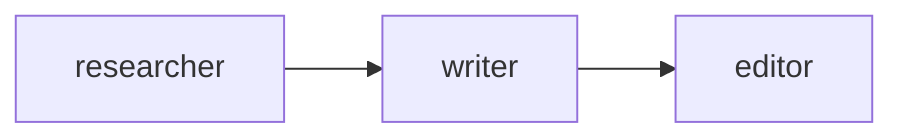
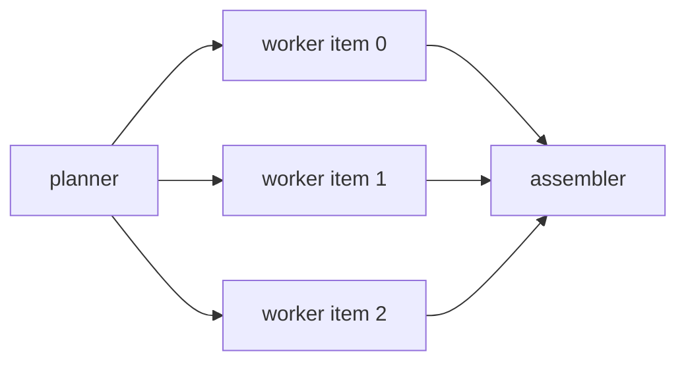
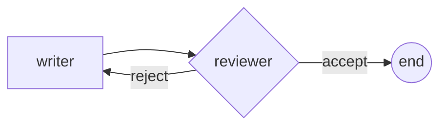
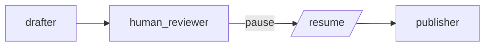
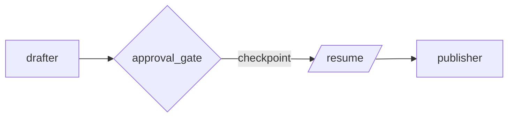
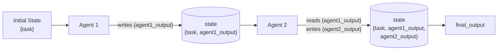
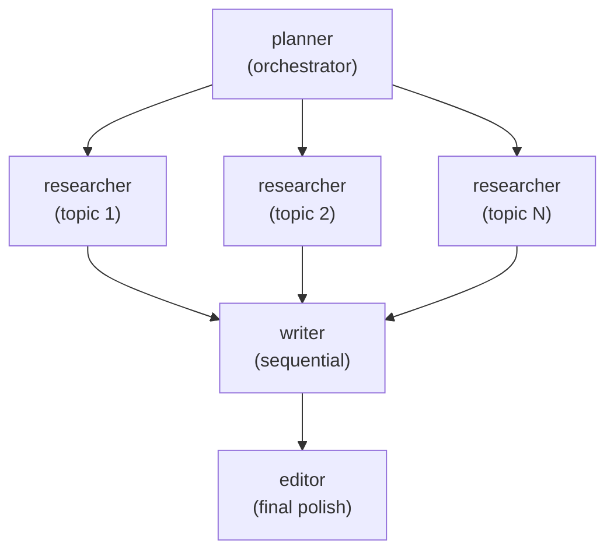
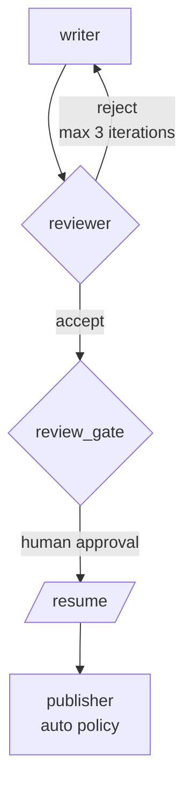
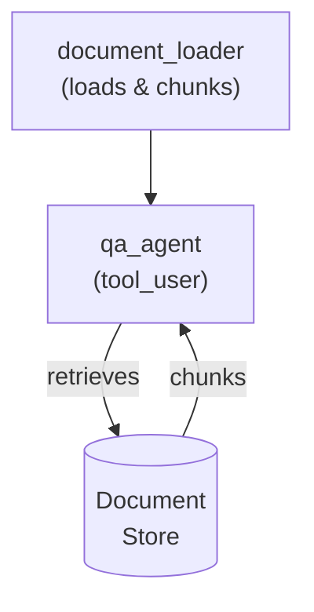

# Workflow Patterns Guide

This guide covers the six workflow step types, how to compose them, and common multi-agent patterns.

## Workflow Basics

A workflow is a directed graph of steps. Each step references an agent and defines how execution proceeds:

```python
from hiveflow import WorkflowEngine, WorkflowStep

steps = [
    WorkflowStep(agent="researcher", step_type="sequential", next_step="writer"),
    WorkflowStep(agent="writer", step_type="sequential"),
]
engine = WorkflowEngine(steps)
```

## Step Types

### Sequential

The simplest pattern — agents execute one after another:



```json
{
    "workflow": {
        "steps": [
            {"agent": "researcher", "type": "sequential", "next": "writer"},
            {"agent": "writer", "type": "sequential", "next": "editor"},
            {"agent": "editor", "type": "sequential"}
        ]
    }
}
```

Each agent receives the accumulated workflow state. The researcher's output is stored as `researcher_output` in the state, which the writer can access.

### Parallel Fan-Out

Run multiple agent instances concurrently, then aggregate results:



The orchestrator agent decomposes the task into `parallel_items`. The engine spawns one worker per item:

```json
{
    "workflow": {
        "steps": [
            {"agent": "planner", "type": "sequential", "next": "writer"},
            {"agent": "writer", "type": "parallel_fan_out", "next": "assembler"},
            {"agent": "assembler", "type": "sequential"}
        ]
    }
}
```

Each worker receives:
- `current_item` — its assigned sub-task
- `item_index` — position in the list
- Isolated context (~3–4K tokens)

Results are collected into `{agent_id}_outputs` (list) and summarized via `{agent_id}_outline`.

### Conditional

Branch based on an agent's evaluation — creates a review loop:



```json
{
    "workflow": {
        "steps": [
            {"agent": "writer", "type": "sequential", "next": "reviewer"},
            {
                "agent": "reviewer",
                "type": "conditional",
                "next_on_accept": null,
                "next_on_reject": "writer",
                "max_iterations": 3
            }
        ]
    }
}
```

The reviewer agent's output is checked for acceptance signals. If rejected, execution loops back to the writer. The loop is capped by `max_iterations` (default: 3) at the step level or `max_conditional_loops` (default: 5) globally.

### Human Gate

An agent-level pause for human input:



```json
{
    "agents": [
        {
            "id": "human_reviewer",
            "role": "Human Reviewer",
            "behavior_type": "human_gate",
            "system_prompt": "Review the draft and provide feedback."
        }
    ],
    "workflow": {
        "steps": [
            {"agent": "drafter", "type": "sequential", "next": "human_reviewer"},
            {"agent": "human_reviewer", "type": "human_gate", "next": "publisher"},
            {"agent": "publisher", "type": "sequential"}
        ]
    }
}
```

When the workflow reaches a `human_gate`, it transitions to `PAUSED` status. Use `session.resume()` or `HiveFlow.resume()` to continue.

### Gated Step

A workflow-level pause with no agent execution — just a checkpoint gate:



```json
{
    "workflow": {
        "steps": [
            {"agent": "drafter", "type": "sequential", "next": "approval_gate"},
            {
                "agent": "",
                "type": "gated",
                "gate_id": "approval_gate",
                "gate_description": "Review draft before publishing",
                "next": "publisher"
            },
            {"agent": "publisher", "type": "sequential"}
        ]
    }
}
```

The `gate_id` identifies the gate and `gate_description` provides context. The workflow emits a `GATE_REQUESTED` event and pauses until `resume()` is called.

### Sub-Workflow

Delegate to another team definition:

```mermaid
graph TD
    S1[step 1] --> SUB[sub_workflow]
    subgraph Nested Team
        N1[agent A] --> N2[agent B]
    end
    SUB --> Nested Team
    Nested Team --> S3[step 3]
```

```json
{
    "agent": "sub_team",
    "type": "sub_workflow",
    "team": "research_report",
    "input_mapping": {"task": "sub_task"},
    "output_mapping": {"final_output": "sub_result"}
}
```

## Checkpointing and Resume

Enable durable persistence so workflows survive process restarts:

```python
from hiveflow import HiveFlow
from hiveflow.core.checkpoint import FileCheckpointStorage

hf = HiveFlow(checkpoint_storage=FileCheckpointStorage())

# Start — pauses at human gate
session = await hf.run(team="review_team", task="Draft a proposal", checkpoint=True)

if session.status.value == "paused":
    # Resume after process restart
    session = await hf.resume(
        session_id=session.session_id,
        responses={req.request_id: {"approved": True}
                   for req in session.pending_requests},
    )
```

### Listing and Rewinding Checkpoints

```python
checkpoints = await hf.list_checkpoints("session-id")
for cp in checkpoints:
    print(f"{cp['checkpoint_id']} — step {cp['step_index']}")

# Resume from a specific checkpoint (rewind)
session = await hf.resume(
    session_id="session-id",
    responses={"approval": True},
    checkpoint_id=checkpoints[0]["checkpoint_id"],
)
```

## State Management

All data flows through the workflow state dictionary. Key conventions:

| Key Pattern | Written By | Contains |
|-------------|-----------|----------|
| `task` | Initial state | The user's task |
| `{agent_id}_output` | Agent | Full raw output |
| `{agent_id}_summary` | WorkflowEngine | ~200-token compressed summary |
| `{agent_id}_outline` | WorkflowEngine | Cross-cutting outline from parallel fan-out |
| `{agent_id}_usage` | Agent | Token usage stats |
| `parallel_items` | Orchestrator | Sub-task decomposition list |
| `final_output` | WorkflowEngine | Code-level assembled output |

### State Flow

Data accumulates in the shared state dictionary as each agent runs:



### State Schema Enforcement

Control how the engine validates state writes:

```json
{
    "state_schema": {
        "required_keys": ["task"],
        "enforcement_mode": "warn",
        "agent_io": {
            "researcher": {"reads": ["task"], "writes": ["findings"]},
            "writer": {"reads": ["task", "findings"], "writes": ["report"]}
        }
    }
}
```

| Mode | Behavior |
|------|----------|
| `warn` | Log warnings for undeclared state writes |
| `strict` | Filter output to only declared write keys |
| `off` | No enforcement |

## Event Callbacks

Register for live progress updates:

```python
def on_event(event_type: str, agent_id: str, data: dict) -> None:
    if event_type == "step_start":
        print(f"Starting: {agent_id}")
    elif event_type == "step_complete":
        print(f"Done: {agent_id}")

engine.on_event(on_event)
```

## Completion Callbacks

Register functions that fire after successful workflow execution:

```python
def publish_results(payload):
    print(f"Workflow complete: {payload.title}")

engine.on_complete(publish_results)
```

Callbacks receive the `ResultPayload`, execute in registration order, and have per-callback error isolation.

## Code-Level Assembly

After all steps complete, the engine can concatenate specified agents' outputs into a single `final_output` without an LLM call:

```python
engine = WorkflowEngine(
    steps,
    assembly_agents=["researcher", "writer"],
)
```

This preserves full section length without truncation — useful when you want the complete combined text.

## Common Patterns

### Research Report Pipeline



### Review Loop with Gated Publishing



### Document Q&A



## Examples

| Example | Description |
|---------|-------------|
| [01_basic_workflow.py](../../examples/getting_started/01_basic_workflow.py) | Two-agent sequential workflow |
| [05_conditional_workflow.py](../../examples/agents_and_teams/05_conditional_workflow.py) | Conditional review loop |
| [06_parallel_fanout.py](../../examples/agents_and_teams/06_parallel_fanout.py) | Parallel fan-out |
| [03_gated_workflow.py](../../examples/core_architecture/03_gated_workflow.py) | Gated steps |
| [04_checkpointing.py](../../examples/core_architecture/04_checkpointing.py) | Checkpoint save/load/rewind |
| [01_fan_out_report.py](../../examples/advanced_workflows/01_fan_out_report.py) | Full fan-out report pipeline |
