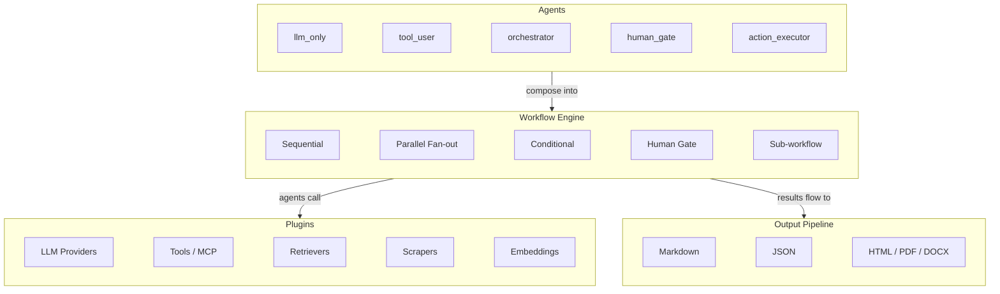
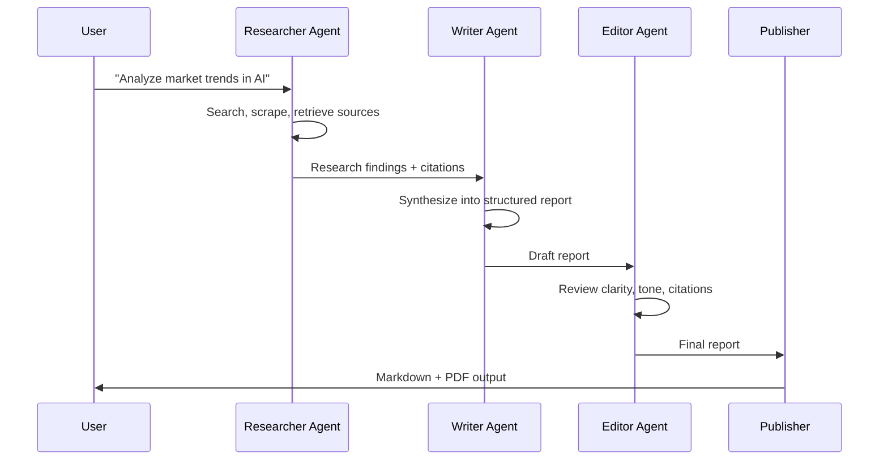
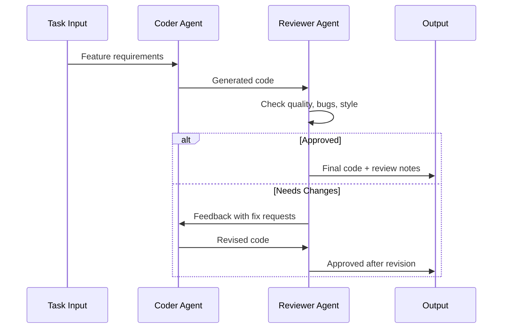
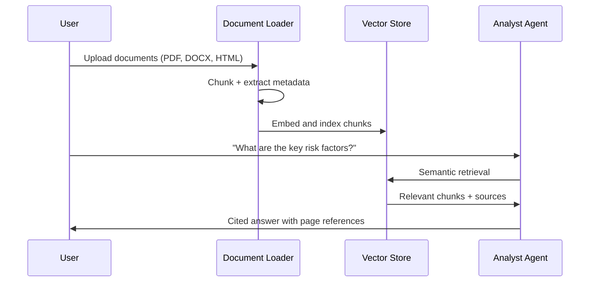
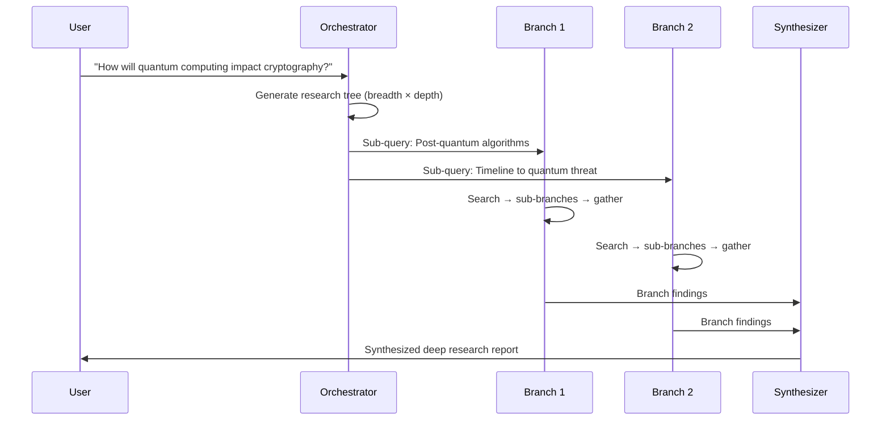
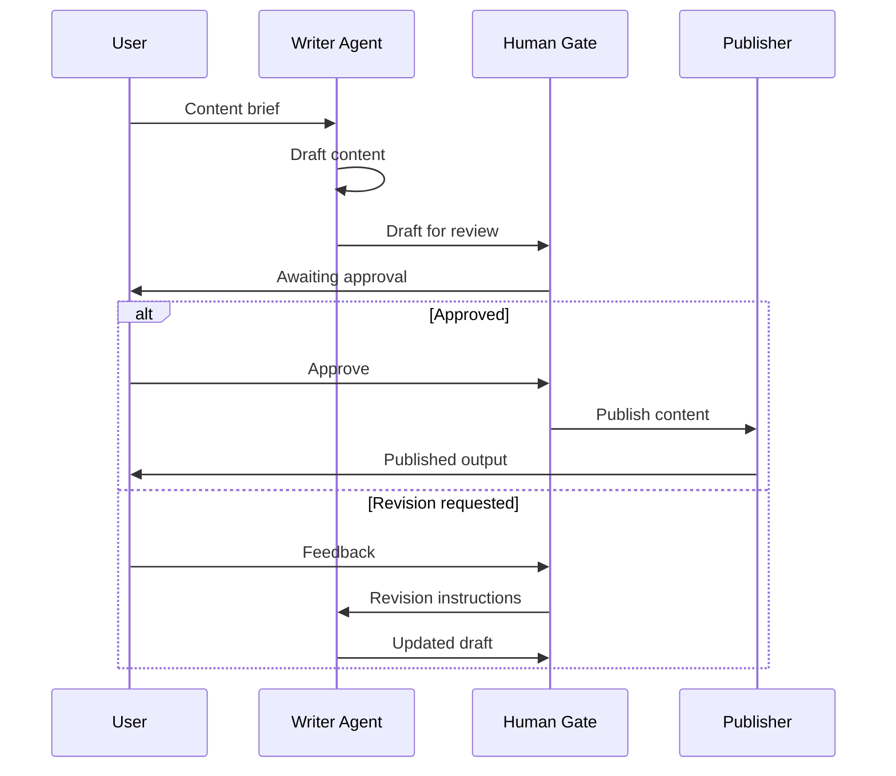

# HiveFlow Documentation

> **Build collaborative AI workflows with confidence.**
> HiveFlow is a production-grade multi-agent framework that lets you compose LLM agents into powerful, resilient workflows — from simple chains to recursive research pipelines.

```python
# Three lines to a working multi-agent pipeline
engine = WorkflowEngine(steps)
result = await engine.execute(agents=agents, initial_state={"task": "..."})
await registry.publish_all(result.result_payload, "./output", ["markdown", "pdf"])
```

---

## Architecture at a Glance

HiveFlow connects agents, workflows, plugins, and publishers into a clean, extensible pipeline:



---

## Quick Links

| | Topic | Description |
|---|-------|-------------|
| | [Quickstart](guides/quickstart.md) | Get a multi-agent pipeline running in 5 minutes |
| | [Getting Started](getting-started.md) | Complete walkthrough with real-world examples |
| | [Architecture](architecture.md) | Deep dive into framework internals and design decisions |
| | [Configuration](configuration.md) | Environment variables, LLM tiers, and layered config files |

---

## What Can You Build?

HiveFlow shines when you need multiple agents collaborating on complex tasks. Here are real-world patterns you can build today.

### Research Report Generation

Assemble a team of specialists — researchers gather data, a writer synthesizes findings, and an editor polishes the result.



### Code Review Pipeline

An agent writes code, a reviewer checks it, and a conditional loop sends it back for revision if needed.



### Document Analysis & Q&A

Load documents, chunk and embed them, then answer questions with grounded, cited responses.



### Deep Research with Recursive Exploration

Tackle complex topics with breadth-first recursive research — each branch spawns sub-queries that drill deeper.



### Content Creation with Human-in-the-Loop

Generate content with an approval gate — humans review before publication, with the option to request revisions.



---

## Key Features

| | Feature | What it gives you |
|---|---------|-------------------|
| | **Universal Agent** | One class, five behavior types — configure via system prompt, tools, model, and behavior |
| | **Workflow Engine** | Compose agents into graphs: sequential, parallel, conditional, gated, and sub-workflows |
| | **Plugin System** | Drop-in plugins for LLMs, tools, retrievers, scrapers, publishers, embeddings, and more |
| | **Context Management** | Summary propagation, differential compression, sliding window, TTL, and token budgets |
| | **Resilience** | Fallback chains, circuit breakers, bulkhead semaphores, and rate limiting out of the box |
| | **Cost Tracking** | Per-agent and per-workflow token usage and cost estimation across providers |
| | **Streaming** | Real-time async pub/sub event streaming with WebSocket support |
| | **Checkpointing** | Auto-checkpoint at gates, resume from any saved state, list checkpoint history |
| | **MCP Integration** | Connect to external tool servers via Model Context Protocol (stdio/HTTP) |
| | **Citations** | Automatic source tracking with APA, numbered, and inline formatting |
| | **Multi-format Output** | Publish to Markdown, JSON, HTML, PDF, and DOCX via publisher plugins |
| | **Agent Skills** | Open-standard skill system compatible with agentskills.io |

---

## Why HiveFlow?

> **"Agents are easy. Orchestrating them reliably is hard."**

- **One agent class to learn.** No inheritance trees — configure behavior, tools, and model at creation time.
- **Graphs, not chains.** Model real workflows with branching, loops, parallelism, and human gates.
- **Plugin everything.** Swap LLM providers, add tools, change output formats — without touching your workflow logic.
- **Production-ready from day one.** Checkpointing, fallback chains, circuit breakers, and cost tracking are built in, not bolted on.
- **Bring your own LLM.** Three-tier model selection (`FAST_LLM`, `SMART_LLM`, `STRATEGIC_LLM`) with automatic fallback across providers.

---

## User Guides

Step-by-step guides covering every major feature:

| | Guide | What you'll learn |
|---|-------|-------------------|
| | [Agents & Teams](guides/agents-and-teams.md) | Build agents, compose teams, use archetypes and dynamic generation |
| | [Workflow Patterns](guides/workflow-patterns.md) | Sequential, parallel, conditional, gated, and sub-workflow patterns |
| | [Document Processing](guides/document-processing.md) | Load, chunk, scope, and retrieve documents from any format |
| | [Data Processing](guides/data-processing.md) | Web search, scraping, embedding, and source curation pipelines |
| | [Output & Publishing](guides/output-publishing.md) | Publish results to Markdown, JSON, PDF, DOCX, and HTML |
| | [MCP Integration](guides/mcp-integration.md) | Connect agents to external MCP tool servers (stdio/HTTP) |
| | [Context Management](guides/context-management.md) | Control context flow, compression, and budgets in multi-agent pipelines |
| | [Deep Research](guides/deep-research.md) | Recursive branching research with breadth-first query trees |
| | [Resilience & Reliability](guides/resilience.md) | Configure fallback chains, circuit breakers, and rate limiting |
| | [Agent Skills](guides/agent-skills.md) | Integrate open-standard skills from agentskills.io |
| | [CLI Reference](guides/cli-reference.md) | Command-line interface for running and managing workflows |

---

## SDK Reference

Detailed API documentation for every class and module:

| | Module | Description |
|---|--------|-------------|
| | [HiveFlow](sdk/hiveflow.md) | Top-level facade — the single entry point to the framework |
| | [Agent](sdk/agent.md) | Universal agent class with five behavior types |
| | [WorkflowEngine](sdk/workflow-engine.md) | Workflow graph execution with state management |
| | [TeamConfiguration](sdk/team-configuration.md) | Pydantic schema for team definitions |
| | [TeamGenerator](sdk/team-generator.md) | LLM-powered dynamic team generation from task descriptions |
| | [WorkflowSession](sdk/workflow-session.md) | Session lifecycle, checkpointing, and resume |
| | [Streaming](sdk/streaming.md) | Real-time event streaming with async pub/sub |
| | [Cost Tracking](sdk/cost-tracking.md) | Token usage monitoring and cost estimation |
| | [Result Payload](sdk/result-payload.md) | Structured workflow output with sections and metadata |
| | [Prompts](sdk/prompts.md) | Prompt template library and composition utilities |
| | [Output Types](sdk/output-types.md) | Output type routing and format configuration |
| | [Document Pipeline](sdk/document-pipeline.md) | Document loading, chunking, and embedding pipeline |

---

## Plugin Reference

| | Plugin Type | Description |
|---|-------------|-------------|
| | [LLM Providers](llm-providers.md) | OpenAI, Anthropic, and Azure OpenAI with automatic fallback |
| | [Plugins](plugins.md) | Build custom tools, retrievers, scrapers, publishers, and more |

---

## Examples

The [examples/](../examples/) directory contains **80+ runnable scripts** organized by topic — from simple two-agent chains to full deep-research pipelines.

> See the [Examples README](../examples/README.md) for the complete index with descriptions.

---

## Installation

```bash
# Core install
uv sync

# Add the extras you need
uv sync --extra llm-azure # Azure OpenAI with Entra ID authentication
uv sync --extra publishers # PDF, DOCX, HTML output via pypandoc
uv sync --extra retrieval # Web search (Tavily, DuckDuckGo)
uv sync --extra scraping # Web scraping with BeautifulSoup + Playwright
uv sync --extra mcp # Model Context Protocol support
uv sync --extra all # Everything included
```

> **Tip:** Start with `uv sync` and add extras as needed. Use `--extra all` for the full experience.
