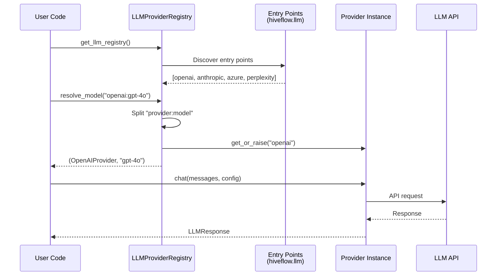
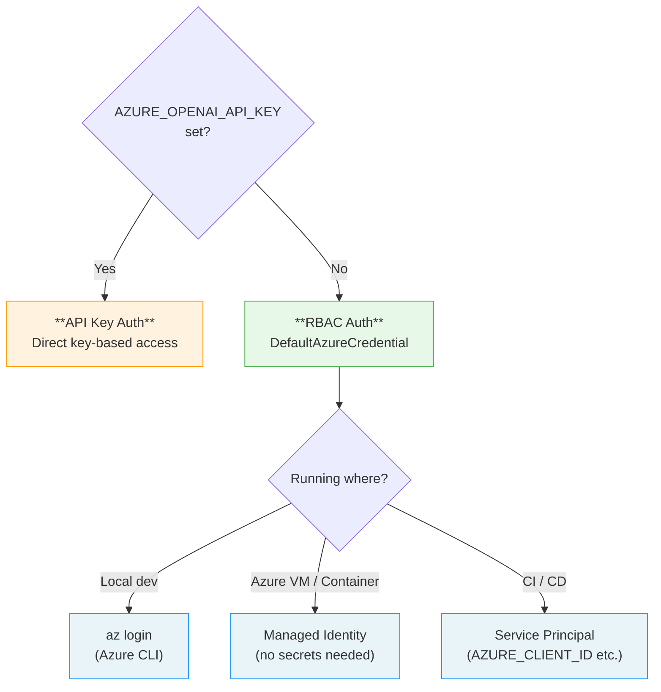
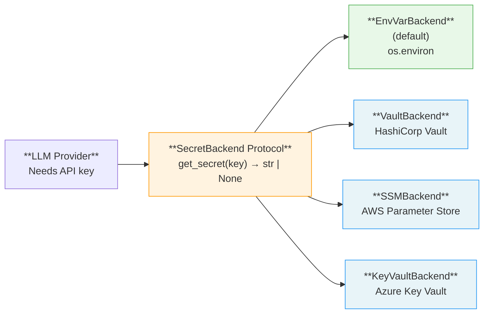
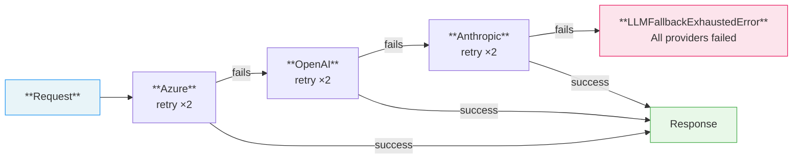
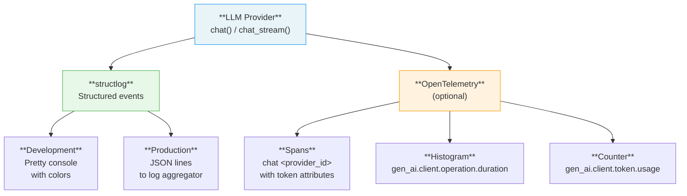

# LLM Providers

HiveFlow auto-discovers LLM providers via Python entry points. Built-in providers: **OpenAI**, **Anthropic**, **Azure OpenAI**, and **Perplexity**.

## Provider Discovery

> **Use case:** List all installed providers and inspect their capabilities at startup—useful for health checks and configuration validation.

All installed providers are discovered automatically at startup via the `hiveflow.llm` entry point group:



```python
from hiveflow.plugins.llm import get_llm_registry

registry = get_llm_registry()
print(registry.list_ids()) # ['anthropic', 'azure', 'openai', 'perplexity']
```

Inspect capabilities per provider:

```python
for pid in registry.list_ids():
    provider = registry.get_or_raise(pid)
    print(f"{pid}: streaming={provider.supports_streaming}, "
          f"tools={provider.supports_function_calling}, "
          f"vision={provider.supports_vision}")
```

## Provider Comparison

All built-in providers support the full feature set. Custom providers can override any flag.

| Capability | OpenAI | Anthropic | Azure OpenAI | Perplexity |
|------------|:------:|:---------:|:------------:|:----------:|
| Streaming | | | | |
| Function Calling | | | | — |
| JSON Mode | | | | |
| Vision / Multimodal | | | | — |
| RBAC / Managed Identity | — | — | | — |
| API Key Auth | | | | |
| `SecretBackend` Integration | | | | |

> **Tip:** Use `check_provider_capabilities(provider, ["streaming", "function_calling"])` to programmatically verify a provider supports what your agents need.

## Model Resolution

All model references use the `provider:model` format:

```python
provider, model = registry.resolve_model("openai:gpt-4o")
provider, model = registry.resolve_model("anthropic:claude-sonnet-4-20250514")
provider, model = registry.resolve_model("azure:my-deployment-name")
provider, model = registry.resolve_model("perplexity:sonar-pro")
```

If a provider is not installed, the error message suggests how to install it:

```
Provider 'google' not found. Available: anthropic, azure, openai.
  Install with: uv add hiveflow[llm-google]
```

## Basic Chat

> **Use case:** Send a single prompt to any provider with token usage tracking.

```python
import asyncio
from hiveflow.plugins.llm import get_llm_registry, LLMConfig, LLMMessage

async def main():
    registry = get_llm_registry()
    provider, model = registry.resolve_model("openai:gpt-4o")

    response = await provider.chat(
        messages=[LLMMessage(role="user", content="Hello!")],
        config=LLMConfig(model=model, max_tokens=100),
    )
    print(response.content)
    print(f"Tokens: {response.usage.total_tokens}")

asyncio.run(main())
```

## Streaming

> **Use case:** Display LLM output token-by-token for interactive UIs or CLI tools.

```python
import asyncio, sys
from hiveflow.plugins.llm import get_llm_registry, LLMConfig, LLMMessage

async def main():
    registry = get_llm_registry()
    provider, model = registry.resolve_model("openai:gpt-4o-mini")

    messages = [LLMMessage(role="user", content="Write a haiku about code.")]
    config = LLMConfig(model=model, max_tokens=60)

    async for token in provider.chat_stream(messages, config):
        sys.stdout.write(token)
        sys.stdout.flush()

asyncio.run(main())
```

## Azure OpenAI

> **Use case:** Deploy in enterprise environments with Azure's compliance, networking, and identity features.

Azure supports two authentication paths. The provider picks automatically based on which credentials are available.

### Azure Authentication Decision Tree



### Setup

```bash
# Install Azure extras
uv sync --extra llm-azure
```

### RBAC Authentication (Preferred)

Uses `DefaultAzureCredential` from `azure-identity`. Works with `az login`, managed identity, or service principal environment variables.

```bash
export AZURE_OPENAI_ENDPOINT=https://my-resource.openai.azure.com
```

The identity must have the **Cognitive Services OpenAI User** role on the Azure OpenAI resource.

### API Key Authentication

```bash
export AZURE_OPENAI_ENDPOINT=https://my-resource.openai.azure.com
export AZURE_OPENAI_API_KEY=your-key
```

### Usage

The model name in `azure:<deployment>` is your Azure deployment name:

```python
provider, model = registry.resolve_model("azure:gpt-4o-mini")
response = await provider.chat(messages, LLMConfig(model=model))
```

### Endpoint Format

Use the base resource URL, not the full deployment URL. If you paste the full URL from the Azure portal, the provider auto-strips `/openai/deployments/<name>`:

```
https://my-resource.openai.azure.com (correct)
https://my-resource.openai.azure.com/openai/deployments/gpt-4o-mini (also works)
```

## Perplexity

> **Use case:** Use Perplexity Sonar models when you want web-grounded responses through an OpenAI-compatible API.

Perplexity is wired as a first-class provider with the model prefix `perplexity:` and uses `PERPLEXITY_API_KEY` for authentication.

### Setup

```bash
export PERPLEXITY_API_KEY=your-key
```

Optional override for proxies or custom gateways:

```bash
export PERPLEXITY_BASE_URL=https://api.perplexity.ai
```

### Usage

```python
provider, model = registry.resolve_model("perplexity:sonar-pro")
response = await provider.chat(messages, LLMConfig(model=model))
```

Available built-in model hints:

```python
provider.get_available_models()
# ['sonar', 'sonar-pro', 'sonar-deep-research', 'sonar-reasoning-pro']
```

Perplexity uses the OpenAI-compatible chat completions shape, so `config.extra` can carry provider-specific search options such as `search_mode`, `search_domain_filter`, or `return_related_questions` when needed.

## Secret Backend

> **Use case:** Centralize credential management—especially in production where secrets come from Vault, SSM, or Key Vault instead of environment variables.

Providers resolve credentials via a pluggable `SecretBackend` protocol. The default `EnvVarBackend` reads from environment variables. You can swap it to any store (Vault, SSM, Azure Key Vault, etc.):



```python
from hiveflow.plugins.llm import set_secret_backend, get_secret_backend

# Default: reads from os.environ
backend = get_secret_backend() # EnvVarBackend

# Custom backend
class VaultBackend:
    def get_secret(self, key: str) -> str | None:
        return vault_client.read(f"secret/hiveflow/{key}")

set_secret_backend(VaultBackend())
# All providers now fetch credentials from Vault
```

The protocol uses structural typing -- any class with `get_secret(key: str) -> str | None` qualifies.

## Fallback Chains

> **Use case:** Build resilient LLM pipelines that survive provider outages by automatically cascading to backup providers.

Cascade through providers on failure with automatic retries:



```python
from hiveflow.core.fallback import build_fallback_chain

chain = build_fallback_chain([
    (azure_provider, "gpt-4o-eastus"),
    (openai_provider, "gpt-4o"),
    (anthropic_provider, "claude-sonnet-4-20250514"),
], max_retries_per_provider=2)

response = await chain.chat(messages, config)
```

Each provider is retried up to `max_retries_per_provider` times before moving to the next. If all providers fail, `LLMFallbackExhaustedError` is raised with details about each failure.

You can also use the lower-level building blocks:

```python
from hiveflow.core.fallback import FallbackChain, RetryProvider

# Manual construction
chain = FallbackChain([
    (RetryProvider(azure_provider, max_retries=3), "gpt-4o-eastus"),
    (openai_provider, "gpt-4o"), # no retries on this one
])
```

> **Tip:** Transient exceptions (`LLMRateLimitError`, `LLMConnectionError`) trigger retries. Non-transient errors (auth failures, invalid requests) immediately move to the next provider.

## Observability

> **Use case:** Monitor LLM usage, latency, and errors across providers in development or production.

### Observability Integration



### Structured Logging

All providers emit structured events via `structlog`. Call `configure_logging()` once at startup:

```python
from hiveflow.core.observability import configure_logging
configure_logging()
```

The renderer is selected by `HIVEFLOW_ENV`:
- `development` (default): Pretty console output with colors
- `production`: JSON lines (one JSON object per log line)

Log events emitted by providers:
- `llm.chat.complete` -- successful chat with `provider_id`, `model`, `latency_ms`, `prompt_tokens`, `completion_tokens`
- `llm.chat.error` -- failed chat with `provider_id`, `model`, `latency_ms`
- `llm.chat_stream.complete` / `llm.chat_stream.error` -- streaming equivalents

### OpenTelemetry (Optional)

OTel spans and metrics are gated by `HIVEFLOW_OTEL_ENABLED=true` (default: `false`). When disabled, no OTel overhead is incurred.

When enabled, providers create:
- Spans: `chat <provider_id>` with `gen_ai.system`, `gen_ai.request.model`, token attributes
- Histogram: `gen_ai.client.operation.duration` (seconds)
- Counter: `gen_ai.client.token.usage` (tokens)

```bash
HIVEFLOW_OTEL_ENABLED=true uv run python my_app.py
```

## Examples

See [`examples/llm_providers/`](../examples/llm_providers/) for 8 runnable examples:

| # | File | Keys? | Covers |
|---|------|-------|--------|
| 01 | `01_discovery.py` | None | Provider discovery, capabilities, error messages |
| 02 | `02_chat.py` | Any | Chat across providers with token usage |
| 03 | `03_streaming.py` | Any | Real-time token streaming |
| 04 | `04_azure_rbac.py` | Azure | RBAC vs API key, chat + streaming |
| 05 | `05_secret_backend.py` | None | Dict, Vault-style backends, protocol check |
| 06 | `06_tier_variables.py` | None | Tier resolution, env + programmatic overrides |
| 07 | `07_fallback_chain.py` | None | FallbackChain, RetryProvider, mock providers |
| 08 | `08_observability.py` | Any | structlog config, OTel toggle, live log events |
