# Plugin System

HiveFlow uses a plugin architecture that makes every major subsystem extensible — LLM providers, tools, retrievers, scrapers, publishers, embeddings, vector stores, and document loaders. Plugins are discovered automatically via Python entry points and drop-in directories.

---

## Architecture Overview

The plugin system is built around a generic `PluginRegistry[T]` that handles discovery, deduplication, and lookup for all plugin types. Every plugin implements `BasePlugin` and provides a unique `plugin_id`.

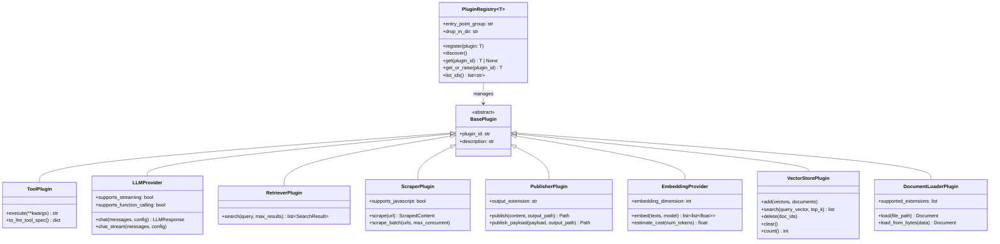

---

## Plugin Discovery Flow

When a registry calls `discover()`, plugins are loaded from two sources and merged with deduplication:

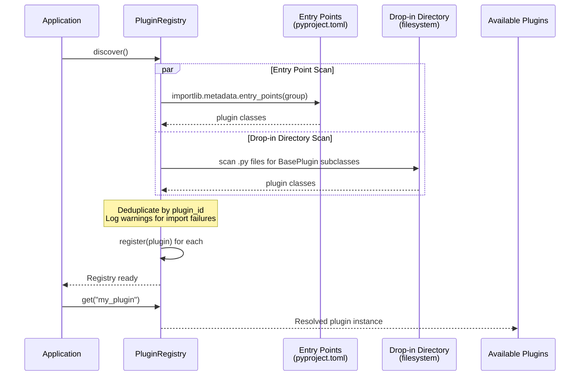

> ** Tip:** If two plugins share the same `plugin_id`, the first one registered wins. Entry points are scanned before drop-in directories.

---

## Plugin Lifecycle

Every plugin moves through four phases from installation to use:

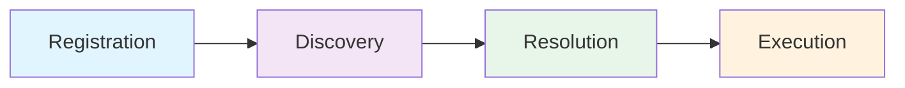

| Phase | What Happens |
|-------|-------------|
| **Registration** | Plugin class is defined and entry point is declared in `pyproject.toml` (or placed in a drop-in directory) |
| **Discovery** | `registry.discover()` scans entry points and drop-in directories, instantiates plugins |
| **Resolution** | `registry.get("plugin_id")` or `registry.get_or_raise("plugin_id")` retrieves a specific plugin |
| **Execution** | The plugin's main method is called (`chat()`, `search()`, `scrape()`, etc.) |

---

## Plugin Types Comparison

| Plugin Type | Base Class | Entry Point Group | Input | Output | Built-in |
|---|---|---|---|---|---|
| **Tools** | `ToolPlugin` | `hiveflow.tools` | `dict` (JSON kwargs) | `str` | `document_retriever` |
| **LLM Providers** | `LLMProvider` | `hiveflow.llm` | `LLMMessage[]` + `LLMConfig` | `LLMResponse` | `openai`, `anthropic` |
| **Retrievers** | `RetrieverPlugin` | `hiveflow.retrievers` | `query: str` | `SearchResult[]` | `tavily`, `duckduckgo` |
| **Scrapers** | `ScraperPlugin` | `hiveflow.scrapers` | `url: str` | `ScrapedContent` | `beautifulsoup`, `playwright` |
| **Publishers** | `PublisherPlugin` | `hiveflow.publishers` | `content` + `output_path` | `Path` | `pdf` |
| **Embeddings** | `EmbeddingProvider` | `hiveflow.embeddings` | `text[]` | `float[][]` | `local` |
| **Vector Stores** | `VectorStorePlugin` | `hiveflow.vector_stores` | vectors + documents | `(doc, score)[]` | `memory` |
| **Document Loaders** | `DocumentLoaderPlugin` | `hiveflow.document_loaders` | file path or bytes | `Document` | — |

---

## Creating Your First Plugin

This walkthrough creates a simple retriever plugin from scratch.

### Step 1: Choose Your Plugin Type

Pick the base class that matches what your plugin does. For a search backend, that's `RetrieverPlugin`.

### Step 2: Implement the Interface

```python
# my_search_package/searcher.py
from hiveflow.plugins.retrievers import RetrieverPlugin, SearchResult

class WikiRetriever(RetrieverPlugin):
    @property
    def plugin_id(self) -> str:
        return "wiki"

    @property
    def description(self) -> str:
        return "Search Wikipedia articles"

    async def search(self, query: str, max_results: int = 10) -> list[SearchResult]:
        # Your Wikipedia API call here
        return [
            SearchResult(
                title="Quantum Computing",
                url="https://en.wikipedia.org/wiki/Quantum_computing",
                content="A quantum computer uses quantum-mechanical phenomena...",
                score=0.92,
                metadata={"provider": "wiki"},
            )
        ]
```

### Step 3: Register the Entry Point

In your package's `pyproject.toml`:

```toml
[project.entry-points."hiveflow.retrievers"]
wiki = "my_search_package.searcher:WikiRetriever"
```

### Step 4: Install and Test

```bash
pip install -e . # Install your package in development mode
```

```python
import pytest
from my_search_package.searcher import WikiRetriever

class TestWikiRetriever:
    def test_properties(self):
        r = WikiRetriever()
        assert r.plugin_id == "wiki"

    @pytest.mark.asyncio
    async def test_search(self):
        r = WikiRetriever()
        results = await r.search("quantum computing")
        assert len(results) > 0
        assert all(isinstance(r, SearchResult) for r in results)
```

### Step 5: Use in a Workflow

```python
from hiveflow.plugins.retrievers import RetrieverRegistry

registry = RetrieverRegistry()
registry.discover()

results = await registry.search_all(
    query="quantum computing",
    retriever_ids=["wiki", "duckduckgo"],
)
```

> ** Tip:** Every plugin type follows this same pattern: subclass → implement → register entry point → install → use. The only difference is which methods you implement.

---

## Tool Plugins

### Overview

Tools give LLM agents the ability to take actions — search the web, read files, call APIs, run calculations. Each tool provides a JSON schema so the LLM knows how to invoke it.

> ** Use Case:** You want your agent to query an internal API, run a database lookup, or interact with a third-party service during a conversation.

### Data Flow

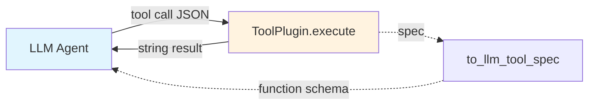

### Code

```python
from hiveflow.plugins.tools import ToolPlugin

class MySearchTool(ToolPlugin):
    @property
    def plugin_id(self) -> str:
        return "my_search"

    @property
    def description(self) -> str:
        return "Search the web for information"

    def to_llm_tool_spec(self) -> dict:
        return {
            "type": "function",
            "function": {
                "name": "my_search",
                "description": "Search the web",
                "parameters": {
                    "type": "object",
                    "properties": {"query": {"type": "string"}},
                    "required": ["query"],
                },
            },
        }

    async def execute(self, **kwargs) -> str:
        query = kwargs.get("query", "")
        # Your search logic
        return f"Results for: {query}"
```

### Registration

```toml
[project.entry-points."hiveflow.tools"]
my_search = "my_package:MySearchTool"
```

---

## LLM Providers

### Overview

LLM providers connect HiveFlow to language model APIs. Each provider wraps a specific API (OpenAI, Anthropic, a local model, etc.) behind a uniform `chat()` interface.

> ** Use Case:** You want to use a self-hosted model, a provider not included out of the box, or add custom pre/post-processing around LLM calls.

### Data Flow

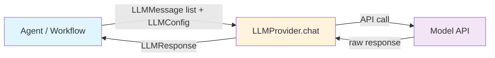

### Code

```python
from hiveflow.plugins.llm import LLMProvider, LLMConfig, LLMMessage, LLMResponse

class MyProvider(LLMProvider):
    @property
    def plugin_id(self) -> str:
        return "my_provider"

    @property
    def description(self) -> str:
        return "My custom LLM provider"

    @property
    def supports_streaming(self) -> bool:
        return False

    async def chat(self, messages: list[LLMMessage], config: LLMConfig) -> LLMResponse:
        # Your API call here
        return LLMResponse(content="Hello!", model=config.model)
```

### Registration

```toml
[project.entry-points."hiveflow.llm"]
my_provider = "my_package:MyProvider"
```

Then resolve by prefix: `registry.resolve_model("my_provider:my-model")`

### Capability Reporting

LLM providers declare their capabilities via boolean properties. This lets callers select the right provider at runtime:

```python
provider = registry.get_or_raise("openai")
provider.supports_streaming # True
provider.supports_function_calling # True
provider.supports_json_mode # True
provider.supports_vision # True
```

> ** Tip:** If your provider doesn't support a capability, return `False`. Callers will gracefully fall back or skip features that require it.

---

## Retriever Plugins

### Overview

Retrievers search external sources (web search engines, internal knowledge bases, document indices) and return normalized `SearchResult` objects. Multiple retrievers can be queried in parallel and results are deduplicated.

> ** Use Case:** You want to search your internal knowledge base alongside public web results, or add a specialized academic paper search to your research workflow.

### Data Flow

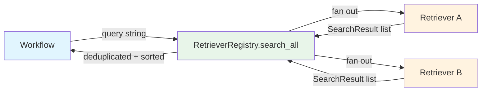

### Code

```python
from hiveflow.plugins.retrievers import RetrieverPlugin, SearchResult

class MyRetriever(RetrieverPlugin):
    @property
    def plugin_id(self) -> str:
        return "my_search"

    @property
    def description(self) -> str:
        return "My custom search backend"

    async def search(self, query: str, max_results: int = 10) -> list[SearchResult]:
        # Call your search API
        return [
            SearchResult(
                title="Result Title",
                url="https://example.com",
                content="Snippet text...",
                score=0.95,
                metadata={"provider": "my_search"},
            )
        ]
```

### Registration & Usage

```toml
[project.entry-points."hiveflow.retrievers"]
my_search = "my_package:MyRetriever"
```

```python
from hiveflow.plugins.retrievers import RetrieverRegistry

registry = RetrieverRegistry()
registry.discover()
results = await registry.search_all(
    query="quantum computing",
    retriever_ids=["my_search", "duckduckgo"],
)
# Results are deduplicated by URL and sorted by score
```

**Built-in retrievers**: `tavily` (requires `TAVILY_API_KEY`), `duckduckgo` (no key needed).

---

## Scraper Plugins

### Overview

Scrapers fetch web pages and extract clean text content. Some scrapers handle static HTML; others support JavaScript-rendered pages. The `ScraperRouter` automatically selects the best scraper for each URL.

> ** Use Case:** You need to extract content from a specific type of website (e.g., arXiv papers, GitHub READMEs) that requires specialized parsing, or you need JS rendering for SPAs.

### Data Flow

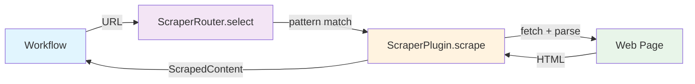

### Code

```python
from hiveflow.plugins.scrapers import ScraperPlugin, ScrapedContent

class MyScraper(ScraperPlugin):
    @property
    def plugin_id(self) -> str:
        return "my_scraper"

    @property
    def description(self) -> str:
        return "My content extractor"

    @property
    def supports_javascript(self) -> bool:
        return False # Set True for JS-capable scrapers

    async def scrape(self, url: str) -> ScrapedContent:
        # Fetch and extract content
        return ScrapedContent(
            url=url,
            title="Page Title",
            text="Extracted clean text...",
            metadata={"scraper": "my_scraper"},
        )
```

Batch scraping with concurrency control:

```python
results = await scraper.scrape_batch(urls, max_concurrent=15)
for result in results:
    if isinstance(result, BaseException):
        print(f"Error: {result}")
    else:
        print(f"{result.title}: {result.word_count} words")
```

### ScraperRouter

The `ScraperRouter` matches URL patterns against registered scrapers and selects the most appropriate one:

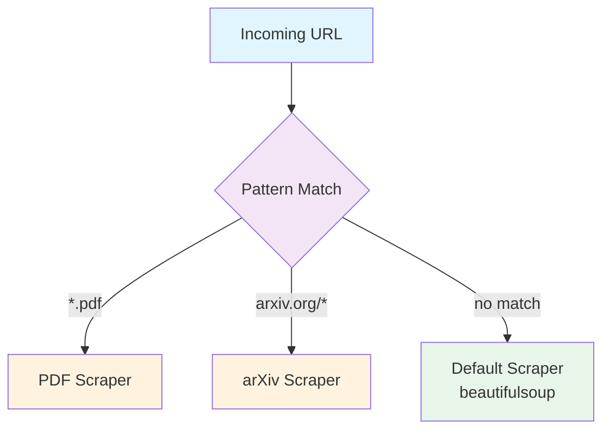

```python
from hiveflow.plugins.scrapers import ScraperRouter, ScraperRegistry

router = ScraperRouter(registry, default_scraper_id="beautifulsoup")
scraper = router.select("https://arxiv.org/abs/2401.00001") # Routes to arxiv scraper
scraper = router.select("https://example.com/page") # Falls back to default
```

### Content Validation

```python
from hiveflow.plugins.scrapers import validate_scraped_content, MIN_CONTENT_LENGTH

# Rejects pages with fewer than 100 chars of text
if validate_scraped_content(content):
    # Process content
```

**Built-in scrapers**: `beautifulsoup` (lightweight HTML), `playwright` (JS-capable, requires `playwright install chromium`).

---

## Publisher Plugins

### Overview

Publishers convert workflow results into output files — PDFs, LaTeX documents, HTML reports, or any other format. They support both a simple string API and a richer payload-aware API.

> ** Use Case:** You want workflow output in a specific format (LaTeX for academic papers, EPUB for ebooks, custom HTML for your company's report template).

### Data Flow

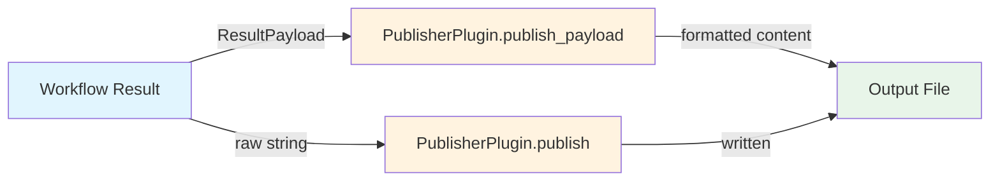

### Code

```python
from pathlib import Path
from typing import Any

from hiveflow.core.layout import LayoutTemplate
from hiveflow.core.result_payload import ResultPayload
from hiveflow.plugins.publishers import PublisherPlugin


class LatexPublisher(PublisherPlugin):
    @property
    def plugin_id(self) -> str:
        return "latex"

    @property
    def description(self) -> str:
        return "LaTeX output publisher"

    @property
    def output_extension(self) -> str:
        return ".tex"

    async def publish(
        self,
        content: str,
        output_path: str | Path,
        metadata: dict[str, Any] | None = None,
    ) -> Path:
        """Legacy string-based API (required)."""
        path = Path(output_path)
        if not path.suffix:
            path = path.with_suffix(".tex")
        path.parent.mkdir(parents=True, exist_ok=True)
        path.write_text(content, encoding="utf-8")
        return path

    async def publish_payload(
        self,
        payload: ResultPayload,
        output_path: str | Path,
        layout: LayoutTemplate | None = None,
        config: dict[str, Any] | None = None,
    ) -> Path:
        """Payload-aware API (recommended override)."""
        path = Path(output_path)
        if not path.suffix:
            path = path.with_suffix(".tex")
        path.parent.mkdir(parents=True, exist_ok=True)
        # Build LaTeX from payload fields
        tex = f"\\title{{{payload.title}}}\n\\begin{{document}}\n{payload.content}\n\\end{{document}}"
        path.write_text(tex, encoding="utf-8")
        return path
```

### Protocol Requirements

| Property / Method | Required | Description |
|---|---|---|
| `plugin_id` | Yes | Unique string identifier (e.g., `"latex"`) |
| `description` | Yes | Human-readable description |
| `output_extension` | Yes | File extension including dot (e.g., `".tex"`) |
| `publish(content, output_path, metadata)` | Yes | Legacy string API |
| `publish_payload(payload, output_path, layout, config)` | No | Payload-aware API (falls back to `publish` if not overridden) |

### Registration

```toml
[project.entry-points."hiveflow.publishers"]
latex = "my_publisher_package:LatexPublisher"
```

After installation, the publisher is automatically discovered and available:

```python
from hiveflow.plugins.publishers import PublisherRegistry

registry = PublisherRegistry()
registry.discover()
assert "latex" in registry
```

### Testing

```python
import pytest
from my_publisher_package import LatexPublisher
from hiveflow.core.result_payload import ResultPayload


class TestLatexPublisher:
    async def test_publish_payload(self, tmp_path):
        publisher = LatexPublisher()
        payload = ResultPayload(title="Test", content="Hello world")
        result = await publisher.publish_payload(payload, tmp_path / "out.tex")
        assert result.exists()
        assert result.suffix == ".tex"

    def test_properties(self):
        publisher = LatexPublisher()
        assert publisher.plugin_id == "latex"
        assert publisher.output_extension == ".tex"
```

### Error Isolation

When a publisher is invoked as part of multi-format publishing (`publish_all`), exceptions are caught and logged. A failure in your publisher does not prevent other publishers from completing.

---

## Embedding Providers

### Overview

Embedding providers convert text into dense vector representations used for similarity search. They handle batching automatically and can report estimated costs.

> ** Use Case:** You want to use a local embedding model instead of OpenAI, or connect to a specialized embedding service tuned for your domain (medical, legal, code).

### Data Flow

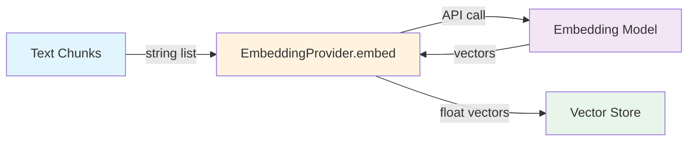

### Code

```python
from hiveflow.plugins.embeddings import EmbeddingProvider

class MyEmbeddingProvider(EmbeddingProvider):
    @property
    def plugin_id(self) -> str:
        return "my_embeddings"

    @property
    def description(self) -> str:
        return "My embedding backend"

    @property
    def embedding_dimension(self) -> int:
        return 768

    async def embed(self, texts: list[str], model: str | None = None) -> list[list[float]]:
        # Call your embedding API
        # Must auto-split when len(texts) > self.max_batch_size
        return [[0.1, 0.2, ...] for _ in texts]

    def estimate_cost(self, num_tokens: int) -> float:
        return (num_tokens / 1_000_000) * 0.02 # USD
```

### Registration

```toml
[project.entry-points."hiveflow.embeddings"]
my_embeddings = "my_package:MyEmbeddingProvider"
```

**Built-in providers**: `local` (local model embeddings).

---

## Vector Store Plugins

### Overview

Vector stores persist embedding vectors and support fast similarity search. They are the storage backend for RAG (Retrieval-Augmented Generation) pipelines.

> ** Use Case:** You want to swap the in-memory store for a production database like ChromaDB, Pinecone, Qdrant, or Weaviate — without changing any workflow code.

### Data Flow

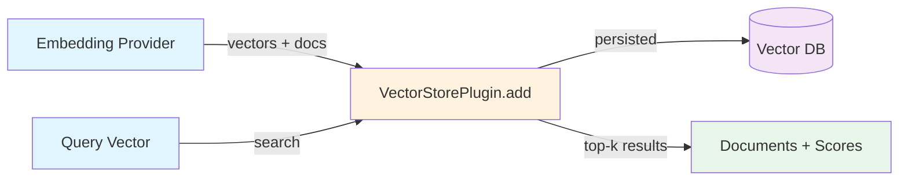

### Code

```python
from hiveflow.plugins.vector_stores import VectorStorePlugin

class MyVectorStore(VectorStorePlugin):
    @property
    def plugin_id(self) -> str:
        return "my_store"

    @property
    def description(self) -> str:
        return "My vector database"

    async def add(self, vectors, documents) -> None:
        # Each document must have a "doc_id" key
        ...

    async def search(self, query_vector, top_k=5, filters=None):
        # Return list of (document, similarity_score) tuples
        ...

    async def delete(self, doc_ids) -> None: ...
    async def clear(self) -> None: ...
    async def count(self) -> int: ...
```

### Registration

```toml
[project.entry-points."hiveflow.vector_stores"]
my_store = "my_package:MyVectorStore"
```

### CollectionManager

`CollectionManager` provides namespace isolation so each workflow run gets its own vector space. Ephemeral collections are automatically cleaned up when the workflow finishes.

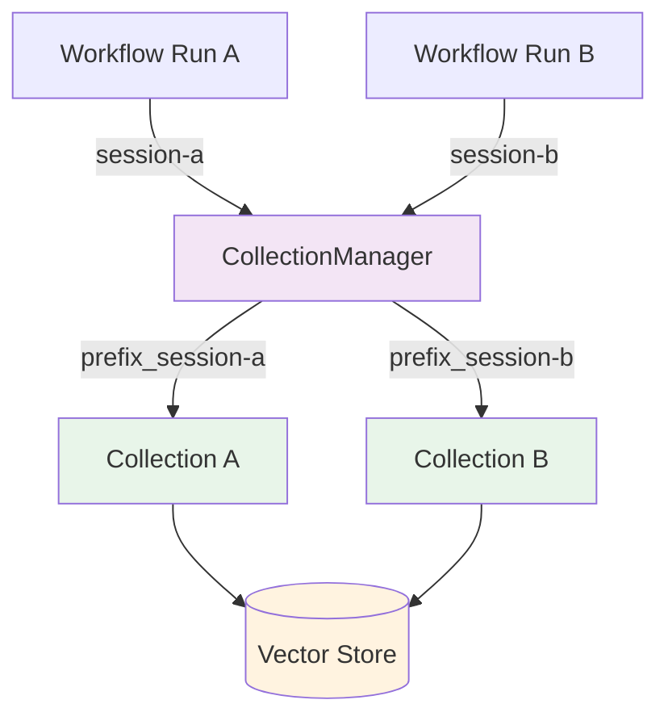

```python
from hiveflow.plugins.vector_stores import CollectionManager

mgr = CollectionManager(store, collection_prefix="research_", persist=False)
print(mgr.collection_name("session-abc")) # "research_session-abc"
await mgr.cleanup() # Clears ephemeral collections
```

> ** Tip:** Set `persist=True` if you want collections to survive across workflow runs (e.g., for a long-lived knowledge base).

**Built-in stores**: `memory` (in-memory with numpy cosine similarity).

---

## Document Loader Plugins

### Overview

Document loaders parse files (PDF, DOCX, Markdown, etc.) into structured `Document` objects with content, metadata, and optional chunking.

> ** Use Case:** You need to ingest a proprietary file format into your RAG pipeline, or you want custom chunking logic for a specific document type.

### Data Flow

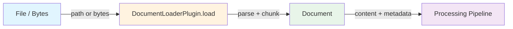

### Registration

```toml
[project.entry-points."hiveflow.document_loaders"]
my_loader = "my_package:MyDocumentLoader"
```

---

## Discovery Mechanism

Plugins are discovered from two sources:

1. **Entry points** — registered in `pyproject.toml` under the appropriate group (e.g., `hiveflow.tools`)
2. **Drop-in directories** — Python files placed in a configurable directory (e.g., `providers/`)

The registry deduplicates by `plugin_id` and gracefully skips plugins that fail to import, logging a warning instead of crashing.

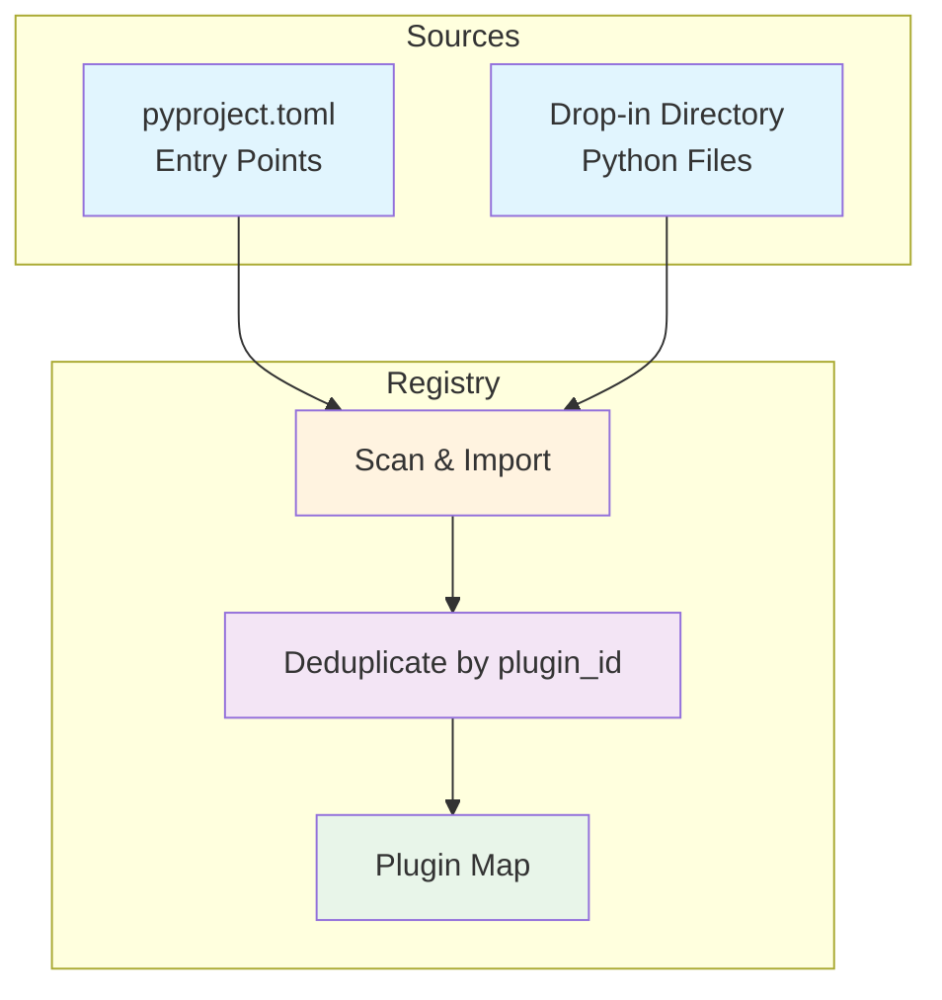

> ** Tip:** Drop-in directories are ideal for development and prototyping. For distribution, always use entry points so your plugin is discovered automatically after `pip install`.
