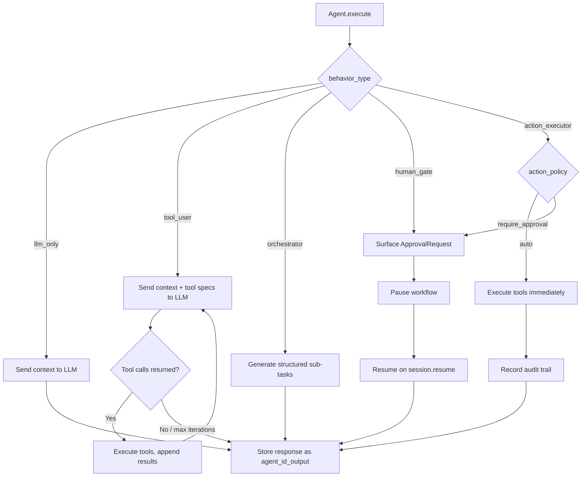

# Agent -- SDK Reference

> The Agent class is the universal building block of HiveFlow, specialized at creation time through configuration to handle LLM calls, tool usage, orchestration, human gates, or real-world action execution.



## Import

```python
from hiveflow import Agent, AgentBehaviorType, AgentResult
```

## AgentBehaviorType

```python
class AgentBehaviorType(StrEnum):
    LLM_ONLY = "llm_only"
    TOOL_USER = "tool_user"
    ORCHESTRATOR = "orchestrator"
    HUMAN_GATE = "human_gate"
    ACTION_EXECUTOR = "action_executor"
```

| Value | Description | Tools | Pauses |
|-------|-------------|:-----:|:------:|
| `llm_only` | Pure LLM response | No | No |
| `tool_user` | LLM with tool access loop | Yes | No |
| `orchestrator` | Decomposes tasks, manages sub-workflows | No | No |
| `human_gate` | Pauses for human approval/input | No | Yes |
| `action_executor` | Real-world side effects with safety policies | Yes | Maybe |

## Constructor

```python
Agent(
    agent_id: str,
    role: str,
    system_prompt: str,
    behavior_type: AgentBehaviorType,
    tools: list[ToolPlugin] | None = None,
    model: str = "$SMART_LLM",
    llm_provider: LLMProvider | None = None,
    llm_config: LLMConfig | None = None,
    max_tool_iterations: int = 10,
    context_budget: int | None = None,
    agent_definition: AgentDefinition | None = None,
    action_policy: str | None = None,
    output_type: str | None = None,
    context_recency_window: int = 0,
    context_reducer: ContextReducer | None = None,
)
```

### Parameters

| Parameter | Type | Default | Description |
|-----------|------|---------|-------------|
| `agent_id` | `str` | — | Unique identifier |
| `role` | `str` | — | Human-readable role description |
| `system_prompt` | `str` | — | System prompt defining agent behavior |
| `behavior_type` | `AgentBehaviorType` | — | How the agent executes |
| `tools` | `list[ToolPlugin]` | `[]` | Tool plugin instances |
| `model` | `str` | `"$SMART_LLM"` | Model reference (tier variables supported) |
| `llm_provider` | `LLMProvider` | `None` | LLM provider instance (auto-wrapped with resilience) |
| `llm_config` | `LLMConfig` | `LLMConfig()` | Base LLM configuration |
| `max_tool_iterations` | `int` | `10` | Max tool call loops |
| `context_budget` | `int` | `None` | Max words for assembled context |
| `agent_definition` | `AgentDefinition` | `None` | Schema definition for document scoping |
| `action_policy` | `str` | `None` | Safety policy: `"auto"` or `"require_approval"` |
| `output_type` | `str` | `None` | Output type for differential compression |
| `context_recency_window` | `int` | `0` | Sliding window for prior summaries |
| `context_reducer` | `ContextReducer` | `None` | Intelligent context compression |

## Methods

### `execute()`

```python
async def execute(self, state: dict[str, Any]) -> dict[str, Any]
```

Execute the agent's task based on current workflow state. Dispatches to the appropriate behavior handler.

**Args:**
- `state` — Current workflow state dictionary

**Returns:** Updated state dictionary with agent outputs added.

The agent stores its output in `state["{agent_id}_output"]` and usage in `state["{agent_id}_usage"]`.

### `get_cost_tracker()`

```python
def get_cost_tracker(self) -> CostTracker | None
```

Return the `CostTracker` from the resilient provider wrapper, if available.

## AgentResult

```python
class AgentResult:
    agent_id: str
    output: dict[str, Any]
    response: LLMResponse | None
    tool_results: list[dict[str, Any]] | None
    latency_ms: float
```

Result of an agent execution step.

## Behavior Details

### LLM Only

Receives the assembled state context; sends it to the LLM; stores the response as `{agent_id}_output`.

### Tool User

Runs in a loop:
1. Send context + tool specs to LLM
2. If LLM returns tool calls, execute tools and append results
3. Repeat until LLM produces a final text response or `max_tool_iterations` is reached

### Orchestrator

Generates structured output (e.g., `{"sub_tasks": [...]}` or `{"parallel_items": [...]}`). Used with `parallel_fan_out` steps to decompose work.

### Human Gate

Pauses the workflow, surfacing an `ApprovalRequest`. Provides context from previous agents. The workflow resumes when `session.resume()` is called.

### Action Executor

Same as `tool_user` but with a safety gate:

| Policy | Behavior |
|--------|----------|
| `auto` | Execute tools immediately, record audit trail |
| `require_approval` | Pause after LLM proposes tool calls, surface `ApprovalRequest` |

## Output Types

| Output Type | Description | Compression Multiplier |
|-------------|-------------|:----------------------:|
| `text` | Free-form text | 1x |
| `reasoning` | Complex analysis | 2x |
| `structured_data` | JSON/structured output | 2x |
| `data` | Raw data, metrics | 0.5x |
| `side_effect` | Action audit trails | 0.5x |
| `composite` | Mixed output | 1x |

When `output_type` is not set, it's inferred from `behavior_type`:
- `llm_only`, `tool_user`, `human_gate` → `text`
- `orchestrator` → `structured_data`
- `action_executor` → `side_effect`

## Examples

```python
# Simple LLM agent
writer = Agent(
    agent_id="writer",
    role="Writer",
    system_prompt="Write clearly.",
    behavior_type=AgentBehaviorType.LLM_ONLY,
    llm_provider=provider,
    context_budget=4000,
)

# Tool-using agent
searcher = Agent(
    agent_id="searcher",
    role="Web Searcher",
    system_prompt="Search for relevant info.",
    behavior_type=AgentBehaviorType.TOOL_USER,
    tools=[web_search_tool],
    llm_provider=provider,
    max_tool_iterations=5,
)

# Action executor with approval
deployer = Agent(
    agent_id="deployer",
    role="Deployer",
    system_prompt="Deploy the application.",
    behavior_type=AgentBehaviorType.ACTION_EXECUTOR,
    tools=[deploy_tool],
    llm_provider=provider,
    action_policy="require_approval",
)
```
