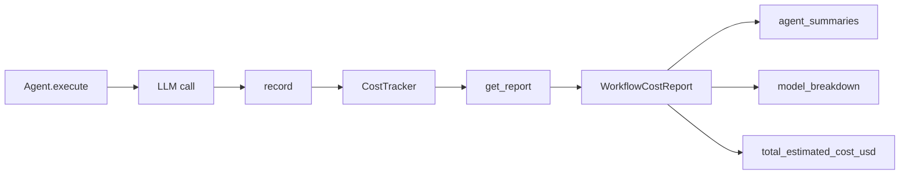

# Cost Tracking -- SDK Reference

> CostTracker monitors LLM token usage and estimated costs across agents and workflow executions, providing per-agent and per-model breakdowns.



## Import

```python
from hiveflow import CostTracker, UsageRecord, WorkflowCostReport
```

## CostTracker

### Constructor

```python
CostTracker(
    custom_pricing: dict[str, tuple[float, float]] | None = None
)
```

| Parameter | Type | Description |
|-----------|------|-------------|
| `custom_pricing` | `dict[str, tuple[float, float]]` | Custom pricing overrides: `{model: (input_cost_per_M, output_cost_per_M)}` |

### `record()`

```python
def record(
    self,
    agent_id: str,
    model: str,
    prompt_tokens: int,
    completion_tokens: int,
    total_tokens: int | None = None,
) -> UsageRecord
```

Record a single LLM usage event.

### `reset()`

```python
def reset(self) -> None
```

Clear all recorded usage data, resetting the tracker to its initial state.

### `get_report()`

```python
def get_report(self) -> WorkflowCostReport
```

Generate a complete cost report.

### Properties

| Property | Type | Description |
|----------|------|-------------|
| `total_cost` | `float` | Running total estimated cost in USD across all recorded events |
| `total_tokens` | `int` | Running total token count across all recorded events |

## UsageRecord

```python
@dataclass
class UsageRecord:
    agent_id: str
    model: str
    prompt_tokens: int
    completion_tokens: int
    total_tokens: int
    timestamp: float
    estimated_cost_usd: float
```

## WorkflowCostReport

```python
@dataclass
class WorkflowCostReport:
    total_prompt_tokens: int = 0
    total_completion_tokens: int = 0
    total_tokens: int = 0
    total_estimated_cost_usd: float = 0.0
    agent_summaries: dict[str, AgentCostSummary] = {}
    model_breakdown: dict[str, dict[str, Any]] = {}
    records: list[UsageRecord] = []
    duration_seconds: float = 0.0
```

## AgentCostSummary

```python
@dataclass
class AgentCostSummary:
    agent_id: str
    total_prompt_tokens: int = 0
    total_completion_tokens: int = 0
    total_tokens: int = 0
    total_estimated_cost_usd: float = 0.0
    call_count: int = 0
```

## Built-in Pricing

| Model | Input ($/M) | Output ($/M) |
|-------|:-----------:|:------------:|
| `gpt-4o` | 2.50 | 10.00 |
| `gpt-4o-mini` | 0.15 | 0.60 |
| `o3-mini` | 1.10 | 4.40 |
| `gpt-4-turbo` | 10.00 | 30.00 |
| `claude-sonnet-4-20250514` | 3.00 | 15.00 |
| `claude-haiku-4-20250414` | 0.80 | 4.00 |
| `llama3.3` | 0.00 | 0.00 |

## Usage Example

```python
from hiveflow.core.cost import CostTracker

tracker = CostTracker()

# Record usage events
tracker.record("researcher", "gpt-4o", prompt_tokens=500, completion_tokens=200)
tracker.record("writer", "gpt-4o", prompt_tokens=800, completion_tokens=400)
tracker.record("reviewer", "gpt-4o-mini", prompt_tokens=300, completion_tokens=100)

# Generate report
report = tracker.get_report()
print(f"Total cost: ${report.total_estimated_cost_usd:.4f}")
print(f"Total tokens: {report.total_tokens}")
print(f"Duration: {report.duration_seconds:.1f}s")

for agent_id, summary in report.agent_summaries.items():
    print(f" {agent_id}: {summary.call_count} calls, "
          f"{summary.total_tokens} tokens, "
          f"${summary.total_estimated_cost_usd:.4f}")
```

### Custom Pricing

```python
tracker = CostTracker(custom_pricing={
    "my-local-model": (0.0, 0.0),
    "premium-model": (10.0, 30.0),
})
```

### Access from Agent

```python
agent = Agent(agent_id="writer", llm_provider=provider, ...)
cost_tracker = agent.get_cost_tracker()

if cost_tracker:
    report = cost_tracker.get_report()
    print(f"Agent cost: ${report.total_estimated_cost_usd:.4f}")
```
