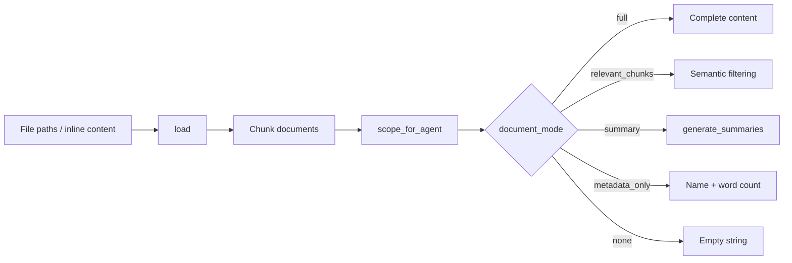

# Document Pipeline -- SDK Reference

> DocumentPipeline handles loading, chunking, scoping, and summary generation for documents, enabling agents to work with external files and inline content within workflows.



## Import

```python
from hiveflow.core.documents import DocumentPipeline
```

## DocumentPipeline

### Constructor

```python
DocumentPipeline(
    working_dir: str | Path = ".",
    allowed_paths: list[str | Path] | None = None,
    chunk_max_length: int = 1000,
    chunk_overlap: int = 200,
    embedding_provider: EmbeddingProvider | None = None,
    llm_provider: LLMProvider | None = None,
)
```

| Parameter | Type | Default | Description |
|-----------|------|---------|-------------|
| `working_dir` | `str \| Path` | `"."` | Base directory for relative paths |
| `allowed_paths` | `list[Path]` | `None` | Restrict file access to these directories |
| `chunk_max_length` | `int` | `1000` | Max tokens per chunk |
| `chunk_overlap` | `int` | `200` | Overlap between consecutive chunks |
| `embedding_provider` | `EmbeddingProvider` | `None` | For semantic filtering |
| `llm_provider` | `LLMProvider` | `None` | For summary generation |

### Methods

#### `load()`

```python
async def load(
    inputs: list[str | dict[str, str]],
) -> tuple[list[dict[str, Any]], str]
```

Load and chunk documents from file paths or inline content.

**Args:**
- `inputs` -- List of file paths (str) or inline content dicts (`{"name": "...", "content": "..."}`)

**Returns:** Tuple of (list of loaded document dicts with chunks, combined metadata string).

#### `load_instructions_file()`

```python
async def load_instructions_file(path: str) -> str
```

Load a text file as task instructions. Validates path security.

**Returns:** File content as string.

#### `scope_for_agent()`

```python
def scope_for_agent(
    documents,
    agent_def,
    task="",
    state=None,
) -> list[dict]
```

Apply document scoping based on agent's `document_mode`.

| Mode | Returns |
|------|---------|
| `full` | Complete document content |
| `relevant_chunks` | Semantically similar chunks (needs embedding provider) |
| `summary` | LLM-generated summary (cached) |
| `metadata_only` | Document name, word count, format |
| `none` | Empty string |

**Args:**
- `documents` -- List of loaded document dicts
- `agent_def` -- Agent definition for scoping rules
- `task` -- Current task description (used for relevance filtering)
- `state` -- Current workflow state

**Returns:** List of scoped document dicts for the agent.

#### `generate_summaries()`

```python
async def generate_summaries(
    documents,
    state,
    llm_provider,
    max_tokens=200,
    model="",
) -> dict[str, str]
```

Generate LLM-based summaries for multiple documents. Results are cached -- repeated calls for the same documents return cached summaries.

**Args:**
- `documents` -- List of document dicts to summarize
- `state` -- Current workflow state
- `llm_provider` -- LLM provider instance for summary generation
- `max_tokens` -- Maximum tokens per summary
- `model` -- Model override (empty string uses default)

**Returns:** Dictionary mapping document names to their summaries.

## Document

Represents a loaded document:

```python
@dataclass
class Document:
    name: str # Document name/filename
    content: str # Full text content
    chunks: list[DocumentChunk] # Chunked content
    word_count: int # Total word count
    metadata: dict[str, Any] # Format, source path, etc.
```

## DocumentChunk

```python
@dataclass
class DocumentChunk:
    text: str # Chunk text content
    chunk_index: int # Position in document
    metadata: dict[str, Any] # Source document info
```

## Document Loaders

### Plugin Base

```python
from hiveflow.plugins.documents import DocumentLoaderPlugin, DocumentLoaderRegistry

class MyLoader(DocumentLoaderPlugin):
    @property
    def plugin_id(self) -> str:
        return "my_format"

    @property
    def supported_extensions(self) -> list[str]:
        return [".myf"]

    async def load(self, path: str) -> Document: ...

    async def load_from_bytes(self, data: bytes, filename: str) -> Document: ...
```

### Registry

```python
registry = DocumentLoaderRegistry()
registry.discover() # Auto-discover from entry points

# List available loaders
print(registry.list_ids())
# ['plain_text', 'markdown', 'json', 'xml', 'html', 'pdf', 'docx', ...]

# Get a specific loader
loader = registry.get("markdown")
doc = await loader.load("notes.md")
```

### Built-in Loaders

| Loader | Extension | Extra |
|--------|-----------|:-----:|
| `plain_text` | `.txt` | — |
| `markdown` | `.md` | — |
| `json` | `.json` | — |
| `xml` | `.xml` | — |
| `html` | `.html` | — |
| `pdf` | `.pdf` | `documents` |
| `docx` | `.docx` | `documents` |
| `excel` | `.xlsx` | `documents` |
| `pptx` | `.pptx` | `documents` |
| `url` | — | — |
| `azure_blob` | — | `documents-azure` |
| `markitdown` | Multiple | `markitdown` |

## Usage Examples

### Load and Chunk

```python
pipeline = DocumentPipeline(working_dir="./docs")
documents, meta = await pipeline.load(["report.pdf", "notes.md"])

for doc in documents:
    print(f"{doc.name}: {doc.word_count} words, {len(doc.chunks)} chunks")
```

### Scope for Agent

```python
from hiveflow.core.schema import AgentDefinition

agent_def = AgentDefinition(
    id="analyst",
    role="Analyst",
    system_prompt="Analyze documents.",
    behavior_type="llm_only",
    document_mode="relevant_chunks",
    max_document_tokens=5000,
)

scoped_docs = pipeline.scope_for_agent(
    documents, agent_def, task="Find key themes"
)
```

### Load from Bytes

```python
registry = DocumentLoaderRegistry()
registry.discover()

loader = registry.get("markdown")
doc = await loader.load_from_bytes(
    data=b"# Test\n\nContent here.",
    filename="test.md",
)
```
