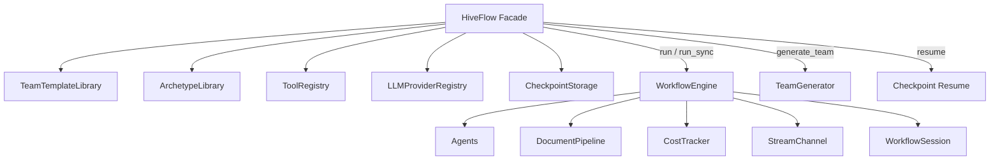

# HiveFlow -- SDK Reference

> HiveFlow is the top-level facade that orchestrates all subsystems -- team configuration, workflow execution, document pipelines, cost tracking, and event streaming -- behind a single entry point.



## Import

```python
from hiveflow import HiveFlow
```

## Constructor

```python
HiveFlow(
    *,
    config: HiveFlowConfig | None = None,
    team_library: TeamTemplateLibrary | None = None,
    archetype_library: ArchetypeLibrary | None = None,
    tool_registry: ToolRegistry | None = None,
    llm_registry: LLMProviderRegistry | None = None,
    checkpoint_storage: CheckpointStorage | None = None,
)
```

All parameters are optional — sensible defaults are used when not provided.

| Parameter | Type | Default | Description |
|-----------|------|---------|-------------|
| `config` | `HiveFlowConfig` | `get_config()` | Framework configuration |
| `team_library` | `TeamTemplateLibrary` | Default templates | Team template library |
| `archetype_library` | `ArchetypeLibrary` | Built-in archetypes | Agent archetype library |
| `tool_registry` | `ToolRegistry` | Empty registry | Tool plugin registry |
| `llm_registry` | `LLMProviderRegistry` | Empty registry | LLM provider registry |
| `checkpoint_storage` | `CheckpointStorage` | `None` | Checkpoint persistence backend |

## Methods

### `run()`

```python
async def run(
    self,
    team: str | dict[str, Any] | TeamConfiguration,
    task: str,
    *,
    documents: list[str | dict[str, str]] | None = None,
    initial_state: dict[str, Any] | None = None,
    checkpoint: bool = False,
    instructions_file: str | None = None,
) -> WorkflowSession
```

Execute a multi-agent workflow.

| Parameter | Type | Description |
|-----------|------|-------------|
| `team` | `str \| dict \| TeamConfiguration` | Template name, dict, or config object |
| `task` | `str` | The user's task or query |
| `documents` | `list[str \| dict]` | Document paths or inline content |
| `initial_state` | `dict[str, Any]` | Initial state overrides |
| `checkpoint` | `bool` | Enable checkpoint persistence at gates |
| `instructions_file` | `str` | Path to instructions text file |

**Returns:** `WorkflowSession` with session_id, status, result, and event stream.

**Raises:**
- `ValidationError` — if team configuration is invalid
- `KeyError` — if template name not found
- `ValueError` — if both `task` (non-empty) and `instructions_file` provided
- `FileNotFoundError` — if `instructions_file` doesn't exist

**Team resolution accepts three forms:**
- `str` — template name, looked up in the team library
- `dict` — raw JSON validated against `TeamConfiguration` schema
- `TeamConfiguration` — used directly

### `run_sync()`

```python
def run_sync(
    self,
    team: str | dict[str, Any] | TeamConfiguration,
    task: str,
    **kwargs: Any,
) -> WorkflowSession
```

Synchronous wrapper around `run()`. Blocks until the workflow completes or pauses. Creates a new event loop if none is running.

### `generate_team()`

```python
async def generate_team(
    self,
    task: str,
    *,
    model: str | None = None,
    auto_approve: bool = False,
) -> TeamGenerationResult
```

Generate a team configuration from a task description.

| Parameter | Type | Description |
|-----------|------|-------------|
| `task` | `str` | Problem description |
| `model` | `str` | LLM for generation (defaults to strategic tier) |
| `auto_approve` | `bool` | Execute immediately if no blocking gaps |

**Returns:** `TeamGenerationResult` with `.config`, `.capability_gaps`, `.has_blocking_gaps`.

### `resume()`

```python
async def resume(
    self,
    session_id: str,
    responses: dict[str, Any],
    *,
    checkpoint_id: str | None = None,
) -> WorkflowSession
```

Resume a paused workflow session. Loads the checkpoint, rebuilds agents and engine, and re-executes from the paused step.

| Parameter | Type | Description |
|-----------|------|-------------|
| `session_id` | `str` | Session to resume |
| `responses` | `dict[str, Any]` | Approval responses keyed by request_id |
| `checkpoint_id` | `str` | Specific checkpoint to resume from (None = latest) |

**Returns:** Updated `WorkflowSession`.

**Raises:** `KeyError` if session or checkpoint not found.

### `list_checkpoints()`

```python
async def list_checkpoints(self, session_id: str) -> list[dict[str, Any]]
```

List all checkpoints for a session. Returns dicts with: `checkpoint_id`, `session_id`, `step_index`, `current_agent_id`, `created_at`.

### Discovery Methods

```python
def team_library(self) -> TeamTemplateLibrary
def archetype_library(self) -> ArchetypeLibrary
def tool_registry(self) -> ToolRegistry
def model_registry(self) -> LLMProviderRegistry
```

Access the registries for teams, archetypes, tools, and LLM providers.

## Usage Examples

### Basic Workflow

```python
hf = HiveFlow()
session = hf.run_sync(team="research_report", task="AI safety risks")
print(session.result.state["final_output"])
```

### Async with Documents

```python
session = await hf.run(
    team="doc_analyzer",
    task="Summarize the key themes",
    documents=["report.pdf", "notes.md"],
)
```

### With Checkpointing

```python
from hiveflow.core.checkpoint import FileCheckpointStorage

hf = HiveFlow(checkpoint_storage=FileCheckpointStorage())
session = await hf.run(team="review_team", task="Draft a proposal", checkpoint=True)

if session.status.value == "paused":
    session = await hf.resume(
        session_id=session.session_id,
        responses={req.request_id: {"approved": True}
                   for req in session.pending_requests},
    )
```

### Team Generation

```python
result = await hf.generate_team(task="Analyze competitor pricing")
if not result.has_blocking_gaps:
    session = await hf.run(team=result.config, task="Analyze competitor pricing")
```
