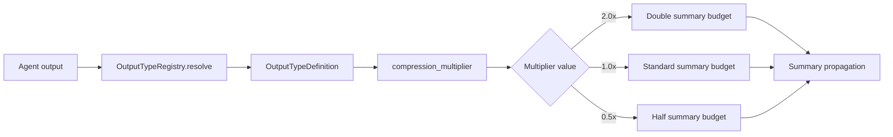

# Output Types -- SDK Reference

> The output type system controls how agent outputs are routed, compressed, and formatted, using compression multipliers to allocate summary budget proportionally to output importance.



## Import

```python
from hiveflow import OutputTypeRegistry, OutputTypeDefinition, OutputTypeId, OutputOptions, CitationsConfig, route_output
```

## OutputTypeId

Ten built-in output types:

| ID | Description | Default Behavior |
|----|-------------|-----------------|
| `text` | Free-form text output | Standard compression |
| `reasoning` | Chain-of-thought analysis | 2x compression budget |
| `structured_data` | JSON/structured output | 2x compression budget |
| `data` | Raw data, metrics | 0.5x compression budget |
| `side_effect` | Action audit trails | 0.5x compression budget |
| `composite` | Mixed output types | Standard compression |
| `report` | Full report format | Standard compression |
| `summary` | Executive summary | Standard compression |
| `analysis` | Analytical output | Standard compression |
| `recommendation` | Recommendations | Standard compression |

## OutputTypeDefinition

```python
@dataclass
class OutputTypeDefinition:
    type_id: OutputTypeId
    description: str
    compression_multiplier: float # Summary budget multiplier
    prompt_template: PromptTemplateSet | None
    citations_config: CitationsConfig | None
    pipeline_shape: str | None # How output flows through pipeline
```

## CitationsConfig

```python
@dataclass
class CitationsConfig:
    enabled: bool = False
    style: str = "apa"
    inline: bool = True
    generate_reference_section: bool = True
```

## OutputOptions

```python
@dataclass
class OutputOptions:
    output_type: OutputTypeId
    citations: CitationsConfig | None = None
    tone: str | None = None
    format_instructions: str | None = None
```

## OutputTypeRegistry

```python
registry = OutputTypeRegistry()
```

### Methods

| Method | Signature | Description |
|--------|-----------|-------------|
| `resolve(type_id)` | `def resolve(self, type_id: str) -> OutputTypeDefinition` | Resolve an output type ID to its full definition |
| `register(definition)` | `def register(self, definition: OutputTypeDefinition) -> None` | Register a custom output type definition |
| `list_types()` | `def list_types(self) -> list[str]` | List all registered output type IDs |
| `load_from_yaml(path)` | `def load_from_yaml(self, path: str) -> None` | Load output type definitions from a YAML file |
| `load_from_directory(dir_path)` | `def load_from_directory(self, dir_path: str) -> None` | Load all YAML definitions from a directory |

```python
# Get definition
definition = registry.resolve("reasoning")
print(f"Multiplier: {definition.compression_multiplier}")  # 2.0

# List all types
types = registry.list_types()

# Register a custom type
registry.register(OutputTypeDefinition(
    type_id="custom_report",
    description="Custom report format",
    compression_multiplier=1.5,
))
```

## route_output()

Route an agent's output through the appropriate pipeline:

```python
def route_output(
    output_type,
    task_description,
    *,
    config=None,
    registry=None,
    model="$SMART_LLM",
) -> dict | None
```

```python
from hiveflow import route_output

# Returns pipeline configuration for the output type
pipeline = route_output("report", "Generate a quarterly summary")
```

## Compression Multipliers

The compression multiplier controls how much context budget an agent's output receives during summary propagation:

| Multiplier | Meaning |
|:----------:|---------|
| `2.0` | Double the default summary budget (preserves more detail) |
| `1.0` | Standard budget |
| `0.5` | Half the budget (more aggressively compressed) |

### Example

If `max_summary_tokens` is 200:
- `reasoning` output gets up to 400 tokens
- `text` output gets up to 200 tokens
- `data` output gets up to 100 tokens

## Setting Output Type

### On Agent

```python
agent = Agent(
    agent_id="analyst",
    output_type="reasoning",
    ...
)
```

### In Team Config

```json
{
    "id": "analyst",
    "output_type": "reasoning"
}
```

### Default Inference

When `output_type` is not explicitly set, it's inferred from `behavior_type`:

| Behavior Type | Default Output Type |
|---------------|-------------------|
| `llm_only` | `text` |
| `tool_user` | `text` |
| `orchestrator` | `structured_data` |
| `human_gate` | `text` |
| `action_executor` | `side_effect` |
