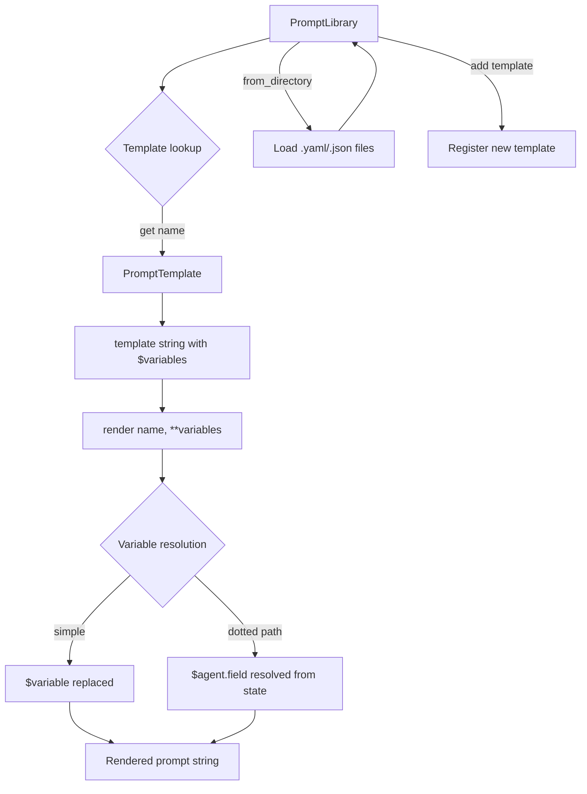

# Prompts -- SDK Reference

> PromptLibrary provides a template system for managing and composing agent prompts with variable substitution, categorization, and support for loading templates from directories.



## Import

```python
from hiveflow import PromptLibrary, PromptTemplate, get_default_library
```

## PromptTemplate

```python
@dataclass
class PromptTemplate:
    name: str # Template name
    template: str # Template text with $variables
    category: PromptCategory # Category for organization
    family: PromptFamily | None # Optional family grouping
    description: str = "" # Human-readable description

    @property
    def variables(self) -> list[str]
    # Extracted automatically from $variable references in the template string
```

## PromptCategory

Categories for organizing prompts:

| Category | Description |
|----------|-------------|
| `system` | System prompts for agents |
| `task` | Task instructions |
| `review` | Review/evaluation prompts |
| `summary` | Summarization prompts |
| `decomposition` | Task decomposition prompts |
| `format` | Output formatting prompts |

## PromptFamily

Families group related prompt variants:

| Family | Description |
|--------|-------------|
| `research` | Research-oriented prompts |
| `writing` | Content creation prompts |
| `analysis` | Data analysis prompts |
| `review` | Quality review prompts |

## PromptLibrary

### Constructor

```python
PromptLibrary()
```

### Key Methods

| Method | Description |
|--------|-------------|
| `add(template)` | Add a prompt template to the library |
| `get(name)` | Retrieve a template by name |
| `render(name, **variables)` | Render a template with variable substitution |
| `list_templates()` | List all template names |
| `list_by_category(category)` | List templates in a category |
| `list_by_family(family)` | List templates in a family |

### `from_directory()` classmethod

```python
@classmethod
def from_directory(cls, path: str) -> PromptLibrary
```

Load all prompt templates from YAML/JSON files in a directory. Returns a new `PromptLibrary` populated with the discovered templates.

## get_default_library()

```python
def get_default_library() -> PromptLibrary
```

Standalone function that returns a `PromptLibrary` pre-loaded with the built-in default templates for common agent patterns.

### Variable Substitution

Templates support `$variable` and `${variable}` syntax, including dotted paths:

```python
lib = PromptLibrary()

lib.add(PromptTemplate(
    name="researcher",
    template="Research $topic. Focus on $focus_area. Use $document_count documents.",
    category="system",
))

rendered = lib.render(
    "researcher",
    topic="quantum computing",
    focus_area="practical applications",
    document_count="5",
)
```

### Dotted-Path Variables

Access nested state values:

```python
template = PromptTemplate(
    name="context_aware",
    template="Previous findings: $researcher.summary. Task: $task",
    category="system",
    variables=["researcher.summary", "task"],
)
```

## Default Library

```python
lib = get_default_library()
print(lib.list_templates())
```

The default library includes templates for common agent patterns.

## Document Template Variables

When documents are loaded, these variables are automatically available:

| Variable | Value |
|----------|-------|
| `$document_count` | Number of loaded documents |
| `$document_names` | Comma-separated document names |
| `$document_summary` | Combined summaries |

## Usage Example

```python
from hiveflow import PromptLibrary, PromptTemplate

lib = PromptLibrary()

# Register templates
lib.add(PromptTemplate(
    name="research_system",
    template=(
        "You are a research analyst specializing in $domain. "
        "Analyze the following topic and provide $num_findings key findings "
        "with supporting data."
    ),
    category="system",
    family="research",
))

lib.add(PromptTemplate(
    name="review_system",
    template=(
        "You are a quality reviewer. Evaluate the following content for "
        "$criteria. Respond with APPROVED or NEEDS_REVISION with specific feedback."
    ),
    category="review",
    family="review",
))

# Render templates
system_prompt = lib.render(
    "research_system",
    domain="renewable energy",
    num_findings="5",
)

review_prompt = lib.render(
    "review_system",
    criteria="accuracy, clarity, and completeness",
)

# List by category
system_templates = lib.list_by_category("system")
review_templates = lib.list_by_category("review")
```
