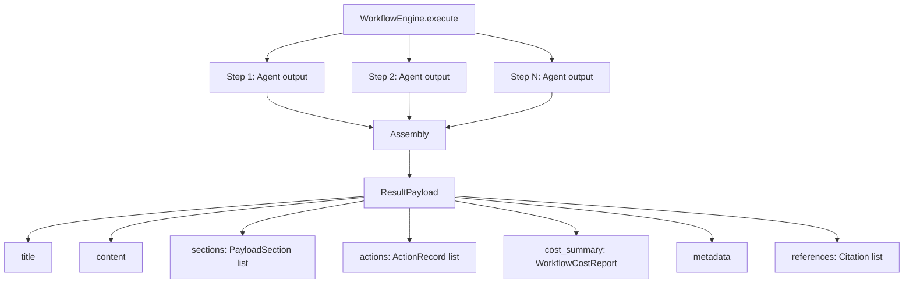

# Result Payload -- SDK Reference

> ResultPayload is the structured, immutable output of a completed workflow execution, assembling content sections, action records, cost data, and metadata for consumption by publishers.



## Import

```python
from hiveflow.core.result_payload import ResultPayload, PayloadSection, ActionRecord
```

## ResultPayload

Immutable dataclass representing the complete output of a workflow execution.

```python
@dataclass(frozen=True)
class ResultPayload:
    title: str # Document title
    content: str # Main assembled content
    sections: list[PayloadSection] = [] # Named content blocks
    metadata: dict[str, Any] = {} # Arbitrary key-value pairs
    references: list[Citation] = [] # Cited sources
    actions: list[ActionRecord] = [] # Actions taken during execution
    cost_summary: WorkflowCostReport = ... # Token/cost figures
```

### Methods

| Method | Returns | Description |
|--------|---------|-------------|
| `to_dict()` | `dict[str, Any]` | JSON-serializable dictionary |

## PayloadSection

Named content block within a payload:

```python
@dataclass(frozen=True)
class PayloadSection:
    section_id: str # Unique section identifier
    title: str # Section title
    content: str # Section content
    order: int # Display order
    agent_id: str | None = None # Agent that produced this section
```

## ActionRecord

Record of a real-world action taken during execution:

```python
@dataclass(frozen=True)
class ActionRecord:
    action_id: str # Unique action identifier
    action_type: str # Type of action (tool name)
    description: str # Human-readable description
    status: str # completed, pending, failed
    agent_id: str # Agent that performed the action
    timestamp: float = time.time() # When the action occurred
    metadata: dict[str, Any] = {} # Additional context
    policy: str | None = None # auto, require_approval
    approved_by: str | None = None # Who approved (if applicable)
    reversible: bool = False # Whether action can be rolled back
    rollback_action: str | None = None # Tool ID for rollback
    workflow_run_id: str | None = None # Workflow session ID
```

### ActionRecord Fields

| Field | Type | Description |
|-------|------|-------------|
| `action_id` | `str` | Unique identifier for this action |
| `action_type` | `str` | Type of action, typically the tool name |
| `description` | `str` | Human-readable description of what the action does |
| `status` | `str` | Current status: `completed`, `pending`, or `failed` |
| `agent_id` | `str` | ID of the agent that performed or proposed the action |
| `timestamp` | `float` | Unix timestamp of when the action occurred |
| `metadata` | `dict[str, Any]` | Additional context (tool arguments, results, etc.) |
| `policy` | `str \| None` | Safety policy applied: `"auto"` or `"require_approval"` |
| `approved_by` | `str \| None` | Identifier of the approver, if approval was required |
| `reversible` | `bool` | Whether this action supports rollback |
| `rollback_action` | `str \| None` | Tool ID to invoke for rollback, if reversible |
| `workflow_run_id` | `str \| None` | Session ID of the workflow run that produced this action |

## Usage Examples

### Building a Payload Programmatically

```python
from hiveflow.core.result_payload import ResultPayload, PayloadSection

payload = ResultPayload(
    title="Q3 2026 Market Analysis",
    content="Full report content here...",
    sections=[
        PayloadSection(
            section_id="executive_summary",
            title="Executive Summary",
            content="The market showed strong growth...",
            order=1,
            agent_id="writer",
        ),
        PayloadSection(
            section_id="methodology",
            title="Methodology",
            content="We analyzed 500 data points...",
            order=2,
            agent_id="researcher",
        ),
        PayloadSection(
            section_id="findings",
            title="Key Findings",
            content="Three major trends emerged...",
            order=3,
            agent_id="analyst",
        ),
    ],
    metadata={
        "date": "2026-02-28",
        "workflow_id": "abc-123",
        "model": "gpt-4o",
    },
)
```

### From Workflow Result

```python
result = await engine.execute(agents, initial_state)

# Auto-generated payload from workflow
payload = result.result_payload
if payload:
    print(f"Title: {payload.title}")
    print(f"Sections: {len(payload.sections)}")
    print(f"Cost: ${payload.cost_summary.total_estimated_cost_usd:.4f}")
```

### Publishing

```python
from hiveflow.plugins.publishers import PublisherRegistry

registry = PublisherRegistry()
registry.discover()

# Single format
path = await registry.get("markdown").publish_payload(payload, "./output/report")

# All formats
results = await registry.publish_all(payload, "./output/report")
```

### Serialization

```python
import json

data = payload.to_dict()
json_str = json.dumps(data, indent=2, default=str)
```
