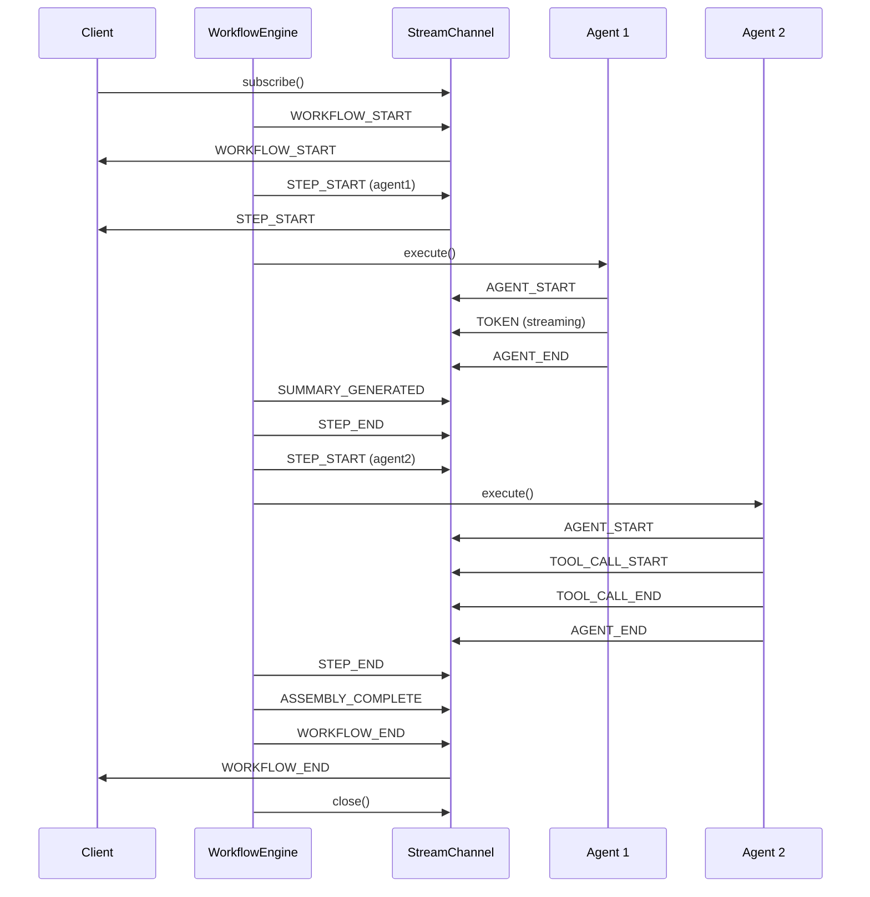

# Streaming -- SDK Reference

> HiveFlow provides an async event streaming system with 32 event types for real-time workflow progress, token streaming, delegation tracking, and tool call monitoring.



## Import

```python
from hiveflow import StreamChannel, StreamConsumer, StreamEvent, StreamEventType
```

## StreamEventType

32 event types covering the full workflow lifecycle:

| Event Type | Description |
|-----------|-------------|
| `TOKEN` | Individual token from LLM streaming |
| `TOOL_CALL_START` | Tool invocation begins |
| `TOOL_CALL_END` | Tool invocation completes |
| `AGENT_START` | Agent begins execution |
| `AGENT_END` | Agent completes execution |
| `AGENT_SPAWNED` | New agent spawned during workflow |
| `STEP_START` | Workflow step begins |
| `STEP_END` | Workflow step completes |
| `ERROR` | Error occurred |
| `STATE_UPDATE` | Workflow state changed |
| `WORKFLOW_START` | Workflow execution begins |
| `WORKFLOW_END` | Workflow execution completes |
| `CHECKPOINT_SAVED` | Checkpoint persisted |
| `ACTION_PROPOSED` | Action executor proposes actions |
| `ACTION_EXECUTED` | Action executor completes |
| `GATE_REQUESTED` | Gated step pauses workflow |
| `OUTPUT` | Agent produces output |
| `APPROVAL` | Approval request surfaced |
| `LOG` | Log message |
| `HUMAN_REQUEST` | Human input requested |
| `COST` | Cost/usage update |
| `ROLLBACK` | Rollback triggered |
| `DELEGATION_STARTED` | Sub-workflow delegation begins |
| `DELEGATION_COMPLETED` | Sub-workflow delegation finishes successfully |
| `DELEGATION_FAILED` | Sub-workflow delegation failed |
| `MESSAGE_SENT` | Inter-agent message dispatched |
| `PLAN_CREATED` | Orchestrator generated execution plan |
| `SUMMARY_GENERATED` | Summary created for an agent's output |
| `OUTLINE_GENERATED` | Outline created from parallel outputs |
| `ASSEMBLY_COMPLETE` | Final output assembly done |
| `EXECUTOR_INVOKED` | Agent executor started |
| `EXECUTOR_COMPLETED` | Agent executor finished |

## StreamEvent

```python
@dataclass
class StreamEvent:
    event_type: StreamEventType # Event type
    agent_id: str = "" # Source agent
    data: dict[str, Any] = {} # Event-specific data
    token: str = "" # Token content (for TOKEN events)
    step_id: str = "" # Step identifier
    content: str = "" # Human-readable description
    metadata: EventMetadata | None = None # Optional metrics
    timestamp: datetime = ... # UTC timestamp

    def to_dict(self) -> dict[str, Any]
```

## EventMetadata

```python
@dataclass
class EventMetadata:
    tokens_used: int | None = None
    latency_ms: float | None = None
    model: str | None = None
    cost_usd: float | None = None
```

## StreamChannel

Async channel for publishing and consuming events. Supports multiple concurrent consumers via fan-out.

```python
channel = StreamChannel(max_buffer=1000)

# Publish events
await channel.publish(StreamEvent(
    event_type=StreamEventType.OUTPUT,
    agent_id="writer",
    content="Report complete",
))

# Close channel when done
await channel.close()
```

### Properties

| Property | Type | Description |
|----------|------|-------------|
| `is_closed` | `bool` | Whether the channel is closed |

### Methods

| Method | Description |
|--------|-------------|
| `subscribe()` | Create a new `StreamConsumer` |
| `publish(event)` | Broadcast event to all consumers |
| `close()` | Close channel and signal all consumers |

## StreamConsumer

Async iterator over stream events:

```python
consumer = channel.subscribe()

async for event in consumer:
    print(f"[{event.event_type}] {event.content}")

# Or manually close
await consumer.close()
```

## JsonLinesWriter

Writes events to a JSON Lines file for persistence:

```python
from hiveflow.core.streaming import JsonLinesWriter

writer = JsonLinesWriter(output_dir="./output")

# Write events
await writer.on_event(event)

# Close file handle
await writer.close()
```

Files are written to `{output_dir}/events-{YYYY-MM-DD}.jsonl`.

## Usage Examples

### Subscribe to Workflow Events

```python
import asyncio
from hiveflow import HiveFlow

async def main():
    hf = HiveFlow()
    session = await hf.run(team="research_report", task="AI trends")

    async for event in session.subscribe():
        match event.event_type:
            case StreamEventType.STEP_START:
                print(f" > Starting: {event.agent_id}")
            case StreamEventType.STEP_END:
                print(f" * Complete: {event.agent_id}")
            case StreamEventType.TOKEN:
                print(event.token, end="", flush=True)
            case StreamEventType.COST:
                cost = event.metadata.cost_usd if event.metadata else 0
                print(f" $ Cost: ${cost:.4f}")

asyncio.run(main())
```

### Token Streaming from Agent

```python
from hiveflow.core.streaming import StreamingAgent, StreamChannel

channel = StreamChannel()

# Stream tokens from an LLM call
full_text = await StreamingAgent.stream_tokens(
    provider=llm_provider,
    messages=messages,
    config=llm_config,
    channel=channel,
    agent_id="writer",
)
```

### Persist Events to File

```python
writer = JsonLinesWriter(output_dir="./output")
engine.on_event(lambda et, aid, data: asyncio.ensure_future(
    writer.on_event(StreamEvent(event_type=et, agent_id=aid, data=data))
))
```
