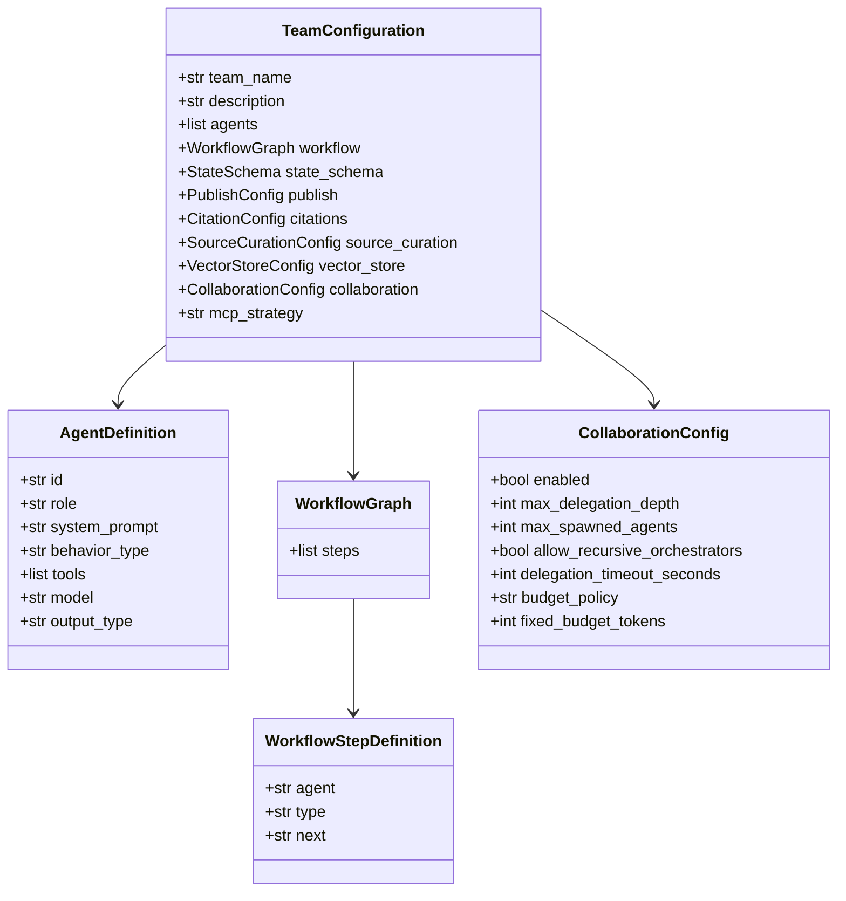

# TeamConfiguration -- SDK Reference

> TeamConfiguration is the Pydantic schema for declarative team definitions, validating agent roles, workflow graphs, collaboration settings, and resource configurations loaded from JSON, YAML, or Python.



## Import

```python
from hiveflow import TeamConfiguration
```

## Schema

```python
class TeamConfiguration(BaseModel):
    team_name: str
    description: str
    agents: list[AgentDefinition]
    workflow: WorkflowGraph
    state_schema: StateSchema | None = None
    publish: PublishConfig | None = None
    citations: CitationConfig | None = None
    source_curation: SourceCurationConfig | None = None
    vector_store: VectorStoreConfig | None = None
    collaboration: CollaborationConfig | None = None
    source_mode: str | None = None              # Tool filtering: web, local, hybrid, cloud, mcp, custom
    source_options: dict[str, Any] | None = None # Per-mode options (e.g. allowed_categories for custom)
    mcp_strategy: str | None = None             # MCP tool discovery strategy
```

## CollaborationConfig

```python
class CollaborationConfig(BaseModel):
    enabled: bool = False                       # Enable agent collaboration/delegation
    max_delegation_depth: int = 3               # Max depth of nested delegations
    max_spawned_agents: int = 10                # Max agents spawned during execution
    allow_recursive_orchestrators: bool = False  # Allow orchestrators to spawn orchestrators
    delegation_timeout_seconds: int = 300       # Timeout for delegated sub-workflows
    budget_policy: str = "shared"               # shared, fixed, unlimited
    fixed_budget_tokens: int = 0                # Token budget when policy is "fixed"
```

| Field | Type | Default | Description |
|-------|------|---------|-------------|
| `enabled` | `bool` | `False` | Enable agent collaboration and delegation |
| `max_delegation_depth` | `int` | `3` | Maximum depth of nested sub-workflow delegations |
| `max_spawned_agents` | `int` | `10` | Maximum number of agents that can be spawned during execution |
| `allow_recursive_orchestrators` | `bool` | `False` | Whether orchestrator agents can spawn other orchestrators |
| `delegation_timeout_seconds` | `int` | `300` | Timeout in seconds for delegated sub-workflows |
| `budget_policy` | `str` | `"shared"` | Token budget policy: `shared`, `fixed`, or `unlimited` |
| `fixed_budget_tokens` | `int` | `0` | Fixed token budget per agent (used when `budget_policy` is `"fixed"`) |

## VectorStoreConfig

```python
class VectorStoreConfig(BaseModel):
    enabled: bool = False
    backend: str = "in_memory"                  # in_memory, chromadb, faiss
    collection_name: str | None = None
    embedding_model: str | None = None
    persist_directory: str | None = None
```

## SourceCurationConfig

```python
class SourceCurationConfig(BaseModel):
    enabled: bool = False
    max_sources: int | None = None
    relevance_threshold: float = 0.0
    deduplication: bool = True
```

## AgentDefinition

```python
class AgentDefinition(BaseModel):
    id: str # Unique agent identifier
    role: str # Human-readable role
    system_prompt: str # System prompt
    behavior_type: AgentBehaviorTypeSchema # llm_only, tool_user, etc.
    tools: list[str] = [] # Tool IDs
    model: str = "$SMART_LLM" # Model reference
    max_tokens: int | None = None # Per-agent output token limit
    documents: list[str] | None = None # Document names visible to this agent
    document_mode: str = "none" # full, relevant_chunks, summary, metadata_only, none
    max_document_tokens: int | None = None # Per-agent document token budget
    action_policy: str | None = None # auto, require_approval
    model_requirements: ModelRequirements | None = None
    output_type: str | None = None # text, reasoning, structured_data, data, side_effect
    context_recency_window: int = 0 # Sliding window for summaries
    context_budget: int | None = None # Max words of context
    on_failure: str | None = None # fail, retry, skip
    max_retries: int = 1 # Retry attempts
    rollback_on_failure: bool = False
    rollback_action: str | None = None
```

## WorkflowGraph

```python
class WorkflowGraph(BaseModel):
    steps: list[WorkflowStepDefinition]
```

## WorkflowStepDefinition

```python
class WorkflowStepDefinition(BaseModel):
    agent: str # Agent ID
    type: WorkflowStepType # sequential, parallel_fan_out, conditional, etc.
    next: str | None = None # Next step
    next_on_accept: str | None = None # Conditional: next on accept
    next_on_reject: str | None = None # Conditional: next on reject
    max_iterations: int = 3 # Conditional: max iterations
    gate_id: str | None = None # Gated: gate identifier
    gate_description: str | None = None # Gated: description
    team: str | None = None # Sub-workflow: team name
    context_ttl: int | None = None # Context expiry
```

## ModelRequirements

```python
class ModelRequirements(BaseModel):
    cost_tier: str | None = None # fast, smart, strategic
    supports_tools: bool | None = None
    supports_vision: bool | None = None
    strengths: list[str] = []
```

## StateSchema

```python
class StateSchema(BaseModel):
    required_keys: list[str] = []
    enforcement_mode: str = "warn" # warn, strict, off
    agent_io: dict[str, AgentIO] = {}
```

## CitationConfig

```python
class CitationConfig(BaseModel):
    enabled: bool = False
    style: str = "apa" # apa, mla, chicago, numbered, inline
    inline: bool = True
    generate_reference_section: bool = True
```

## Methods

### `from_json_file()`

```python
@classmethod
def from_json_file(cls, path: str) -> TeamConfiguration
```

Load and validate from a JSON file.

### `to_json_schema()`

```python
def to_json_schema(self) -> dict[str, Any]
```

Export the JSON Schema for documentation/validation.

### `model_dump()`

```python
def model_dump(self, mode: str = "python") -> dict[str, Any]
```

Serialize to a dictionary (Pydantic built-in).

## JSON Example

```json
{
    "team_name": "research_pipeline",
    "description": "Research and write a report",
    "agents": [
        {
            "id": "researcher",
            "role": "Researcher",
            "system_prompt": "Research the topic thoroughly.",
            "behavior_type": "llm_only",
            "model": "$SMART_LLM",
            "output_type": "reasoning"
        },
        {
            "id": "writer",
            "role": "Writer",
            "system_prompt": "Write a polished report from the research.",
            "behavior_type": "llm_only",
            "model": "$SMART_LLM",
            "context_budget": 4000
        }
    ],
    "workflow": {
        "steps": [
            {"agent": "researcher", "type": "sequential", "next": "writer"},
            {"agent": "writer", "type": "sequential"}
        ]
    },
    "citations": {
        "enabled": true,
        "style": "apa"
    },
    "publish": {
        "formats": ["markdown", "json"],
        "output_dir": "./output"
    }
}
```

## Python Example

```python
config = TeamConfiguration(
    team_name="research_pipeline",
    description="Research and write a report",
    agents=[
        AgentDefinition(
            id="researcher",
            role="Researcher",
            system_prompt="Research the topic thoroughly.",
            behavior_type="llm_only",
        ),
        AgentDefinition(
            id="writer",
            role="Writer",
            system_prompt="Write a report from the research.",
            behavior_type="llm_only",
            context_budget=4000,
        ),
    ],
    workflow=WorkflowGraph(steps=[
        WorkflowStepDefinition(agent="researcher", type="sequential", next="writer"),
        WorkflowStepDefinition(agent="writer", type="sequential"),
    ]),
)

# Round-trip to JSON
import json
print(json.dumps(config.model_dump(mode="json"), indent=2))
```
