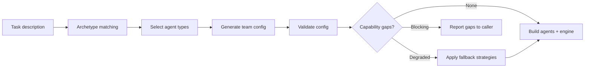

# TeamGenerator -- SDK Reference

> TeamGenerator creates team configurations from task descriptions using deterministic archetype matching, with optional LLM-based generation for complex scenarios and capability gap detection.



## Import

```python
from hiveflow import TeamGenerator, TeamGenerationResult, CapabilityGap
```

## TeamGenerator

### Constructor

```python
TeamGenerator()
```

No parameters required.

### `generate_team()`

```python
def generate_team(
    self,
    task_description: str,
    *,
    agent_types: list[str] | None = None,
    include_review: bool = False,
) -> dict[str, Any]
```

Generate a team configuration using deterministic archetype matching (no LLM call).

| Parameter | Type | Default | Description |
|-----------|------|---------|-------------|
| `task_description` | `str` | — | Description of the problem |
| `agent_types` | `list[str]` | `None` | Specific archetypes to use |
| `include_review` | `bool` | `False` | Add a review step |

**Returns:** Team configuration dict compatible with `TeamConfiguration`.

### `build()`

```python
def build(
    self,
    config: dict[str, Any],
    provider: LLMProvider,
    *,
    model: str | None = None,
    tool_registry: ToolRegistry | None = None,
) -> tuple[dict[str, Agent], WorkflowEngine]
```

Build live `Agent` instances and a `WorkflowEngine` from a config dict.

| Parameter | Type | Description |
|-----------|------|-------------|
| `config` | `dict` | Team configuration dict |
| `provider` | `LLMProvider` | LLM provider for all agents |
| `model` | `str` | Override model for all agents |
| `tool_registry` | `ToolRegistry` | Tool registry for tool resolution |

**Returns:** Tuple of `(agents_dict, workflow_engine)`.

## TeamGenerationResult

```python
@dataclass
class TeamGenerationResult:
    config: dict[str, Any] | TeamConfiguration
    capability_gaps: list[CapabilityGap] = field(default_factory=list)

    @property
    def has_blocking_gaps(self) -> bool:
        """True if any gap has severity 'blocking'."""
```

## CapabilityGap

```python
@dataclass
class CapabilityGap:
    resource_type: str # "tool", "provider", etc.
    resource_id: str # Missing resource ID
    severity: str # "blocking", "degraded", "functional_but_limited"
    description: str
    fallback_strategy: str
```

## LLM-Generated Teams via HiveFlow

For LLM-based team generation with capability gap detection:

```python
from hiveflow import HiveFlow

hf = HiveFlow()
result = await hf.generate_team(task="Design a data migration pipeline")

if result.has_blocking_gaps:
    for gap in result.capability_gaps:
        print(f"Missing: {gap.resource_id} ({gap.severity})")
else:
    session = await hf.run(team=result.config, task="Migrate the database")
```

## Usage Examples

### Basic Generation

```python
gen = TeamGenerator()
config = gen.generate_team("Write a research report on AI safety")
print(config["team_name"])
print([a["id"] for a in config["agents"]])
```

### With Specific Agent Types

```python
config = gen.generate_team(
    "Analyze quarterly earnings",
    agent_types=["researcher", "analyst", "writer"],
    include_review=True,
)
```

### Build and Execute

```python
agents, engine = gen.build(config, llm_provider)
result = await engine.execute(
    agents,
    {"task": "Analyze quarterly earnings"},
)
```
