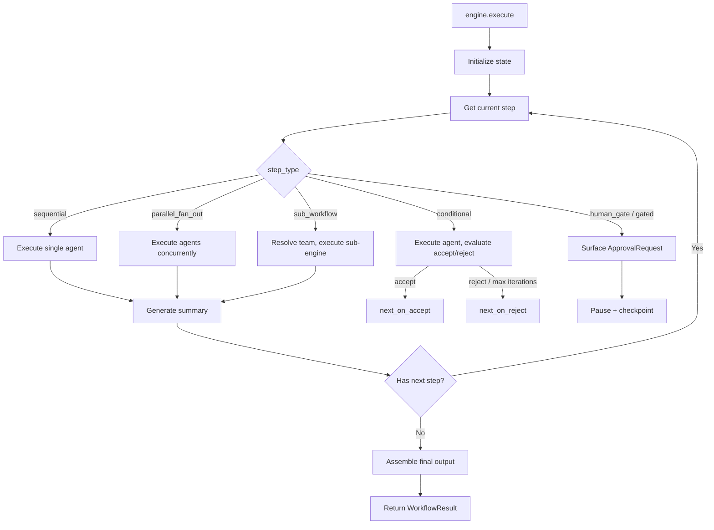

# WorkflowEngine -- SDK Reference

> The WorkflowEngine executes directed graphs of agents, handling sequential, parallel, conditional, gated, and sub-workflow steps with checkpoint persistence and event streaming.



## Import

```python
from hiveflow import WorkflowEngine, WorkflowStep, WorkflowResult, WorkflowStatus
```

## WorkflowStep

```python
@dataclass
class WorkflowStep:
    agent: str # Agent ID (empty for gated steps)
    step_type: StepType | str # Step type
    next_step: str | None = None # Next step (sequential, parallel, gated)
    next_on_accept: str | None = None # Next step on accept (conditional)
    next_on_reject: str | None = None # Next step on reject (conditional)
    max_iterations: int = 3 # Max iterations (conditional)
    gate_id: str | None = None # Gate identifier (gated)
    gate_description: str | None = None # Gate description (gated)
    team: str | None = None # Sub-workflow team name
    input_mapping: dict[str, str] | None = None # Sub-workflow input mapping
    output_mapping: dict[str, str] | None = None # Sub-workflow output mapping
    context_ttl: int | None = None # Steps until this agent's summary expires
```

## StepType

```python
class StepType(StrEnum):
    SEQUENTIAL = "sequential"
    PARALLEL_FAN_OUT = "parallel_fan_out"
    CONDITIONAL = "conditional"
    HUMAN_GATE = "human_gate"
    GATED = "gated"
    SUB_WORKFLOW = "sub_workflow"
```

## WorkflowEngine Constructor

```python
WorkflowEngine(
    workflow_steps: list[WorkflowStep],
    max_conditional_loops: int = 5,
    summarizer: SummaryGenerator | None = None,
    assembly_agents: list[str] | None = None,
    document_pipeline: DocumentPipeline | None = None,
    publish_config: Any | None = None,
    state_schema: Any | None = None,
    team_library: Any | None = None,
)
```

| Parameter | Type | Default | Description |
|-----------|------|---------|-------------|
| `workflow_steps` | `list[WorkflowStep]` | — | Steps defining the workflow graph |
| `max_conditional_loops` | `int` | `5` | Global max iterations for conditional steps |
| `summarizer` | `SummaryGenerator` | `None` | Summary generator for context propagation |
| `assembly_agents` | `list[str]` | `None` | Agent IDs whose outputs are assembled into `final_output` |
| `document_pipeline` | `DocumentPipeline` | `None` | Document loading pipeline |
| `publish_config` | `PublishConfig` | `None` | Auto-publishing configuration |
| `state_schema` | `StateSchema` | `None` | State access enforcement |
| `team_library` | `TeamTemplateLibrary` | `None` | For sub-workflow resolution |

## Methods

### `execute()`

```python
async def execute(
    self,
    agents: dict[str, Agent],
    initial_state: dict[str, Any],
    *,
    documents: list[str | dict] | None = None,
    checkpoint_storage: CheckpointStorage | None = None,
    session_id: str | None = None,
    team_config: dict | None = None,
) -> WorkflowResult
```

Execute the workflow graph.

| Parameter | Type | Description |
|-----------|------|-------------|
| `agents` | `dict[str, Agent]` | Agent instances keyed by ID |
| `initial_state` | `dict[str, Any]` | Initial state (must include `"task"`) |
| `documents` | `list` | Document paths or inline content |
| `checkpoint_storage` | `CheckpointStorage` | For checkpoint persistence |
| `session_id` | `str` | Session identifier |
| `team_config` | `dict` | Team config for checkpoint persistence |

**Returns:** `WorkflowResult`

### `resume()`

```python
async def resume(
    self,
    agents: dict[str, Agent],
    checkpoint: WorkflowCheckpoint,
    *,
    responses: dict[str, Any],
    checkpoint_storage: CheckpointStorage | None = None,
    session_id: str | None = None,
) -> WorkflowResult
```

Resume from a checkpoint.

### `on_event()`

```python
def on_event(self, callback: Callable[[str, str, dict], None]) -> None
```

Register an event callback. Called with `(event_type, agent_id, data)`.

### `set_collaboration_config()`

```python
def set_collaboration_config(self, config: CollaborationConfig) -> None
```

Set the collaboration configuration for the workflow engine. Controls delegation depth, spawned agent limits, and budget policies for agent-to-agent collaboration.

### `on_complete()`

```python
def on_complete(self, callback: Callable[..., Any]) -> None
```

Register a completion callback. Called with the `ResultPayload` after successful execution.

## WorkflowResult

```python
@dataclass
class WorkflowResult:
    status: WorkflowStatus # completed, failed, paused
    state: dict[str, Any] # Final state dictionary
    step_results: list[StepResult] # Per-step results
    error: str | None # Error message if failed
    result_payload: ResultPayload | None # Structured output
```

## WorkflowStatus

```python
class WorkflowStatus(StrEnum):
    PENDING = "pending"
    RUNNING = "running"
    COMPLETED = "completed"
    FAILED = "failed"
    PAUSED = "paused"
```

## StepResult

```python
@dataclass
class StepResult:
    agent_id: str
    step_type: str
    state: dict[str, Any]
    status: str = "completed"
    error: str | None = None
```

## Usage Example

```python
import asyncio
from hiveflow import Agent, AgentBehaviorType, WorkflowEngine, WorkflowStep

async def main():
    researcher = Agent(
        agent_id="researcher",
        role="Researcher",
        system_prompt="Research the topic.",
        behavior_type=AgentBehaviorType.LLM_ONLY,
        llm_provider=provider,
    )
    writer = Agent(
        agent_id="writer",
        role="Writer",
        system_prompt="Write a report.",
        behavior_type=AgentBehaviorType.LLM_ONLY,
        llm_provider=provider,
    )

    steps = [
        WorkflowStep(agent="researcher", step_type="sequential", next_step="writer"),
        WorkflowStep(agent="writer", step_type="sequential"),
    ]

    engine = WorkflowEngine(steps, assembly_agents=["writer"])

    def on_event(event_type, agent_id, data):
        print(f"[{event_type}] {agent_id}")

    engine.on_event(on_event)

    result = await engine.execute(
        agents={"researcher": researcher, "writer": writer},
        initial_state={"task": "Explain quantum computing"},
    )

    print(f"Status: {result.status}")
    print(f"Output: {result.state.get('final_output', '')[:200]}")

asyncio.run(main())
```
