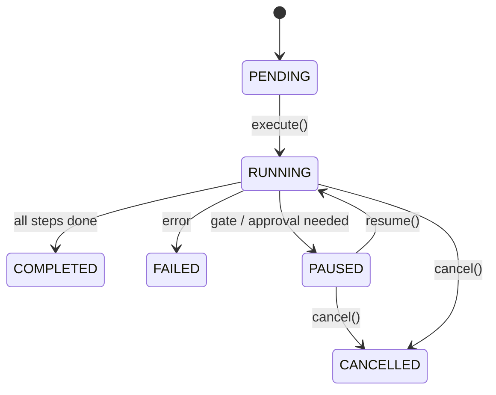

# WorkflowSession -- SDK Reference

> WorkflowSession is a handle to a running or completed workflow, tracking status, results, pending approval requests, and supporting event subscriptions and serialization.



## Import

```python
from hiveflow import WorkflowSession
from hiveflow.core.session import ApprovalRequest
```

## WorkflowSession

### Properties

| Property | Type | Description |
|----------|------|-------------|
| `session_id` | `str` | Unique session identifier (UUID) |
| `status` | `WorkflowStatus` | Current status |
| `result` | `WorkflowResult \| None` | Result after completion/failure |
| `error` | `str \| None` | Error message if failed |
| `pending_requests` | `list[ApprovalRequest]` | Pending approval requests |

### Status Transitions

```
PENDING → RUNNING → COMPLETED
PENDING → RUNNING → FAILED
PENDING → RUNNING → PAUSED → RUNNING → COMPLETED
PENDING → RUNNING → PAUSED → CANCELLED
```

### Methods

#### `subscribe()`

```python
async def subscribe(self) -> AsyncIterator[StreamEvent]
```

Subscribe to real-time workflow events. Returns an async iterator of `StreamEvent` objects.

```python
async for event in session.subscribe():
    print(f"[{event.event_type}] {event.agent_id}: {event.content}")
```

#### `resume()`

```python
async def resume(self, responses: dict[str, Any]) -> None
```

Resume a paused session with approval responses.

#### `cancel()`

```python
async def cancel(self) -> None
```

Cancel a running or paused session. Transitions to `CANCELLED` status.

#### `to_dict()`

```python
def to_dict(self) -> dict[str, Any]
```

JSON-serializable snapshot of the session state.

#### `from_dict()` classmethod

```python
@classmethod
def from_dict(cls, data: dict[str, Any]) -> WorkflowSession
```

Reconstruct a `WorkflowSession` from a serialized dictionary (as produced by `to_dict()`).

## ApprovalRequest

```python
@dataclass
class ApprovalRequest:
    request_id: str # Unique request identifier
    request_type: str # "human_gate", "action_approval", "gate"
    context: dict[str, Any] # Context about what needs approval
    agent_id: str # Agent that generated the request
    step_index: int # Workflow step index that triggered the request
    created_at: str # ISO 8601 timestamp of when the request was created
```

### ApprovalRequest Fields

| Field | Type | Description |
|-------|------|-------------|
| `request_id` | `str` | Unique identifier for this approval request |
| `request_type` | `str` | Type of request: `"human_gate"`, `"action_approval"`, or `"gate"` |
| `context` | `dict[str, Any]` | Context about what needs approval (proposed actions, gate info, etc.) |
| `agent_id` | `str` | ID of the agent that generated the request |
| `step_index` | `int` | Index of the workflow step that triggered the request |
| `created_at` | `str` | ISO 8601 timestamp of when the request was created |

## Checkpointing

### FileCheckpointStorage

```python
from hiveflow.core.checkpoint import FileCheckpointStorage

storage = FileCheckpointStorage(
    directory=".hiveflow/checkpoints" # Default
)
```

Checkpoints are saved as JSON files: `{directory}/{session_id}.json`

### CheckpointStorage Protocol

```python
class CheckpointStorage(Protocol):
    async def save(self, checkpoint: WorkflowCheckpoint) -> None: ...
    async def load(self, session_id: str, checkpoint_id: str | None = None) -> WorkflowCheckpoint | None: ...
    async def list_checkpoints(self, session_id: str) -> list[WorkflowCheckpoint]: ...
```

### WorkflowCheckpoint

```python
@dataclass
class WorkflowCheckpoint:
    checkpoint_id: str
    session_id: str
    step_index: int
    current_agent_id: str
    state: dict[str, Any]
    pending_requests: list[ApprovalRequest]
    iteration_counts: dict[str, int]
    task: str
    team_config: dict | None
    created_at: str
```

## Usage Examples

### Basic Session

```python
from hiveflow import HiveFlow

hf = HiveFlow()
session = hf.run_sync(team="research_report", task="AI trends")

print(f"Session: {session.session_id}")
print(f"Status: {session.status.value}")
print(f"Output: {session.result.state.get('final_output', '')[:200]}")
```

### Session with Event Stream

```python
import asyncio
from hiveflow import HiveFlow

async def main():
    hf = HiveFlow()
    session = await hf.run(team="research_report", task="AI trends")

    async for event in session.subscribe():
        if event.event_type.value == "step_start":
            print(f"Starting: {event.agent_id}")
        elif event.event_type.value == "step_end":
            print(f"Done: {event.agent_id}")

asyncio.run(main())
```

### Pause and Resume

```python
from hiveflow import HiveFlow
from hiveflow.core.checkpoint import FileCheckpointStorage

hf = HiveFlow(checkpoint_storage=FileCheckpointStorage())
session = await hf.run(team="review_team", task="Draft proposal", checkpoint=True)

if session.status.value == "paused":
    for req in session.pending_requests:
        print(f"Approval needed: {req.context}")

    session = await hf.resume(
        session_id=session.session_id,
        responses={req.request_id: {"approved": True, "feedback": "LGTM"}
                   for req in session.pending_requests},
    )

print(f"Final status: {session.status.value}")
```

### Serialization

```python
# Snapshot for storage/transmission
snapshot = session.to_dict()
import json
print(json.dumps(snapshot, indent=2))
```
