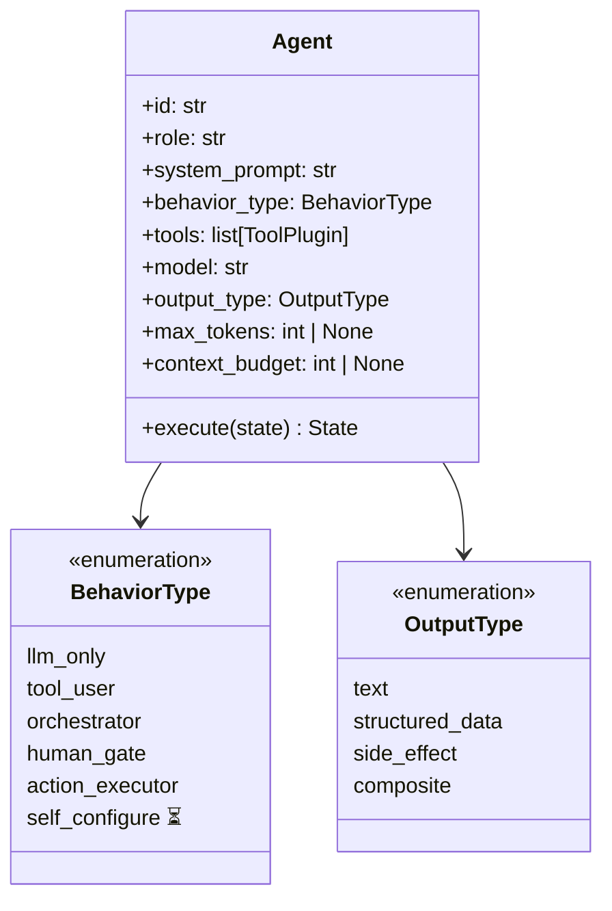
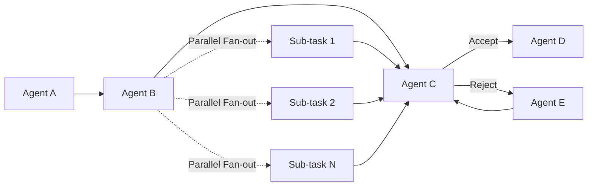

[< Back to Index](README.md)

---

## Core Idea

### 1. Universal Agent Class

Instead of one class per role, define a **single agent class** that is
specialized at creation time through configuration:

- **System prompt** — defines the agent's identity and behavior
- **Tools** — optional external capabilities (web search, file I/O, code
  execution, API calls, deployments, notifications, etc.)
- **Behavior type** — how the agent executes (pure LLM response, tool-user,
  orchestrator that spawns sub-workflows, action executor, human gate, etc.)
- **Model** — which LLM backs this particular agent (allows per-agent model
  selection)
- **Output type** — what the agent produces (text, structured data, side
  effects, or a combination)
- **Max tokens** — optional per-agent cap on LLM output length (overrides the
  global `MAX_TOKENS` default when set)
- **Context budget** — optional per-agent cap on input context size (in words);
  when set, the agent's state summarization is truncated to fit this budget



> **Note on `self_configure`:** This behavior type is **deferred to a future
> release**. It is under-specified and its use case can be approximated by
> composing an `orchestrator` (that selects a persona) with an `llm_only`
> agent (that executes with the selected persona). A formal definition
> will be added when the archetype library matures enough to support
> dynamic archetype selection at runtime.

#### OutputType

The `output_type` field on each agent declares what kind of result it produces.
This influences how the workflow engine handles the output:

| Value             | Meaning                                              | Engine handling                              |
| ----------------- | ---------------------------------------------------- | -------------------------------------------- |
| `text`            | Free-form prose or markdown                          | Merged into state; eligible for assembly     |
| `structured_data` | JSON-parseable structured output                     | Merged into state; validated as JSON         |
| `side_effect`     | Real-world action performed (no content output)      | Logged to audit trail; not assembled         |
| `composite`       | Both content and side effects                        | Content merged; side effects logged          |

The field is optional. When omitted, the framework infers `text` for
`llm_only` agents, `structured_data` for `orchestrator` agents, and
`side_effect` for `action_executor` agents.

### 2. Dynamic Team Composition

The first step of any workflow is determining **which agents form the team and
how they collaborate**. Three modes are supported:

- **Template mode (primary):** Load a pre-built team configuration from the
  `TeamLibrary`.
- **Custom mode:** Developer provides a complete `TeamConfiguration`
  (JSON/YAML). The framework validates and builds it.
- **LLM-generated mode:** For unknown problems, delegate team design to an
  LLM. This is a one-time bootstrapping mechanism — the generated team is
  saved and reused on subsequent runs.

Additionally, a `TeamGenerator` class provides **deterministic team assembly**
from the `ArchetypeLibrary` — composing pre-defined agent archetypes into a
workflow without requiring an LLM call.

See [Agents & Teams](03-agents-and-teams.md) for full details on team
composition modes, archetypes, the team library, capability gaps, and
per-agent model selection.

### TeamGenerator & Archetype Library

Archetypes are **configuration, not code**. They are reusable, standalone
`AgentDefinition` objects stored as JSON files and loaded by an
`ArchetypeLibrary`. The `TeamGenerator` composes archetypes into teams.

See [Agents & Teams — Archetypes](03-agents-and-teams.md#archetypes-reusable-agent-definitions)
for the full archetype specification, built-in archetypes, and the
`ArchetypeLibrary` / `TeamLibrary` APIs.

### 3. Workflow Graph Definition

Knowing _who_ is on the team is not enough — the framework must also define _how
they interact_. The team configuration must include a **workflow graph** that
expresses:

- **Sequential steps** (agent A runs before agent B)
- **Parallel fan-out** (multiple sub-tasks executed simultaneously)
- **Conditional loops** (evaluate → iterate → re-evaluate until threshold met)
- **Human-in-the-loop gates** (optional approval checkpoints)
- **Gated steps** (pauses before an agent runs, pending a gate condition such
  as human approval, automated checks, or external webhooks)



This means the LLM-generated or template-loaded config produces both a roster of
agents **and** their execution topology.

---

## 4. Public API Design Principles

The framework is designed to be consumed from multiple contexts: embedded in
Python applications, wrapped by a REST API, driven from a CLI, or integrated
into native desktop applications. The public API is the **single source of
truth** — all consumption modes delegate to it.

```
┌──────────────────────────────────────────────────┐
│                 Consumer Layer                    │
│  ┌──────────┐  ┌──────────┐  ┌──────────────┐   │
│  │ REST API │  │   CLI    │  │ Native App   │   │
│  │ (FastAPI)│  │ (Click)  │  │ (embedded)   │   │
│  └────┬─────┘  └────┬─────┘  └──────┬───────┘   │
│       └──────────────┼───────────────┘           │
│                      ▼                           │
│         ┌────────────────────────┐               │
│         │  HiveFlow Public API   │               │
│         │  (Python library)      │               │
│         └────────────────────────┘               │
│                      │                           │
│         ┌────────────┴────────────┐              │
│         │     Framework Core      │              │
│         │  Agents, Workflows,     │              │
│         │  Teams, Plugins         │              │
│         └─────────────────────────┘              │
└──────────────────────────────────────────────────┘
```

### Design Principles

| Principle | Implication |
|---|---|
| **Serializable in/out** | All public API inputs and outputs are JSON-serializable (Pydantic models or dataclasses). No opaque Python objects required as inputs to top-level operations. |
| **Session-based execution** | Running workflows are represented as `WorkflowSession` handles — inspectable, pausable, resumable. A REST API maps naturally to session CRUD. |
| **Async-first + sync wrapper** | Core is async (`async def`). A `run_sync()` convenience method is provided for scripts and desktop apps using synchronous code. |
| **Stateless framework, stateful sessions** | The `HiveFlow` instance holds no per-workflow state. All state lives in `WorkflowSession` objects and checkpoint storage. This enables horizontal scaling behind a REST API. |
| **Event-driven** | All workflow activity is observable via async event streams (`AsyncIterator[WorkflowEvent]`). Maps to WebSocket/SSE for web, callbacks for native. |
| **Discovery-friendly** | Teams, archetypes, tools, and models are listable and describable via serializable summaries. A UI (web or native) can enumerate what's available. |
| **HITL as explicit API operations** | Human-in-the-loop is not callbacks — it's explicit pause/request/resume on a session. A REST API returns pending requests as JSON; a desktop app shows a dialog; a CLI prompts the user. |

### Top-Level API

```python
class HiveFlow:
    """Top-level entry point for the framework."""

    def __init__(self, config: HiveFlowConfig | None = None): ...

    # Discovery
    def team_library(self) -> TeamLibrary
    def archetype_library(self) -> ArchetypeLibrary
    def tool_registry(self) -> ToolRegistry
    def model_registry(self) -> LLMProviderRegistry

    # Execution
    async def run(
        self,
        team: str | TeamConfiguration,  # Template name or full config
        task: str | dict[str, Any],      # Task description or initial state
        *,
        documents: list[str] | None = None,
    ) -> WorkflowSession

    def run_sync(self, **kwargs) -> WorkflowSession  # Sync wrapper

    # LLM team generation
    async def generate_team(
        self,
        task_description: str,
        *,
        auto_approve: bool = False,
    ) -> TeamGenerationResult


class WorkflowSession:
    """Handle to a running or completed workflow."""

    @property
    def session_id(self) -> str
    @property
    def status(self) -> WorkflowStatus
    @property
    def result(self) -> WorkflowResult | None
    @property
    def pending_requests(self) -> list[ApprovalRequest]

    async def resume(self, responses: dict[str, str]) -> WorkflowSession
    async def cancel(self) -> None
    async def events(self) -> AsyncIterator[WorkflowEvent]
```

This API supports all consumption patterns:

| Consumer | `run()` | Approval flow | Events |
|---|---|---|---|
| **Embedded Python** | `await hf.run(...)` | Check `session.pending_requests`, call `session.resume()` | `async for event in session.events()` |
| **REST API** | `POST /workflows` | `GET /workflows/{id}` returns pending requests, `POST /workflows/{id}/resume` | WebSocket or SSE on `/workflows/{id}/events` |
| **CLI** | `hiveflow run --template ...` | Interactive prompt when paused | Print events to terminal |
| **Native desktop** | `hf.run_sync(...)` | Show dialog from `pending_requests`, call `resume()` | Event callback or polling |

### What the Framework Does NOT Include

The REST API server, WebSocket handlers, CLI implementation, and native app
integration are **consumer-layer code**, not part of the core framework. The
framework provides the public API; consumers wrap it. A reference FastAPI
integration and CLI are provided as optional packages but are not required.

---

[Next: Workflows & Cross-Domain Applications >](02-workflows.md)
