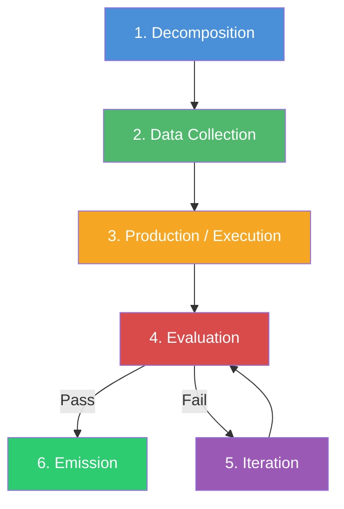
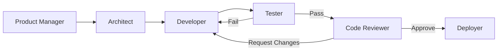
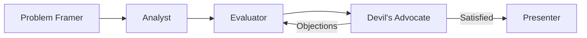
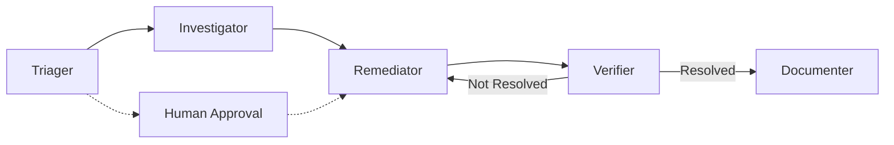
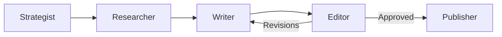

[< Back to Index](README.md)

---

## The Generalized Workflow

Every multi-step problem follows a lifecycle that can be described in terms of
abstract **capabilities**, not fixed roles. HiveFlow identifies six such
capabilities. A team configuration wires them to concrete agents — which agents,
how many, and what they are called is entirely up to the template or the LLM
that generates it. The stages below are **capability descriptions**, not role
names.

### Stage 1 — Decomposition

**Capability:** Break the problem into sub-tasks, questions, or work items.
**Typical behavior types:** `orchestrator`, `llm_only`
**Examples across domains:**
- Decompose a broad research question into subtopics
- Break a feature request into implementation tasks
- Triage an alert into investigation threads
- Identify evaluation dimensions for a decision

### Stage 2 — Data Collection

**Capability:** Use tools to collect the data, context, or resources needed.
**Typical behavior types:** `tool_user`
**Examples across domains:**
- Search the web, scrape articles, query databases
- Read source code, check CI logs, query issue trackers
- Pull metrics, query logs, check service health
- Gather market data, survey results, competitor analysis

### Stage 3 — Production / Execution

**Capability:** Generate candidate outputs **or perform real-world actions**.
**Typical behavior types:** `llm_only`, `action_executor`
**Examples across domains:**
- Write report sections or draft code
- Create a PR, run tests, execute a deployment
- Execute remediation (restart, scale, rollback)
- Draft a recommendation with supporting evidence

### Stage 4 — Evaluation

**Capability:** Evaluate quality, correctness, or success criteria.
**Typical behavior types:** `llm_only`, `tool_user`
**Examples across domains:**
- Check output accuracy, completeness, or style
- Run automated tests, security scans, or coverage checks
- Verify a remediation succeeded via health checks
- Validate reasoning, check for biases

### Stage 5 — Iteration

**Capability:** Refine output based on evaluation feedback until acceptance
criteria are met.
**Typical behavior types:** `llm_only`
**Examples across domains:**
- Rewrite flagged sections of a document
- Fix code-review comments, update tests
- Adjust a remediation approach after a failed attempt
- Refine a recommendation based on new objections

### Stage 6 — Emission

**Capability:** Finalize and emit the result in its target form.
**Typical behavior types:** `action_executor`, `llm_only`
**Examples across domains:**
- Export a document as PDF/DOCX or post to a CMS
- Merge a PR, deploy to staging, update documentation
- File a post-mortem, update a runbook, close a ticket
- Present a decision record, send a notification



### Not All Stages Are Required

A workflow can use any subset of these capabilities. A quick summarization task
might only need Production → Emission. An incident response might emphasize
Data Collection → Execution → Evaluation. A review loop might cycle through
Production → Evaluation → Iteration many times.

The stages are a **vocabulary of capabilities**, not a mandate and not a set of
fixed role names. Any agent, with any name and any system prompt, can fulfil
one or more of these capabilities depending on how the team config wires it.

---

## Cross-Domain Applications

The universal workflow maps naturally to many problem domains. The examples
below show how **different teams with different agent names** can be composed
from the same universal agent class — the framework imposes no fixed role names.
Each example is just one possible team configuration; the user or LLM could
produce entirely different compositions for the same domain.

### Example: Software Engineering



**One possible team configuration:**

| Agent (user-defined) | Behavior Type    | Tools                            | Purpose                              |
| -------------------- | ---------------- | -------------------------------- | ------------------------------------ |
| Product Manager      | orchestrator     | issue_tracker, roadmap           | Decompose feature into tasks         |
| Architect            | llm_only         | —                                | Design solution approach             |
| Developer            | action_executor  | code_editor, git, terminal       | Write and commit code                |
| Tester               | tool_user        | test_runner, coverage_checker    | Run tests and report results         |
| Code Reviewer        | llm_only         | static_analysis                  | Review code quality and correctness  |
| Deployer             | action_executor  | ci_cd, cloud_deploy, notifier   | Deploy and notify stakeholders       |

Nothing about these names is prescribed by the framework — a different team
config could merge Tester and Code Reviewer into a single agent, or split
Developer into Frontend and Backend specialists.

### Example: Decision-Making



**Use case:** "Should we migrate from AWS to Azure?"

| Agent (user-defined) | Behavior Type | Tools                         | Purpose                                            |
| -------------------- | ------------- | ----------------------------- | -------------------------------------------------- |
| Problem Framer       | orchestrator  | —                             | Define evaluation criteria and dimensions           |
| Analyst              | tool_user     | web_search, cost_calculator   | Gather pricing, feature comparisons, case studies   |
| Evaluator            | llm_only      | —                             | Score options against criteria, draft recommendation|
| Devil's Advocate     | llm_only      | —                             | Challenge assumptions, find weaknesses              |
| Presenter            | llm_only      | doc_generator                 | Format decision record with supporting evidence     |

### Example: Incident Response



**Use case:** Alert fires: "API latency > 5s for 10 minutes"

| Agent (user-defined) | Behavior Type    | Tools                                      | Purpose                                |
| -------------------- | ---------------- | ------------------------------------------ | -------------------------------------- |
| Triager              | tool_user        | alertmanager, pagerduty                    | Classify severity, assign priority     |
| Investigator         | tool_user        | log_query, metrics_dashboard, trace_viewer | Gather context on the incident         |
| Human Approval       | human_gate       | —                                          | Approve remediation before execution   |
| Remediator           | action_executor  | kubernetes, cloud_api, restart_service     | Execute remediation actions            |
| Verifier             | tool_user        | health_check, metrics_dashboard            | Confirm incident is resolved           |
| Documenter           | llm_only         | jira, confluence                           | Write post-mortem, update runbook      |

### Example: Content Creation



**Use case:** "Create a blog post about quantum computing for a general audience"

| Agent (user-defined) | Behavior Type   | Tools                       | Purpose                              |
| -------------------- | --------------- | --------------------------- | ------------------------------------ |
| Strategist           | orchestrator    | seo_tool, trend_analyzer    | Define angle, audience, keywords     |
| Researcher           | tool_user       | web_search, scraper         | Gather source material               |
| Writer               | llm_only        | —                           | Draft the content                    |
| Editor               | llm_only        | grammar_checker             | Review for quality, tone, accuracy   |
| Publisher            | action_executor | cms_api, social_scheduler   | Publish and schedule social posts    |

> **Key point:** These four examples use completely different agent names,
> different numbers of agents, and different workflow topologies — yet they
> are all driven by the same universal agent class and workflow engine. The
> framework provides the execution machinery; the team config provides the
> specialization.

---

## Workflow Execution Capabilities

Beyond the generalized workflow stages, the framework provides concrete
execution capabilities for production-grade workflow management.

### Workflow Checkpointing (Inspired by Microsoft Agent Framework)

Long-running workflows — especially those with human-in-the-loop gates or
`action_executor` agents with `require_approval` — may need to **pause, persist
state, and resume later**. The framework supports workflow checkpointing.

#### How It Works

1. **Save** — At configurable points (after each step, or at gate/approval
   points), the engine serializes the full workflow state: current step,
   agent states, workflow state dict, pending approval requests
2. **Persist** — Checkpoints are written to a `CheckpointStorage` backend
   (pluggable: file-based, database, or in-memory)
3. **Resume** — A workflow can be re-created from a checkpoint ID, restoring
   all state and continuing from the exact point of interruption
4. **Respond** — Pending human approval requests can be answered on resume,
   allowing truly asynchronous human-in-the-loop patterns

#### Checkpoint Storage Interface

```python
class CheckpointStorage(Protocol):
    """Pluggable storage for workflow checkpoints."""

    async def save(self, checkpoint: WorkflowCheckpoint) -> str
        # Returns checkpoint_id

    async def load(self, checkpoint_id: str) -> WorkflowCheckpoint

    async def list_checkpoints(self, workflow_name: str) -> list[CheckpointSummary]
```

Built-in implementations:

| Backend | Package | Notes |
|---|---|---|
| `FileCheckpointStorage` | Core | JSON files in a directory; good for development |
| `InMemoryCheckpointStorage` | Core | For testing; not persistent |

Additional backends (database, Redis, etc.) can be added as plugins.

#### Checkpoint Data

```python
@dataclass
class WorkflowCheckpoint:
    checkpoint_id: str
    workflow_name: str
    timestamp: str                      # ISO 8601
    iteration_count: int
    current_step: str                   # Agent ID of the paused step
    current_step_index: int             # Step index (for duplicate agent IDs)
    state: dict[str, Any]               # Full workflow state
    pending_requests: dict[str, Any]    # Approval requests awaiting response
    executor_states: dict[str, Any]     # Per-agent saved state
    status: str                         # "completed" | "awaiting_human_response" | "in_progress"
```

> **Implementation note:** Steps are currently identified by agent ID in the
> workflow step map. `current_step_index` is included to handle workflows
> where the same agent appears in multiple steps. The resume logic should
> use the index to find the exact step, not just the agent ID.

#### Usage Pattern

```python
# Initial run — pauses at a gated step
result = await engine.execute(agents, initial_state, checkpoint_storage=storage)
# result.status == PAUSED, result.pending_requests has the approval request

# Later — resume with the human's response
result = await engine.resume(
    checkpoint_id=result.checkpoint_id,
    responses={"request_123": "approved"},
    agents=agents,
    checkpoint_storage=storage,
)
```

#### Implementation Phase

Phase 1: File-based checkpoint storage, save/resume at human gates and gated
steps. Phase 2: Pluggable backends, automatic checkpointing after every step,
checkpoint browsing and replay.

### Sub-Workflows (Composition) — Phase 2

A workflow can contain other workflows as steps. This enables reusable workflow
patterns that nest inside larger orchestrations.

> **Status: Not yet implemented.** The `sub_workflow` step type is not in the
> current `WorkflowStepType` enum or engine execution loop. This is a Phase 2
> feature.

#### How It Works

- A `sub_workflow` step type references another `TeamConfiguration` by name
- The parent workflow passes a subset of its state to the sub-workflow as
  initial state
- The sub-workflow executes independently and returns its result to the parent
- The parent merges the sub-workflow result into its own state

```json
{
  "agent": "research_team",
  "type": "sub_workflow",
  "team": "deep_research",
  "input_mapping": { "task": "research_question" },
  "output_mapping": { "research_data": "findings" },
  "next": "reviewer"
}
```

This allows building complex workflows from simpler, tested building blocks.
For example, a "product launch" workflow might contain a "market research"
sub-workflow and a "content creation" sub-workflow.

#### Implementation Phase

Phase 1: Inline sub-workflow execution (sub-workflow runs synchronously within
the parent). Phase 2: Parallel sub-workflows, sub-workflow checkpointing,
recursive nesting limits.

### Workflow-as-Agent Pattern — Phase 2

A complete workflow can be wrapped to behave as a single agent, enabling
hierarchical composition. From the outside, the wrapped workflow looks like
any other agent — it receives state, produces output.

> **Status: Not yet implemented.** This is a Phase 2 feature.

```python
# Wrap a workflow so it can participate in a larger workflow as a single agent
research_agent = workflow.as_agent(
    agent_id="research_team",
    role="Research Team",
)
```

This pattern enables:
- Building reusable workflow "macros" that plug into larger orchestrations
- Testing complex multi-agent flows as a single unit
- Progressive refinement: start with one agent, later expand into a sub-workflow

### Event Streaming

The workflow engine emits structured events during execution, enabling real-time
observability without modifying agent or executor code.

#### Event Types — Currently Implemented

These events are emitted by the `WorkflowEngine` via `on_event()` callbacks:

| Type                   | Description                                              | Status      |
| ---------------------- | -------------------------------------------------------- | ----------- |
| `step_start`           | An agent step has begun                                  | Implemented |
| `step_complete`        | An agent step has finished                               | Implemented |
| `step_error`           | An agent step failed                                     | Implemented |
| `gate_requested`       | A gated step is pausing for approval                     | Implemented |
| `action_proposed`      | An `action_executor` agent proposed actions for approval  | Implemented |
| `documents_loaded`     | Documents were loaded into workflow state                 | Implemented |
| `summary_generated`    | A summary was produced for context propagation           | Implemented |
| `outline_generated`    | An outline was assembled from parallel item summaries    | Implemented |
| `assembly_complete`    | Code-level output assembly finished                      | Implemented |

#### Event Types — Planned

| Type                   | Description                                              | Phase       |
| ---------------------- | -------------------------------------------------------- | ----------- |
| `output`               | Terminal output from the workflow                         | Phase 1     |
| `tool_call`            | A tool was invoked (input/output) — requires agent-level event propagation | Phase 2 |
| `checkpoint_saved`     | A checkpoint was persisted                               | Phase 1 (with checkpointing) |
| `approval`             | A human has approved or rejected an action/gate           | Phase 1 (with resume) |

> **Note on `tool_call` events:** Tool calls currently happen inside `Agent`
> execution, which does not propagate events to the workflow engine. Surfacing
> tool calls as engine-level events requires either agent-level event hooks or
> middleware (see [Plugins — Middleware](04-plugins.md#agent-middleware-inspired-by-microsoft-agent-framework)).

#### Current Mechanism: Callbacks

Events are consumed via `on_event()` callbacks registered on the engine:

```python
engine.on_event(lambda event_type, agent_id, data:
    print(f"[{event_type}] {agent_id}: {data}")
)
```

#### Future: Async Iterator (Phase 2)

For real-time delivery, a future `execute_stream()` method will yield events
as an async iterator, suitable for WebSocket/SSE consumers:

```python
async for event in engine.execute_stream(agents, initial_state):
    if event.type == "output":
        print(event.data)
    elif event.type == "gate_requested":
        # Handle human-in-the-loop
        ...
```

This is not yet implemented. The `on_event()` callback is the current
mechanism for event consumption.

---

---

[Next: Agents & Teams >](03-agents-and-teams.md)
