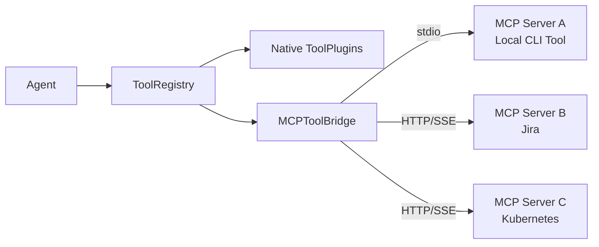

[< Back to Index](README.md)

---

## Dynamic Agent / Role Selection (Deferred)

> **Status: Deferred.** This feature depends on the `self_configure` behavior
> type which is deferred to a future release. See
> [Agents & Teams — Behavior Types](03-agents-and-teams.md#agent-behavior-types)
> for the deferral rationale.
>
> The use case (selecting an agent persona dynamically based on task content)
> can be approximated today by composing an `orchestrator` agent (that selects
> from the archetype library) with an `llm_only` agent (that executes with the
> selected persona). A first-class `self_configure` behavior type will be
> formalized when the archetype library matures.

---

## MCP Integration (Model Context Protocol)

The [Model Context Protocol](https://modelcontextprotocol.io/) enables agents
to connect to external **tool servers** at runtime — databases, APIs, internal
services — without bundling those integrations into the framework.

MCP tools coexist transparently with native `ToolPlugin` tools in the same
registry. Agents see a unified tool list — they don't know or care whether a
tool comes from a native plugin or an MCP server. The framework handles routing
transparently.

See also [Plugins — MCP Integration](04-plugins.md#mcp-integration-model-context-protocol)
for the `MCPToolBridge` pattern that registers MCP tools as native `ToolPlugin`
instances.

### Current Baseline

The existing plugin architecture provides all the extension points MCP needs:

- **`ToolPlugin`** (abstract base in `hiveflow/plugins/tools/__init__.py`) —
  defines `plugin_id`, `description`, `input_schema`, `output_schema`,
  `execute()`, and `to_llm_tool_spec()`. `MCPToolBridge` extends this
  interface.
- **`ToolRegistry`** (in `hiveflow/plugins/tools/__init__.py`) — singleton
  registry with `register()`, `get_tools_for_agent()`, and
  `get_llm_tool_specs()`. MCP tools register here alongside native tools.
- **Agent tool wiring** (in `hiveflow/core/agent.py`) — agents receive tools
  via their constructor as a `list[ToolPlugin]`, build an internal
  `_tool_map: dict[str, ToolPlugin]`, and dispatch tool calls by `plugin_id`.
  No agent code changes are needed for MCP tools.

MCP integration is **purely additive** — it introduces new classes and
configuration without modifying any existing interfaces.

### Architecture



Each MCP server exposes a set of tools via the standardized MCP protocol. The
framework's MCP client discovers available tools from connected servers and
registers them into the `ToolRegistry` as `MCPToolBridge` instances.

### MCP Transport Modes

MCP supports two transport mechanisms. The framework supports both:

| Transport    | Connection                                | Use Case                                  |
| ------------ | ----------------------------------------- | ----------------------------------------- |
| **stdio**    | Spawn a local process, communicate via stdin/stdout | CLI tools, local MCP servers, development |
| **HTTP/SSE** | Connect to a remote URL via HTTP with Server-Sent Events | Remote services, shared infrastructure    |

### MCPToolBridge

Each MCP tool is wrapped in an `MCPToolBridge` instance that implements the
existing `ToolPlugin` interface:

```python
class MCPToolBridge(ToolPlugin):
    """Bridges a single MCP server tool into the HiveFlow tool registry.

    Implements the existing ToolPlugin contract — plugin_id, description,
    input_schema, output_schema, execute(), to_llm_tool_spec() — by
    delegating to the MCP client connection.
    """

    def __init__(self, client: MCPClient, tool_spec: MCPToolSpec):
        self._client = client
        self._spec = tool_spec

    @property
    def plugin_id(self) -> str:
        return f"mcp:{self._spec.name}"

    @property
    def description(self) -> str:
        return self._spec.description

    @property
    def input_schema(self) -> dict[str, Any]:
        return self._spec.input_schema

    @property
    def output_schema(self) -> dict[str, Any]:
        return self._spec.output_schema or {"type": "object"}

    async def execute(self, tool_input: dict[str, Any]) -> dict[str, Any]:
        return await self._client.call_tool(self._spec.name, tool_input)
```

The `mcp:` prefix on `plugin_id` prevents name collisions with native tools.
Agents interact with MCP tools via the same `_tool_map` lookup and
`to_llm_tool_spec()` flow used for native tools — no agent code changes
required.

### MCP Strategy Modes

| Strategy     | Behavior                                                                       | Use Case                    |
| ------------ | ------------------------------------------------------------------------------ | --------------------------- |
| **disabled** | MCP is off; agents use only native tool plugins                                | Simple workflows, offline   |
| **fast**     | Connect to MCP servers, list tools, register all into the tool registry        | Default; low overhead       |
| **deep**     | Pre-fetch tool schemas from all MCP servers; use LLM to select the best tools for the current task | Complex tasks needing tool discovery |

### LLM-Based Tool Selection (Deep Mode)

Deep mode uses the `FAST_LLM` tier (defined in `HiveFlowConfig`) to
intelligently filter the MCP tool catalog:

1. Connects to all configured MCP servers
2. Fetches the full tool catalog (names, descriptions, schemas)
3. Passes the catalog + task description to the `FAST_LLM`
4. The LLM returns a ranked list of which MCP tools are most relevant
5. Only those tools are registered and injected into the agent

Deep mode depends on the `ToolRegistry.describe()` enhancement specified in
[Plugins — Tool Registry Serialization](04-plugins.md#tool-registry-serialization-for-llm-context)
for serializing the combined native + MCP tool catalog.

### Configuration

MCP server configuration is stored in a **dedicated JSON file**
(`mcp.json`) rather than in `HiveFlowConfig`, because MCP config involves
nested structures (server lists with per-server auth) that do not map cleanly
to the flat `HIVEFLOW_`-prefixed environment variable pattern used by
`HiveFlowConfig` (`hiveflow/core/config.py`).

**Default location:** `.hiveflow/mcp.json` (configurable via
`HIVEFLOW_MCP_CONFIG` environment variable).

```json
{
  "strategy": "fast",
  "servers": [
    {
      "name": "company_db",
      "transport": "http",
      "url": "http://mcp-db-server:8080",
      "auth": { "type": "bearer", "env": "MCP_DB_TOKEN" }
    },
    {
      "name": "local_tools",
      "transport": "stdio",
      "command": "my-mcp-tool-server",
      "args": ["--verbose"]
    },
    {
      "name": "jira",
      "transport": "http",
      "url": "http://mcp-jira-server:8080"
    }
  ]
}
```

**Server definition fields:**

| Field       | Required | Description                                                |
| ----------- | -------- | ---------------------------------------------------------- |
| `name`      | Yes      | Unique server name for logging and diagnostics             |
| `transport` | Yes      | `"stdio"` or `"http"`                                      |
| `url`       | http     | Server URL (required for `http` transport)                 |
| `command`   | stdio    | Executable to spawn (required for `stdio` transport)       |
| `args`      | No       | Arguments for the spawned process (`stdio` only)           |
| `env`       | No       | Additional environment variables for the process (`stdio`) |
| `auth`      | No       | Authentication config (`http` only)                        |

**Strategy override:** The strategy can be overridden per-server or
per-workflow via the team config:

```json
{
  "mcp_strategy": "deep"
}
```

When not specified, the strategy from `mcp.json` applies.

### MCP + Native Tool Coexistence

MCP tools and native `ToolPlugin` tools coexist in the same `ToolRegistry`.
The agent sees a unified tool list via `get_llm_tool_specs()` — it doesn't
know or care whether a tool comes from a native plugin or an MCP server. The
existing agent execution flow (`_tool_map.get(tool_name)` →
`tool.execute(args)`) handles both transparently.

When a team config references tools, MCP tools use their `mcp:` prefixed IDs:

```json
{
  "id": "data_analyst",
  "tools": ["web_search", "mcp:company_db_query", "mcp:jira_search"]
}
```

### HiveFlow as an MCP Gateway (Phase 2)

HiveFlow itself can **expose its workflows as MCP tools** — allowing other
MCP-capable applications to trigger HiveFlow workflows:

```
External MCP Client → HiveFlow MCP Server → workflow execution → result
```

This is implemented via an optional `hiveflow-mcp-server` package that wraps
the `HiveFlow` facade (`hiveflow/core/hiveflow.py`) as an MCP-compliant
server. Each registered team in the `TeamLibrary` becomes an MCP tool.

### Implementation Phases

**Phase 1 — MCP Client (fast mode):**
- `MCPClient` class supporting both stdio and HTTP/SSE transports
- `MCPToolBridge(ToolPlugin)` implementing the existing `ToolPlugin` interface
- `MCPManager` that reads `mcp.json`, connects to servers, registers tools
- `disabled` and `fast` strategy modes
- Tools appear in the unified `ToolRegistry` and in `get_llm_tool_specs()`
- Integration with `TeamGenerator.build()` — MCP tools available alongside
  native tools when building agents from team configs

**Phase 2 — Deep mode + HiveFlow as MCP Server:**
- `deep` strategy mode with LLM-based tool selection via `FAST_LLM`
- `ToolRegistry.describe()` for serializing tool catalogs to LLM prompts
  (prerequisite from [04-plugins.md](04-plugins.md))
- HiveFlow MCP server exposing workflows as tools to external MCP clients
- `hiveflow-mcp-server` optional package

---

## Conversational Memory

Multi-turn interactions require memory that persists across individual workflow
runs. The framework provides **building blocks** for memory; how memory is
managed is a consumer/application concern.

### Current Baseline

The following memory primitives are already implemented:

- **`WorkflowState`** (`hiveflow/core/state.py`) — Immutable-merge state dict
  with history tracking. Each `merge()` creates a new state snapshot and
  appends the previous state to an internal `_history` list.
- **`WorkflowSession`** (`hiveflow/core/session.py`) — Session identity,
  status tracking (`PENDING` → `RUNNING` → `COMPLETED`/`PAUSED`/`FAILED`),
  approval request extraction, and event streaming via `StreamChannel`.
- **`FileCheckpointStorage`** (`hiveflow/core/checkpoint.py`) — File-based
  JSON persistence of `WorkflowCheckpoint` snapshots at workflow pause points
  (human gates, gated steps, action approval). Default directory:
  `.hiveflow/checkpoints/`.
- **Agent state accumulation** — Each agent writes structured outputs to the
  workflow state dict under namespaced keys:
  - `{agent_id}_output` — agent's primary output
  - `{agent_id}_summary` — compressed summary (when summarizer is configured)
  - `{agent_id}_tool_results` — tool call results (tool_user agents)
  - `{agent_id}_action_records` — audit trail (action_executor agents)
  - `{agent_id}_usage` — token usage tracking
- **Context propagation** (`Agent._summarize_state()` in
  `hiveflow/core/agent.py`) — Agents receive accumulated context from prior
  steps with deduplication (trigram-based), recency windowing
  (`CONTEXT_RECENCY_WINDOW`), TTL expiry, and optional LLM-based context
  reduction (`ContextReducer` in `hiveflow/core/context_reducer.py`).
- **`EmbeddingProvider`** (`hiveflow/plugins/embeddings/__init__.py`) —
  Abstract interface for embedding text into vectors, with batch and single
  methods.
- **`SimpleVectorStore`** (`hiveflow/plugins/embeddings/__init__.py`) —
  In-memory cosine-similarity vector store with `add()`, `search()`, `clear()`.

### Memory Tiers

| Tier                  | Scope                  | Lifetime           | Framework provides                                |
| --------------------- | ---------------------- | ------------------ | ------------------------------------------------- |
| **Turn memory**       | Single agent step      | One workflow step   | `WorkflowState` (immutable merge, `_history`)     |
| **Session memory**    | Single workflow run    | Until session ends  | `WorkflowSession` + `FileCheckpointStorage`       |
| **Persistent memory** | Cross-session recall   | Indefinite          | `EmbeddingProvider` + `SimpleVectorStore` interfaces |

### Turn Memory (Core — Implemented)

The `WorkflowState` dict (`hiveflow/core/state.py`) flows between agents in a
workflow. Each agent reads from the shared state via `_summarize_state()` and
writes its output back. The state accumulates all agent outputs across the
workflow run.

The `WorkflowState.merge()` method creates immutable snapshots — the previous
state is preserved in `_history`, and a new state is returned with updates
applied. This provides an audit trail of state evolution within a single run.

### Session Memory (Framework-Supported — Implemented)

`WorkflowSession` (`hiveflow/core/session.py`) combined with
`FileCheckpointStorage` (`hiveflow/core/checkpoint.py`) provides durable
session persistence:

- **Accumulated agent outputs** — The full workflow state dict (containing all
  `{agent_id}_output`, `{agent_id}_summary`, `{agent_id}_tool_results`, and
  `{agent_id}_action_records` entries) is captured in checkpoint snapshots.
  This is the accumulated work product from all completed steps.
- **Session identity and status** — `WorkflowSession` tracks `session_id`,
  `status`, pending `ApprovalRequest` objects, and provides event streaming.
- **Checkpoint at pause points** — `WorkflowEngine._save_checkpoint()`
  automatically persists the full state, step index, iteration counts, team
  config, and task when the workflow pauses (at human gates, gated steps, or
  action approvals).
- **Resume from checkpoint** — `HiveFlow.resume()` loads a checkpoint,
  restores the full state dict, applies approval responses, rebuilds agents
  and the engine, and resumes execution from the next step.

The framework provides the storage primitives (`CheckpointStorage` protocol
and `FileCheckpointStorage` implementation). The application decides how to
manage session lifecycle — including whether to store additional data (such as
raw conversation message lists) in the workflow state before checkpointing.

**Multi-turn conversation patterns** (sending successive user messages to the
same workflow session) are an **application-level concern**. The framework
provides the building blocks (`WorkflowSession` for identity,
`CheckpointStorage` for persistence, `WorkflowState` for accumulation) but
does not prescribe a specific multi-turn protocol. See
`examples/llm_providers/09_multi_turn.py` for an application-level pattern
using `LLMMessage` lists.

### Persistent Memory (Application Layer — Not Implemented)

For long-lived assistants that remember across sessions, the framework provides
the **plugin interfaces** but the memory management logic is application-level:

- **Embedding-based recall** — Use `EmbeddingProvider` to embed previous
  outputs, store in `SimpleVectorStore` (or a custom `VectorStorePlugin`
  implementation), and retrieve by semantic similarity.
- **Summary compression** — Older sessions summarized (using `SummaryGenerator`
  from `hiveflow/core/summarizer.py`) and re-embedded.
- **Metadata tagging** — Topic, date, user ID, quality score stored alongside
  vectors in the vector store.

This is not part of the core framework. Applications build persistent memory
on top of the embedding and vector store plugin interfaces defined in
[Data Processing](05-data-processing.md).

---

---

[Next: Entry Points >](07-entry-points.md)
